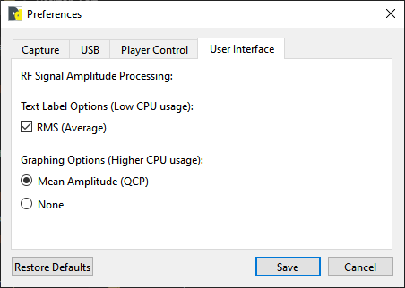
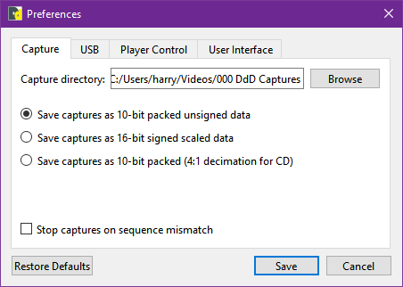

# Domesday Duplicator 

The Domesday Duplicator (DdD) is a USB 3.0 hardware solution originally built for capturing LaserDiscs RF at 40msps 10-bit.

> [!CAUTION]
> - The DdD is also suitable for use capturing many other single channel FM RF based formats, such as Video8/Hi8 & Betamax NTSC.
> 
> - However VHS, Betamax PAL and other formats require multible ADC channels for Video RF & HiFi audio (Also Baseband or Linear audio) please look at the [Clockgen Mod](https://github.com/oyvindln/vhs-decode/wiki/Clockgen-Mod) & the new [MISRC](https://github.com/Stefan-Olt/MISRC/) for this as the DdD only has a single ADC channel.

# Docs

- [How to Order a Domesday Duplicator (DdD) for Dummies](https://github.com/simoninns/DomesdayDuplicator/wiki/How-To-Order)

- [Primary Usage Docs](https://github.com/simoninns/DomesdayDuplicator/wiki/)

- [Windows 10 v2.0 Firmware Package](https://drive.google.com/file/d/1rqnqQy7h8KjSP-bJ-Y6uXyeQgXAMRrB6/view?usp=sharing)

- [Windows 10 Firmware & USB Driver Setup](https://docs.google.com/document/d/1j9QM5dFXIgRhrnFb7q1N1S557zTegOVq0JKApvoDmdE/)

- [FLAC RF Data Compression Guide](https://github.com/oyvindln/vhs-decode/wiki/RF-Compression-&-Decompression-Guide)

The DdD documentation originally lived on [Domesday86.com project pages](https://www.domesday86.com/?page_id=978) but is now moved entirely onto GitHub.

## Physical Gain Control 

0000 is 1-2-3-4 dips, In orientation to bottom numbers.

`up is 1` and `down is 0`

All selected in this up position is 1111 or 2.02 Minimum Gain When dip’s 2-3-4 are down it's 1000 this is the maximum gain of 8.5, the table below shows all possible positions.

|**Configuration**|**Switch Position**|**Gain**|
|-----------------|-------------------|--------|
| 15              | 1111              | 2.02   |
| 7               | 0111              | 2.17   |
| 11              | 1011              | 2.27   |
| 13              | 1101              | 2.45   |
| 3               | 0011              | 2.54   |
| 14              | 1110              | 2.59   |
| 5               | 0101              | 2.79   |
| 6               | 0110              | 3.02   |
| 9               | 1001              | 3.04   |
| 10              | 1010              | 3.34   |
| 1               | 0001              | 3.8    |
| 12              | 1100              | 4      |
| 2               | 0010              | 4.4    |
| 4               | 0100              | 6      |
| 8               | 1000              | 8.5    |

# Software 

The software is a GUI based capture tool, with a serial control interface for LaserDisc players.

[Linux Install](https://github.com/simoninns/DomesdayDuplicator/wiki/User-Guide#installation) / [MacOS Builds](https://github.com/simoninns/DomesdayDuplicator/wiki/User-Guide#installation))

[Windows Build](https://drive.google.com/file/d/10Hte6i0k5u6X9hX6CeV31xrPPbA5APJA/view?usp=drivesdk) / [Ubuntu 22.04 Build](https://drive.google.com/file/d/10G9mYrEjb5m0hoBVxnn7At4KffKn2gNZ/view?usp=drivesdk)

> [!TIP]  
> Enable RMS Measurement to have a live readout.

Enable stop captures on sequence mistmach **if your seeing dropped samples with your setup**.

Dark mode on windows can be done via:

    DomesdayDuplicator.exe --style fusion

## Linux Software Install

For Ubuntu 20.2 & Linux Mint 22.3

Install Dependency's

    sudo apt install --no-install-recommends git cmake libgl-dev qt6-base-dev libqt6serialport6-dev libusb-1.0-0-dev qt6-multimedia-dev build-essential

&

    sudo apt install libqt5serialport5-dev

Download The Software

    mkdir ~/github
    cd ~/github
    git clone https://github.com/simoninns/DomesdayDuplicator

Build The Software 

    cd ~/github/DomesdayDuplicator/Linux-Application
    sudo cmake -DCMAKE_BUILD_TYPE=RelWithDebInfo .
    sudo make -j8
    sudo make install

USB Permissions

Make a file called called `40-domesdayduplicator.rules` inside of `/etc/udev/rules.d directory` after opening it as a root user.

    # 1d50:603b - Domesday Duplicator
    SUBSYSTEM=="usb", ATTRS{idVendor}=="1d50", ATTRS{idProduct}=="603b", MODE="0666"

Reload Rules

    sudo udevadm control --reload-rules

Lastly take ownership of the files directly as a user

Replace `USER` with your local username.

    sudo chown -R USER ~/github/DomesdayDuplicator

Then run the DdD App

    DomesdayDuplicator &

If you get `Segmentation fault (core dumped)` try using:

    sudo strace DomesdayDuplicator

## Desktop Icon In Linux

    sudo xdg-icon-resource install --size 256 --novendor ~/github/DomesdayDuplicator/Linux-Application/DomesdayDuplicator/Graphics/ApplicationIcon/DomesdayDuplicator_256x256.png

Desktop File (App Icon Fix)

    desktop-file-install

