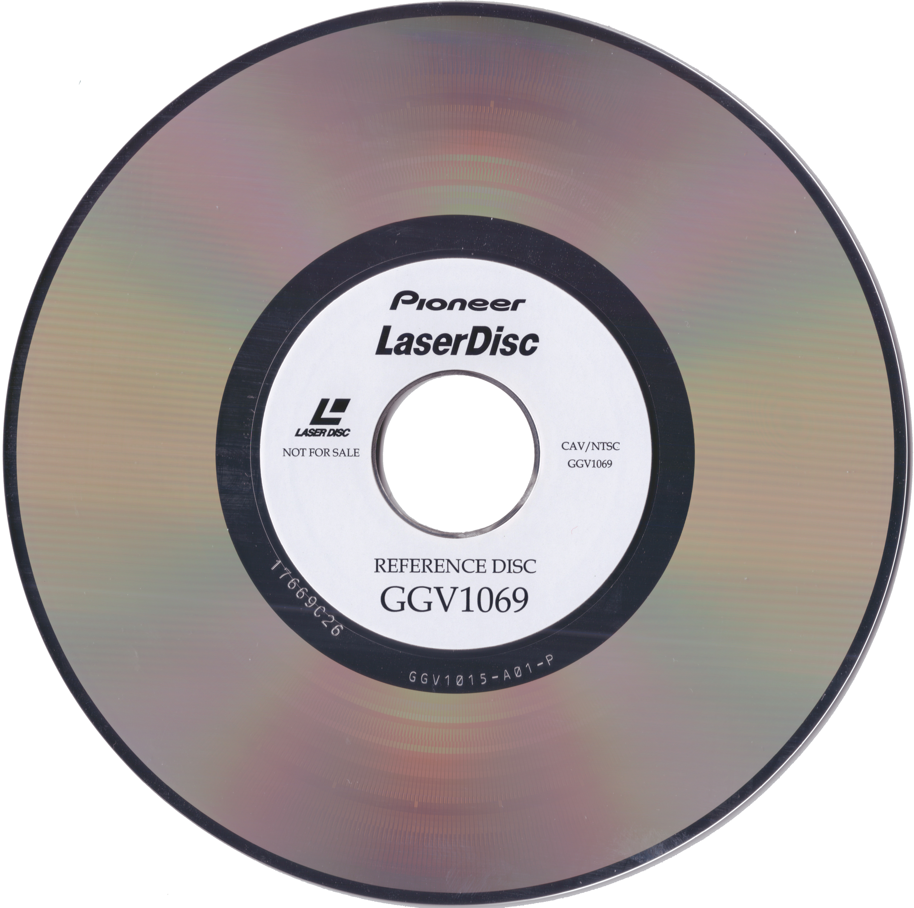
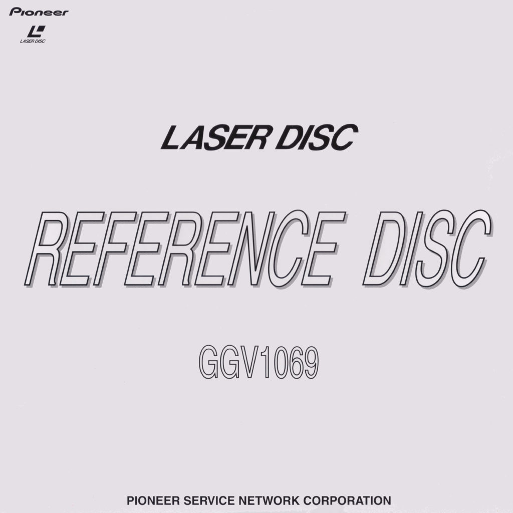
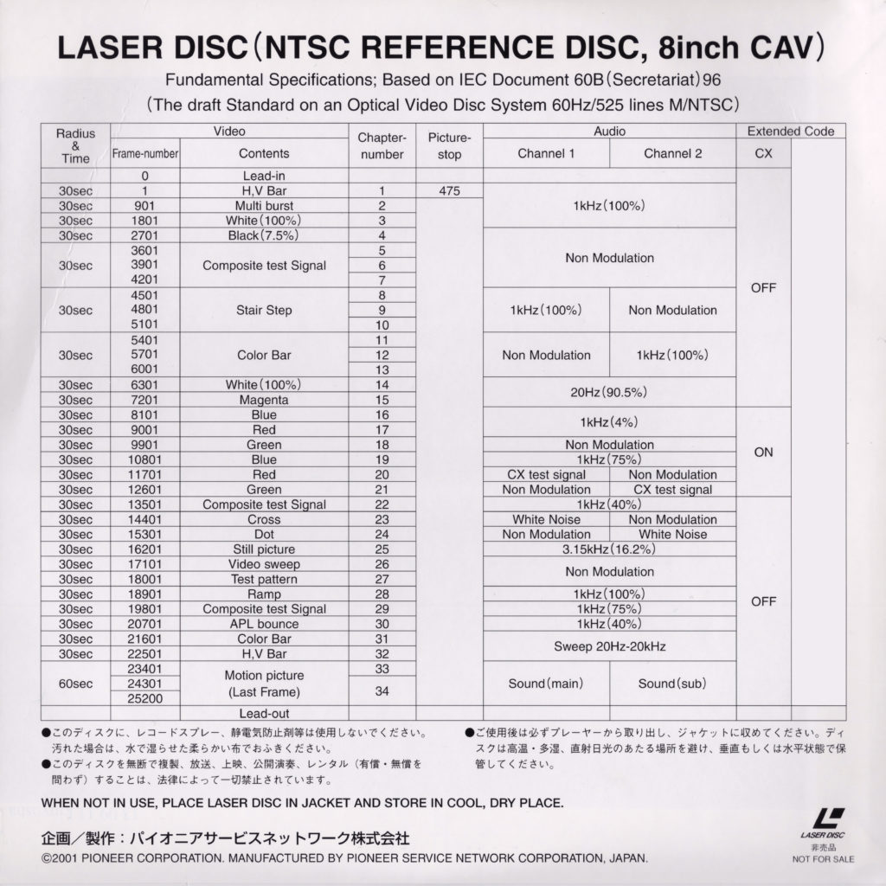

# GGV1069 Description

The Pioneer GGV1069 was the last NTSC test and calibration LaserDisc produced by Pioneer and is required in order to service NTSC and NTSC/PAL players. The GGV1069 in an 8 inch reference disc which, at the time of writing, is still available to purchase.

_GGV1069 LaserDisc_

The front cover of the GGV1069’s sleeve is shown in the following photograph:

_The Pioneer GGV1069 front cover_

The back cover of the GGV1069’s sleeve is shown in the following photograph:

_The Pioneer GGV1069 back cover_

A RF copy of the GGV1069 LaserDisc made using the Domesday Duplicator (and suitable for use with ld-decode) is available from the Internet Archive:

[https://archive.org/details/pioneer-ggv-1069-cav-ntsc-side-1](https://archive.org/details/pioneer-ggv-1069-cav-ntsc-side-1)

The disc table of contents (as pictured on the back cover) are also available as a text based PDF:

[GGV1069-Contents](https://www.domesday86.com/wp-content/uploads/2021/01/GGV1069-Contents.pdf)