# Hardware Guide

_The Domesday Duplicator 3_0_

# Electronics design and schematics

The Domesday Duplicator 3.0 design is split logically over 5 schematic pages.  The following sections describe each schematic along with details of the design and how it functions.  The Domesday Duplicator is designed specifically for the digitization (sampling) of RF spectra generated by a LaserDisc player when reading both NTSC and PAL LaserDiscs.  For a non-technical overview please see the [project overview page](../Misc/Overview.md).

## Expected input signals

The expected signal for NTSC LaserDiscs is shown in the following diagram: 

_NTSC RF Spectra_

The expected signal for PAL LaserDiscs is shown in the following diagram: 

_PAL RF Spectra_

## Measuring RF signal amplitude

The expected input signal to the Domesday Duplicator is a 50 Ohm impedance source.  The Domesday Duplicator gain and other amplitude measurements are based on this impedance.  When measuring the amplitude of signals care should be taken to match the impedance of the test equipment to the signal impedance under test (this includes measuring the RF amplitude from LaserDisc players to select the correct gain on the Domesday Duplicator). 

To measure the peak-to-peak output from a LaserDisc player connect the RF output from the player to the Domesday Duplicator using a BNC T-adaptor, then connect the oscilloscope probe to the T-adaptor using a BNC probe adaptor.  This will ensure that the RF signal is correctly terminated and the oscilloscope will show the correct peak-to-peak amplitude (as seen by the Duplicator itself).

## Overview.md schematic

The overview schematic shows the high-level interconnection of the 4 child-schematics consisting of:

* RF Amplifier
* ADC (Analogue to Digital Converter)
* Cypress Superspeed Interface (USB 3.0)
* Power supply

The schematic is shown in the following diagram: 

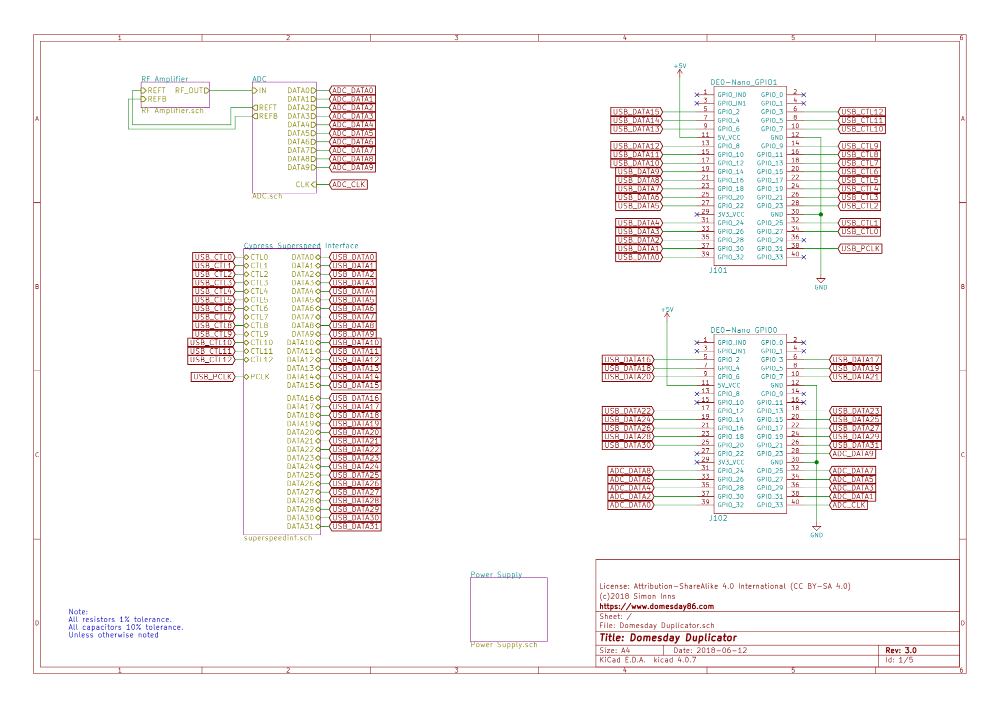

_Domesday Duplicator 3_0 - Top-level Schematic_

The interconnection of the child-schematics follows the path of RF Amplifier -> ADC -> DE0-Nano FPGA <-> Cypress Superspeed Interface providing the required connectivity to move from the LaserDisc RF output through to the required USB 3.0 interface towards the host computer.  Communication is directional from the RF source to the host with the exception of the FPGA to Cypress Superspeed interface which is bidirectional (this allows the USB interface to provide configuration communication to the FPGA). 

The FPGA function is detailed in a separate section below; please see this section for details.

## RF Amplifier

The RF Amplifier provides two basic functions.  Firstly it amplifies the LaserDisc RF signal to the appropriate levels for the ADC (including setting the DC offset of the signal correctly for the ADC).  Secondly it filters the RF signal using a low-pass filter to remove signal frequencies above the supported Nyquist limit of the ADC. 

The RF Amplifier schematic is shown in the following diagram: 

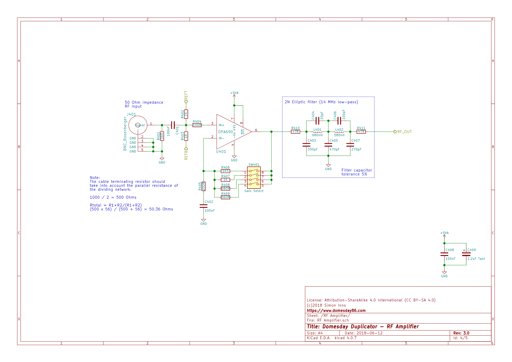

_Domesday Duplicator 3_0 - RF Amplifier Schematic_

### Input stage

The input stage of the RF Amplifier is responsible for setting the impedance of the input from the RF source as well as removing any DC offset from the source signal and applying the required DC offset for the amplification stage.

#### Input impedance

The initial resistor R401 sets the overall impedance of the input however, the resistance of R401 is changed due to the presence of R402 and R403.  The actual input impedance is the parallel resistance caused by the three resistors.  This means that, in order to provide a 50 Ohm impedance, R401's value must be modified to account for the overall impedance.  As R402 and R403 form a voltage divider the resistance at the centre-point of the divider is half the overall resistance of the resistor (i.e. 1000 Ohms / 2 = 500 Ohms).  Ohm's law can be used to specify the overall impedance by calculating the parallel resistance between R401 and the 500 Ohm voltage divider: (500 x 56) / (500 + 56) = 50.36 Ohms.  As the impedance of a LaserDisc player's RF test-point is typically 47 to 50 Ohms, this provides a close match across the expected range.  For the purposes of calculation a 50 Ohm impedance is assumed by the rest of this description.

#### DC offset correction

The DC offset of the incoming RF signal is removed by C401.  Resistors R402 and R403 form a voltage divider between the reference top and reference bottom voltages (provided by the internal reference of the ADC).  This places the DC offset at 2.5V which is the centre-point of the amplification stage.  This same DC offset is used by the ADC removing the need to further correct the DC offset after amplification (therefore simplifying the circuit).

### Amplification stage

The amplification stage is fed the DC corrected RF signal via R404 (which provides some resistance to the input of the operational amplifier IC as recommended by the data-sheet).  The operational amplifier is configured as a non-inverting amplifier with the linear gain set by the resistance between the op-amp output and the inverted input.  The operational amplifier is a Texas Instruments OPA690 selected due to its high bandwidth (over 100 MHz) and rail-to-rail operation from a single supply (i.e. using ground and 5Vs only).  The gain of the amplification stage is set by the combination of R405 to R409.  The exact combination of resistors is user-selectable using a 4 way DIP switch that acts to make and break connection physically to the 4 resistors R406 to R409 (note: R405 is always included in the circuit).

#### Operational amplifier gain theory

Within the circuit R406 to R409 act as a single resistor providing one side of the gain calculation (identified as 'A' in this text).  The other resistor R405 provides the second gain setting resistance (identified as 'B' in this text).  The OPA690 data-sheet provides a set of rules for setting the linear gain of the operational amplifier: 

The individual resistance of both A and B should be greater than 200 Ohms and less than 1500 Ohms. 

The parallel combination of A and B should be less than 300 Ohms ( (A \* B) / (A + B) = parallel combination resistance). So, (220 \* 1200) / (220 + 1200) = 185.92 Ohms for example. 

The overall gain is given by 1+(A / B), so and example calculation would be 1+(1500 / 200) = 8.5.  Note that the gain calculation is linear.

#### Gain configuration

Gain configuration is provided using a 4-way DIP switch which allows the user to connect from one to four resistors in parallel.  This configuration is used as a low-cost form of Variable Gain Amplifier (VGA).  As the Domesday Duplicator uses a relatively high RF frequencies, solutions such as digital potentiometers do not provide the required bandwidth.  Specialised ICs for variable and programmable gain do exist, however are cost prohibitive and generally require a fully differential ADC configuration.  By using a carefully chosen set of resistor values along with a small footprint switch the amplification stage can provide 15 configurable gain settings that require only a few passive components to implement (keeping both the cost and signal noise to a minimum). 

The resistor values for R406 to R409 are selected due to the gain setting rule that the resistors A and B must both be between 200 Ohms and 1500 Ohms.  The values 1500, 1000, 680 and 560 Ohms allow the maximum value for A (by selecting only the 1500 Ohm resistor) and the minimum value for A due to the parallel resistance combination of all four values: 

1/R = (1/1500 + 1/1000 + 1/680 + 1/560) = 203.13 Ohms 

Once the maximum and minimum allowed values are established (by one resistor and all four resistors together), the other 13 configurations are formed by the other possible switch settings.  To represent the various configurations it is useful to consider the 4 available switches as binary forming the numbers 0 to 15 (note: 0 is not a valid configuration as all resistors are disconnected, leaving 1-15 for use).  The following table shows the configuration number, the switch position and the linear gain for each possible configuration (in order of increasing gain):

| **Configuration** | **Switch Position** | **Gain** |
| ----------------- | ------------------- | -------- |
| 15                | 1111                | 2.02     |
| 7                 | 0111                | 2.17     |
| 11                | 1011                | 2.27     |
| 13                | 1101                | 2.45     |
| 3                 | 0011                | 2.54     |
| 14                | 1110                | 2.59     |
| 5                 | 0101                | 2.79     |
| 6                 | 0110                | 3.02     |
| 9                 | 1001                | 3.04     |
| 10                | 1010                | 3.34     |
| 1                 | 0001                | 3.8      |
| 12                | 1100                | 4        |
| 2                 | 0010                | 4.4      |
| 4                 | 0100                | 6        |
| 8                 | 1000                | 8.5      |

The gain values in the table above are calculated by the parallel resistance of the connected resistors (according to the DIP switch position) as the A value and the fixed 200R resistor (R405) as the B value.

### Filter stage

The amplification stage has a wide bandwidth and amplifies the whole RF signal with linear gain up to (and over the 100 MHz) range.  In order for this signal to be digitized it's important that all frequencies above the Nyquist are removed before the ADC stage.  Nyquist theorem states that the highest frequency that can be sampled is half the total sampling rate; therefore, with a 40 MSPS ADC, the highest allowed frequency is 20 MHz.  An issue with the ADC process is that any frequencies present in the sampled signal above the Nyquist are 'reflected' into the sample distorting the signal and these 'aliases' of the signal cannot be removed once the sampling is complete.  Therefore it is important to remove as much of the unwanted frequencies as possible in the analogue stage. 

To remove unwanted high-frequencies a low-pass filter (often referred to as an anti-alias filter) is employed.  The filter is placed after the amplification stage to prevent additional noise since the signal amplitude is greater versus relative noise (i.e. it has a better signal to noise ratio).  A passive filter design is used as it generally causes less distortion, but at the cost of signal attenuation.  LaserDisc players often employ a filter which has a stop-band of 13.2 MHz (above the upper parts of the video signal) and this design is also used by the Duplicator. 

There are many different types of passive LPF filter designs available, however the filter used is a 2 pole elliptic D low-pass filter.  Elliptic filters are desirable as they provide a very steep attenuation of the signal in the stop-band however, this is at the cost of 'ripple' in the pass-band.  For the purpose of the filter design the pass-band should attenuate the signal less than -3dB.  In the stop-band, attenuation should be as great as possible.  The filter used by the Domesday Duplicator was designed using a filter design tool as shown in the following screen-shot (of the predicted frequency response as well as phase): 

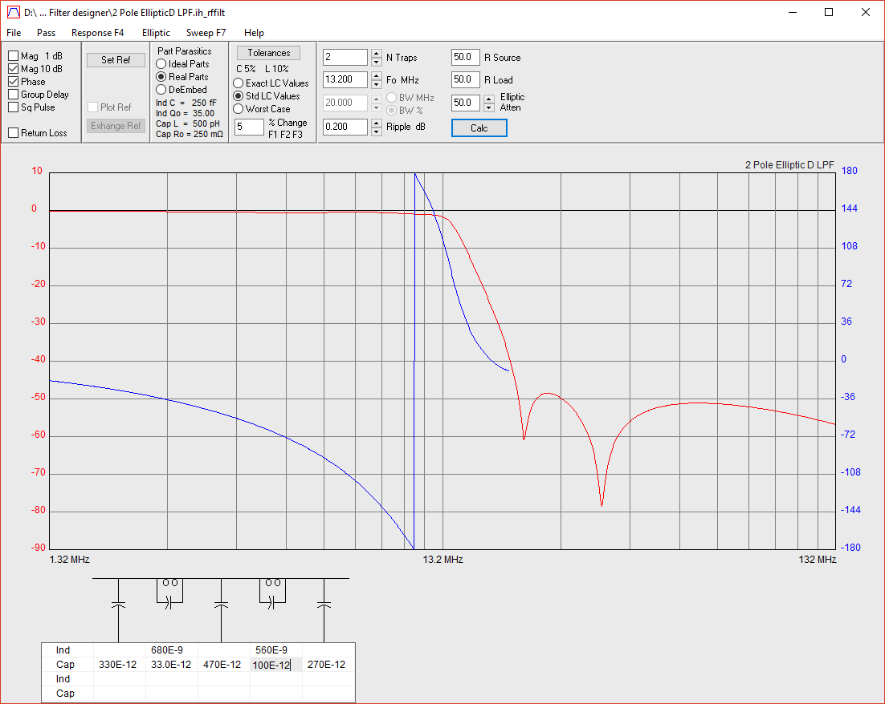

_Filter response calculation including frequency and phase_

It should be noted that the approximation of the filter output does not take into account the response and gain of the preceding input stage circuitry (and assumes certain component characteristics for the filter components).  Therefore it is necessary to test the filter design within the Domesday Duplicator as a whole to assess the actual filter response.  The filter was tested using a waveform generator to input pure sine-wave signals into the duplicator at frequencies 1/16 octave frequencies from 10 KHz to 22 MHz and an oscilloscope was used to compare the peak-to-peak amplitude of the filter output verses the original signal.  The results of this are shown in the following graph: 

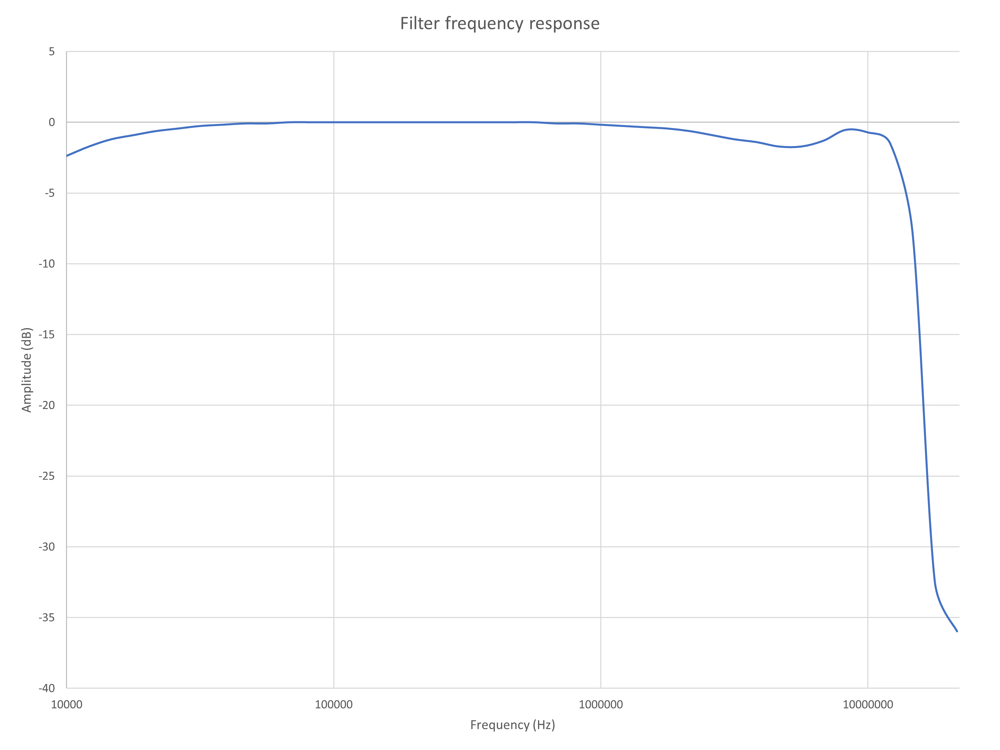

_Filter frequency response graph_

It can be seen from the graph above that the actual filter is a close match to the predicted frequency response of the theoretical filter with both the pass-band and stop-band response within tolerance of the design.  The -3dB point is approximately 13.8 MHz with a gain of less than -35 dB at the 20 Mhz Nyquist limit (against the prediction of -42 dBs).

## Analogue to Digital Converter (ADC)

The Analogue to Digital Converter accepts the incoming RF signal from the RF Amplifier stage and converts the analogue signal into a digital sample at a rate of 40 million samples per second (MSPS). 

The ADC schematic is shown in the following diagram: 

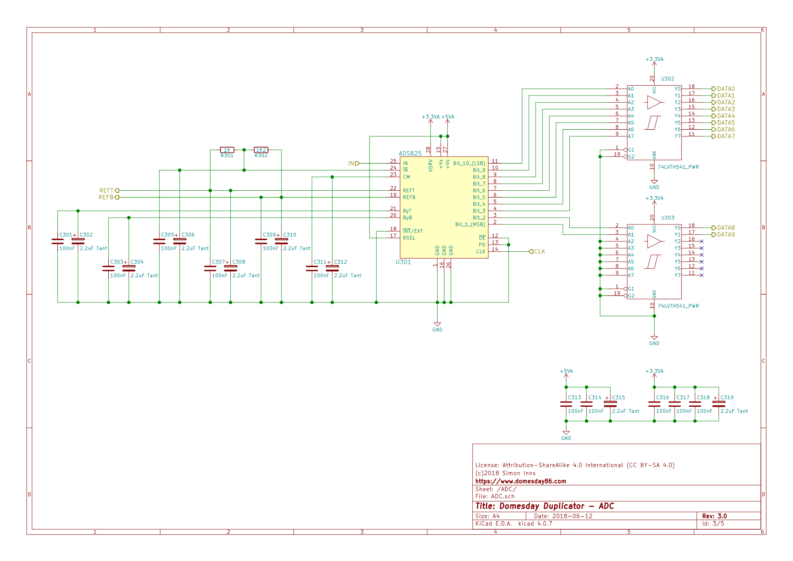

_Domesday Duplicator 3_0 - ADC Schematic_

The ADC integrated circuit is a Texas Instruments ADS825 providing a maximum sampling rate of 40 MSPS.  The Domesday Duplicator can also be used with the pin-compatible ADS826 (60 MSPS) and ADS828 (75 MSPS) however, sampling rates above 40 MSPS are not required for capturing LaserDisc RF spectra so all testing is performed with the ADS825 and other (higher speed) ADCs are not directly supported by the project (note that the RF Amplifier provides a low-pass anti-alias filter which rejects frequencies over 14 MHz - use of higher speed ADCs would require this filter to be redesigned according to the Nyquist frequency of the selected ADC). 

The ADC is highly sensitive to noise so a large number of decoupling capacitors are required to ensure power stability to the ADC.  A combination of 100nF (ceramic) and 2.2uF (tantalum) capacitors are used to provide a wide-range of noise rejection.  The ADC expects a 2V peak-to-peak input with a DC offset of 2.5 volts.  The ADS825 provides an internally generated top and bottom reference voltage that is fed to two resistors (R301 and R302) that act as a voltage divider to feed-back the required DC offset to the !IN pin of the ADC.  The ADS825 data-sheet states that the voltage divider should be symmetrical however, previous revisions of the Duplicator design have shown this configuration to provide unwanted asymmetry of the DC offset.  The values of R301 and R302 have been chosen to correct this and provide a sample which is symmetrical around the 2.5 volt DC offset used by the RF Amplifier. 

The ADC sample quality is affected by digital noise created by the digital side of the ADC.  As the ADC output is digital, noise is generated by the rapid fluctuations of energy required to create the square-wave output of data on the 10-bit data-bus.  The level of noise is affected by two main factors; namely the overall power draw on the ADC used to drive the bus and the 'reflected' signal caused by the parasitic capacitance of the data-bus traces.  In order to reduce this unwanted noise to a minimum two 74LVTH541\_PWR integrated circuits are used to buffer the data-bus.  These ICs are placed as close as possible to the ADC to reduce track length.  The buffer ICs then drive the data-bus output towards the FPGA.  This has the added benefit of correcting signal-edge overshoot and distortion, providing a cleaner digital output to the FPGA that ensures no data loss even through the (relatively) low frequency header pins used for interconnection of the Duplicator modules. 

The ADC is also powered using two separate supplies.  The analogue stages of the ADC are powered from 5 volts to provide the maximum possible swing of voltage (of 2V peak-to-peak) of the inbound RF signal.  The digital stage of the ADC is powered from 3.3 volts to reduce the required energy on the data-bus (and therefore reduce noise in the analogue stage). 

It should be noted that, even with the provided noise protection, a considerable amount of ADC clock noise is present on the inbound RF signal (and can be seen by examining the RF signal with an oscilloscope whilst the ADC is in operation).  The ADC is designed to sample the incoming RF at a point where the ADC clock interference is minimal to ensure an accurate sample.  However, when testing the RF Amplifier stage of the design, the DE0-Nano should be removed to ensure the ADC is inactive otherwise the clock noise will cause incorrect test results due to the additional noise and distortion outside of the ADC acquisition period.

## DE0-Nano FPGA

Due to the unpredictable performance of a USB 3.0 interface, an FPGA is used to act as a FIFO buffer between the ADC and the USB hardware. Although a modern PC can handle many times the bandwidth required by the application, the bandwidth is not guaranteed (since a general purpose PC is not a real-time system, other system activities can cause the available bandwidth to vary). 

The FPGA is provided by a DE0-Nano. The DE0-Nano is a low-cost FPGA development board from Terasic containing an Intel (Altera) Cyclone IV FPGA. The interconnection between the Domesday Duplicator and the FPGA development board is shown in the main schematic diagram above. 

The FPGA uses a PLL function (Phase Locked Loop) to provide a 40MHz sampling clock to the ADC as well as a communication clock to the FX3.  Both clocks are generated from the DE0-Nano's on-board 50MHz clock. Data from the ADC is collected by the FPGA into a 10-bit wide dual-clock FIFO buffer. The dual-clock FIFO buffer supports separate clock rates on both the input and output of the FIFO. The interface between the FPGA and the Cypress FX3 interface is clocked at 60MHz. This dual-clock implementation allows the USB 3.0 interface to ‘catch up’ with the ADC data collection in the event of temporary loss of bandwidth. 

In addition the FPGA changes the 10-bit unsigned FIFO output to scaled 16-bit signed data before passing the data to the USB 3.0 interface via a 16-bit data-bus. In addition to the data-bus the FPGA provides several additional control signals used to provide flow-control of the data between the FPGA and the Cypress FX3 GPIF interface. 

The data bandwidth from the FPGA to the USB 3.0 interface is typically 40 million 16-bit words per second (a data transfer rate of 610 Mbits/sec) , however this can peak at 60 million words as required (a data transfer rate of 916 Mbits/sec).  Note that a data transfer rate average of 610 Mbits/sec is approximately 73 Mbytes of data per second. 

The design provides a full 32-bit data bus between the FPGA and the FX3 and 13 control lines. Currently, only 16-bits of the data-bus is used by the software (additional data bus and control signals are provided by the board to support future expansion).

## Cypress FX3 Superspeed Interface

The USB 3.0 interface between the FPGA and the host PC is provided by a Cypress SuperSpeed Explorer development board. This board provides a Cypress FX3 SuperSpeed USB 3.0 peripheral controller. USB 3 is required due to the data bandwidth requirement of the Domesday Duplicator (USB 2.0 only provides a realistic bandwidth of around 280Mbits/sec which is too low for the application). The FX3 provides a state-machine model (called GPIF II) that handles the transfer of data from the FPGA output data-bus to the USB 3.0 interface and can run at a maximum of 100MHz (100 million words of 32-bit data per second). For the Domesday Duplicator, the FX3 is configured to use a 16-bit data-bus and the synchronous data clock is provided by the FPGA (at 60MHz). 

The Cypress Superspeed Interface schematic is shown in the following diagram: 

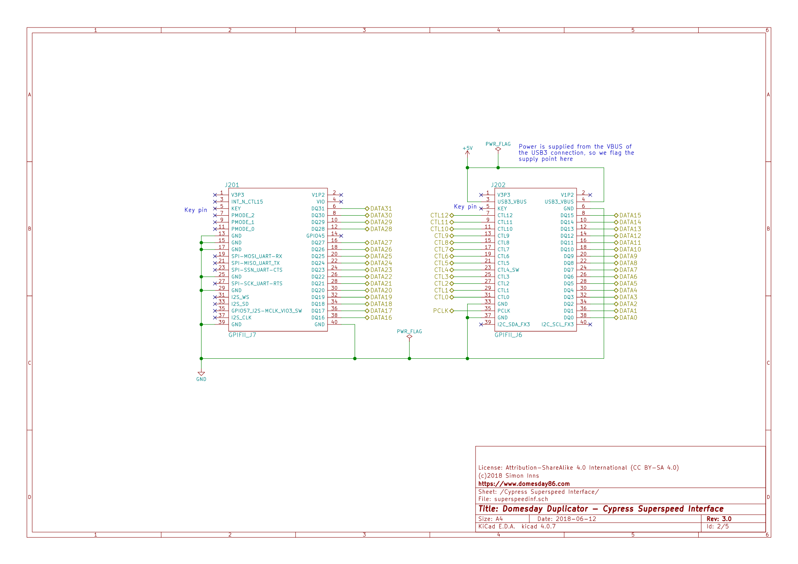

_Domesday Duplicator 3_0 - Cypress Superspeed Interface Schematic_

## Power supply
The power for the Domesday Duplicator board is sourced from the 5V supply provided by the host computer through the USB 3.0 interface on the Cypress FX3.  Although the board also supplies 3.3V, there are long traces involved when routing the power from the FX3 to the Duplicator (due to the physically stacked configuration used by the design).  Therefore the Duplicator provides local regulation of the 5V supply to 3.3V as well as smoothing and noise suppression of both the 3.3V and 5V supplies. 

The power supply schematic is shown in the following diagram: 

_Domesday Duplicator 3\_0 - Power Supply Schematic_

The 5V supply from the Cypress FX3 board is smoothed by a combination of a small ceramic capacitor as well as a larger tantalum capacitor.  Since capacitors act primarily on the voltage of the supply, an additional inductor is also included to provide additional noise suppression and smoothing of the supply current to the 5VA supply to the components and the LM1117-3.3 regulator.  The LM1117-3.3 regulator generates a 3.3V supply for the Duplicator which is further smoothed and decoupled by an additional ceramic and tantalum capacitor on the 3.3V output of the regulator.

# Board layout

The overall layout of the Domesday Duplicator PCB can be divided in to several distinct sections namely:

* Power supply
* RF front-end
* Analogue to Digital converter
* Stacked board interconnection

These sections are illustrated by the following diagram: 

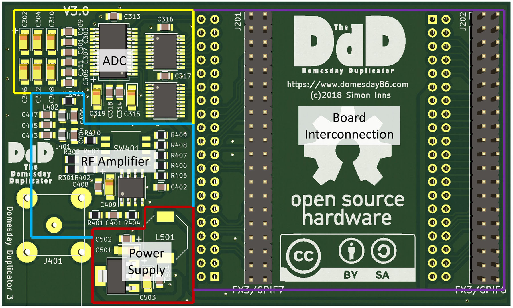

_Domesday Duplicator 3_0 board layout_

Since the RF amplifier stage is sensitive to power rail noise as well as supply fluctuations (due to the varying power requirements of the operational amplifier) the power supply and RF Amplifier are place closely together with a small area of unpopulated ground plane between the two sections.  To avoid unwanted RF interference it is also necessary to place the BNC connector as close to the op-amp input as possible.  In this configuration the RF Amplifier stage gets the maximum possible advantage from the additional decoupling and smoothing provided by the power supply. 

The amplifier, gain selection and filter sections are located to provide the minimum possible signal path length from the operational amplifier to the input of the ADC.  The RF amplifier section is also surrounded by a wide, unpopulated ground plane between the RF Amplifier section and the ADC section to help reduce possible interference and noise generated by the digital side of the ADC. 

The ADC section is located as close as possible to the digital data-bus pins connecting to the DE0-Nano to reduce the signal path length as much as possible in order to reduce noise and signal edge skew on the data-bus.  The analogue side of the ADC is closely decoupled by a number of ceramic and tantalum capacitors which are placed as close as possible to the analogue side of the ADC integrated circuit. 

Since the ADC data-bus is 10-bit, it is necessary to use 2 buffering ICs of which only one can be placed parallel to the ADC to ensure minimum track length.  The buffering ICs are placed so the more distant IC handles the two most significant bits of the ADC since these signals tend to have the lowest overall data-rates.  Both buffering chips are provided with tight decoupling to reduce overall noise. 

The board interconnection section is arranged to provide minimum length traces between the ADC and DE0-Nano as well as the DE0-Nano to Cypress FX3.  The layout of output pins from the FPGA (which are configurable in software) are arranged to provide the simplest possible board routing in order to prevent unwanted noise on the header pin connectors. 

Most of the required signal routing is provided on the top-copper board layer to allow the bottom-copper layer to provide unbroken ground plane wherever possible.  This helps to suppress noise and power instability in the design overall.

# Bill of materials (BoM)

The Domesday Duplicator revision 3\_0 PCB uses the following components (in order of suggested assembly sequence):

|**Ref**|**Qnty**|**Value**|**Footprint**|**Vendor**|**Article** **number**|
|:----|:----|:----|:----|:----|:----|
|U301|1|ADS825E|SSOP-28 5.3x10.2mm Pitch 0.65mm|RS Components|662-0082|
|U302, U303|2|74LVTH541_PWR|TSSOP-20 4.4x6.5mm Pitch 0.65mm|RS Components|662-9187|
|U401|1|OPA690|SOIC-8 3.9x4.9mm Pitch 1.27mm|RS Components|620-0082|
|U501|1|LM1117-3.3|SOT-223-3|Distrelec|300-19-198|
|SW401|1|Gain Select DIP|Switch DIPx4 W7.62mm|Distrelec|300-90-640|
|C501, C503|2|10uF TANT|B_EIA-3528-21|Distrelec|300-47-865|
|C305, C307, C301, C303, C313, C314, C316, C317, C318, C309, C311, C401, C402, C408, C502, C504|16|100nF|0805|Distrelec|300-65-839|
|C302, C304, C308, C310, C315, C319, C312, C306, C409|9|2.2uF Tant|A_EIA-3216-18|RS Components|648-0660|
|C404|1|33pF|0805|RS Components|264-4264|
|C406|1|100pF|0805|RS Components|264-4292|
|C407|1|270pF|0805|RS Components|723-6262|
|C403|1|330pF|0805|RS Components|723-6271|
|C405|1|470pF|0805|RS Components|723-6290|
|R410, R411|2|47R|0805|Distrelec|300-56-808|
|R401|1|56R|0805|Distrelec|300-56-823|
|R404|1|100R|0805|Distrelec|300-56-716|
|R405|1|200R|0805|Distrelec|300-56-755|
|R409|1|560R|0805|Distrelec|300-56-819|
|R408|1|680R|0805|Distrelec|300-56-829|
|R301, R402, R403, R407|4|1K|0805|Distrelec|300-56-717|
|R302|1|1K2|0805|Distrelec|300-56-729|
|R406|1|1K5|0805|Distrelec|300-56-740|
|L401|1|680nH|0805|RS Components|775-4726|
|L402|1|560nH|0805|RS Components|786-7087|
|L501|1|100uH|Bourns SRN8040 Series SMD|RS Components|743-5197|
|J101|1|DE0-Nano_GPIO1|Pin Header Straight 2×20 Pitch 2.54mm (female)|Distrelec|300-24-958|
|J102|1|DE0-Nano_GPIO0|Pin Header Straight 2×20 Pitch 2.54mm (female)|Distrelec|300-24-958|
|J201|1|GPIFII_J7|Pin Header Straight 2×20 Pitch 2.54mm|Distrelec|143-70-334|
|J202|1|GPIFII_J6|Pin Header Straight 2×20 Pitch 2.54mm|Distrelec|143-70-334|
|J401|1|BNC_Rosenberger|BNC Socket – Rosenberger 51K204-400A5|Distrelec|146-44-967|

# PCB Assembly

## Step 1

Mount the active components and the DIP switch on the top-side of the board (U301, U302, U303, U401, U501 and SW401). Note the orientation of the integrated circuits and DIP switch; pin 1 is highlighted with a red dot: 

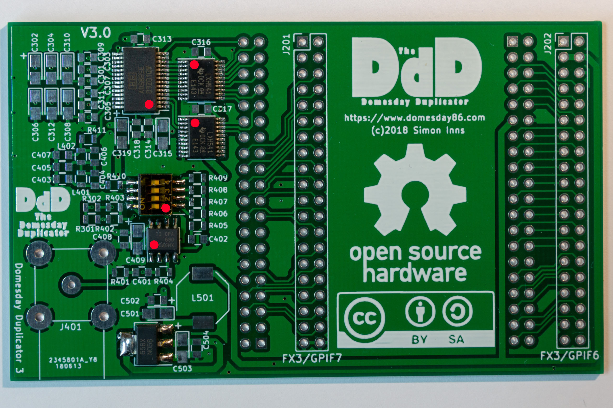 

## Step 2

Mount C501/C503 (10uF) tantalum capacitors: 

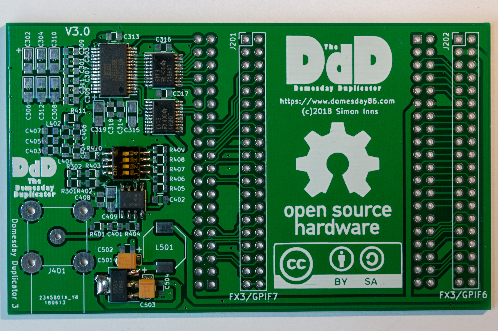 

## Step 3

Mount the 16x 100nF 0805 capacitors (C305, C307, C301, C303, C313, C314, C316, C317, C318, C309, C311, C401, C402, C408, C502 and C504): 

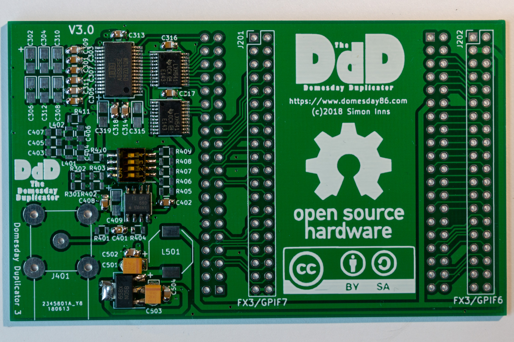 

## Step 4
Mount the 9x 2.2uF tantalum capacitors (C302, C304, C308, C310, C315, C319, C312, C306 and C409): 

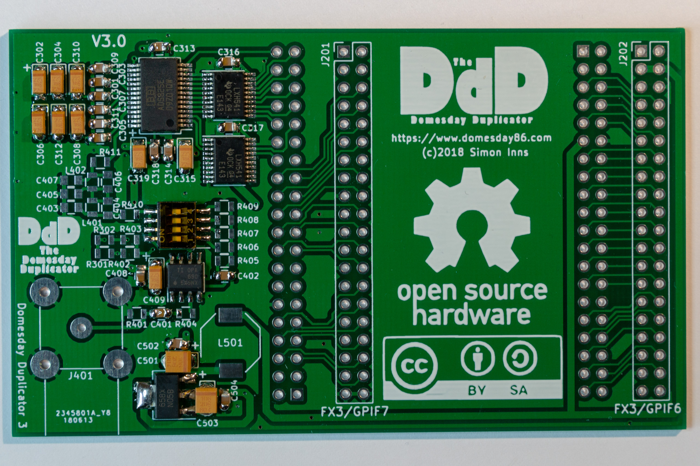 

## Step 5

Mount capacitors C404 (33pF), C406 (100pF), C407 (270pF), C403 (330pF) and C405 (470pF): 

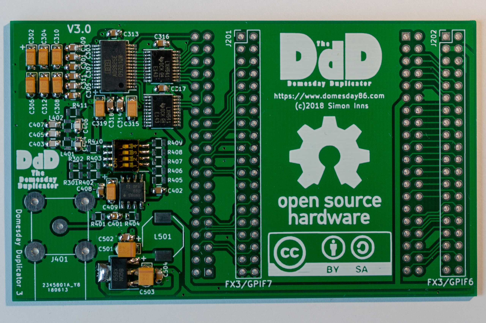 

## Step 6

Mount resistors R410/R411 (47R), R401 (56R), R404 (100R), R405 (200R), R409 (560R), R408 (680R), R301/R402/R403/R407 (1K), R302 (1K2) and R406 (1K5): 

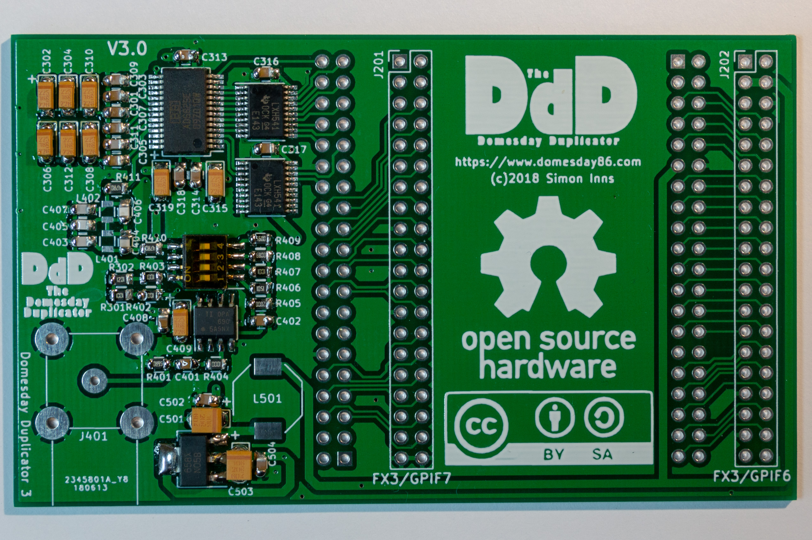 

## Step 7

Mount inductors L401 (680nH), L402 (560nH) and L501 (100uH): 

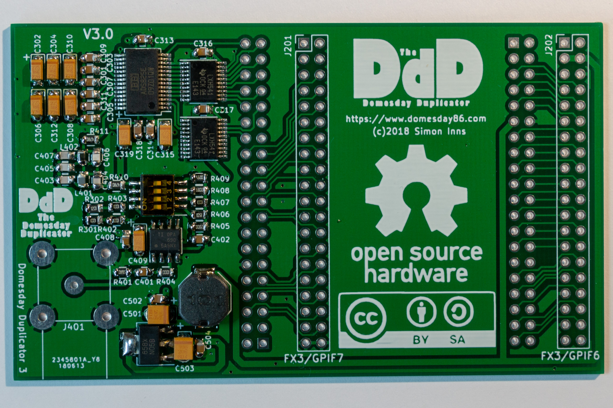 

## Step 8

Mount the header pins (male on the top-side and and female underside). Pin 3 of the male headers must be removed to allow insertion into the Cypress FX3 board which is keyed (it’s easiest to do this before soldering the header onto the board): 

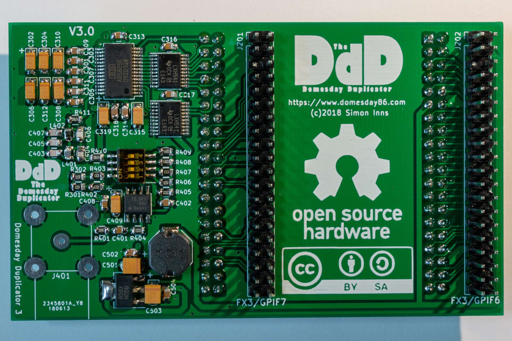 

## Step 9

Mount the BNC connector: 

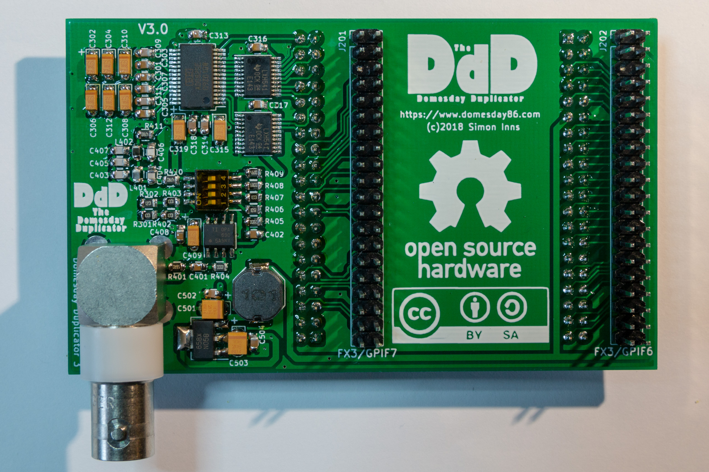 

## Step 10

Insert the Domesday Duplicator into DE0-Nano FPGA development board being careful to correctly align the header pins. The board is orientated with the USB programming connector on the same side as the duplicator’s BNC connector. 

## Step 11

Insert Cypress FX3 Superspeed development board onto Domesday Duplicator being careful to align the pins correctly. Note that pin 3 on either header is keyed and the FX3 board will only insert with the USB 3 connector to the rear of the duplicator: 

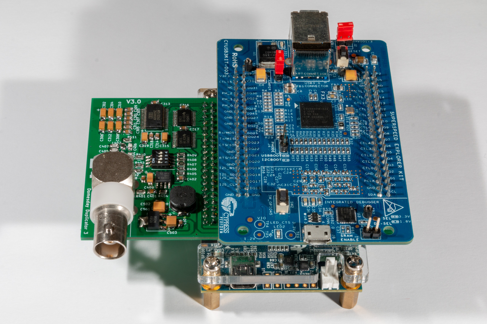 

## Step 12

You will now need to program both the FPGA and FX3. Please see the [software guide](../Misc/Software-Guide.md) for details.

# RF Cables

The Domesday Duplicator is designed to work with a 50 Ohm impedance source (such as the RF output from a Pioneer LD-V4300D LaserDisc player). The BNC connector on the duplicator is rated for 50 Ohms and a 50 Ohm BNC cable should be used to connect the player to the board. To prevent unwanted noise this cable should be as short as practically possible (i.e. 1m). 

Note that the input is not video, therefore 75 Ohm video cables should not be used.

# DC offset

Due to the design of the duplicator a DC-offset must be applied to the incoming RF signal before the op-amp stage of the RF front-end.  This is necessary as the op-amp operates in a range of 0V-5V requiring the offset to be as close to 2.5Vs as possible (in order to provide the maximum range and sensitivity of the ADC).  The ADC also requires the same DC offset on the not IN pin when acting in a single-ended configuration.  This set-up provides efficient use of external components however, since the DC offset is generated separately for the op-amp and ADC there is slight variance in the offset that can cause the sampled signal to be slightly shifted (due to the accuracy of the resistors used).  To compensate for the majority of the DC offset variance the revision 3\_0 board contains two additional resistors (R301 and R302) that provide the reference offset to the ADC.  These resistors must be matched with the DC offset of the op-amp output – therefore an asymmetrical voltage divider is used (i.e. the values of R301 and R302 are not the same).  The level of variance in the DC offset will vary slightly from board-to-board (due to the 1% tolerance of the resistors).  The following data shows a typical variance of a board:

* Voltage at ADC IN pin: 2.480V
* Voltage at ADC !IN pin: 2.509V
* Total variance: -0.029V (-29mV)

