# LDV4300D Calibration

# Preface
This article covers the mechanical calibration of the Pioneer LD-V4300D LaserDisc player based on the service manual and including a wealth of additional material and information.  Note that this article does not cover the electrical calibration steps (page 119 of the original service manual) – only the mechanical calibration.

The Pioneer LD-V4400 is an NTSC only variant of the LD-V4300D (they are the same players with different power supplies and firmware). Therefore these calibration instructions are suitable for the LD-V4400 too - as the calibration disc is NTSC, the procedure is exactly the same.

There is, of course, no guarantee that the calibration steps suggested here are correct.  You should note that attempting to calibrate a LaserDisc player can not only cause the player to stop functioning, it can also damage the player (and even you, since the 240V/110V voltages in the exposed power supply are potentially deadly).  Proceed with calibration **at your own risk** and ensure you have studied the details of each step (and understood the requirements) before attempting on a player.  If you are unsure, don’t have the required equipment or don’t have the required electronics skills – **do not attempt to calibrate your player**.

The laser in a LaserDisc player produces an intense but invisible beam of infrared light. Under no circumstances should you stare directly into the lens of the player whilst it is powered up. Always ensure the test disc is in place when the player is powered up and avoid standing over the player looking directly down at it. Please ensure you study the dangers of working with lasers before attempting to open a LaserDisc player or attempting calibration.

# Introduction
## Required materials
In order to calibrate the player the following items are required (in addition you will need an ESD safe work-space and access to standard tools such as screwdrivers, hex-wrenches etc.):

* Dual-channel Digital Storage Oscilloscope (DSO) with at least 20MHz of bandwidth
* Arbitrary Waveform Generator (AWG) capable of generating a 4KHz sinewave
* A Pioneer GGV1069 NTSC 8" calibration and test disc
* Pioneer CU-V113A LaserDisc IR remote control
* RM Series RMC12010 3rd-party Pioneer service IR remote
* Either a calibration breakout board (see below) or the required test-header connecting cables and components (100K resistor and 1uF unpolarised capacitor)
* A monitor/TV capable of displaying NTSC video along with the required interconnecting cables for video and audio

Nearly all calibration steps require connection between the player and an oscilloscope (some steps require connection to both the DSO and AWG). In addition, some steps also require simple filtering components in the measurement path. To make these steps easier there is a calibration board design [available on Github](https://github.com/simoninns/LD-V4300D-Service-Adaptor) including the required Gerber files for PCB production. The following schematic shows the contents of the board:

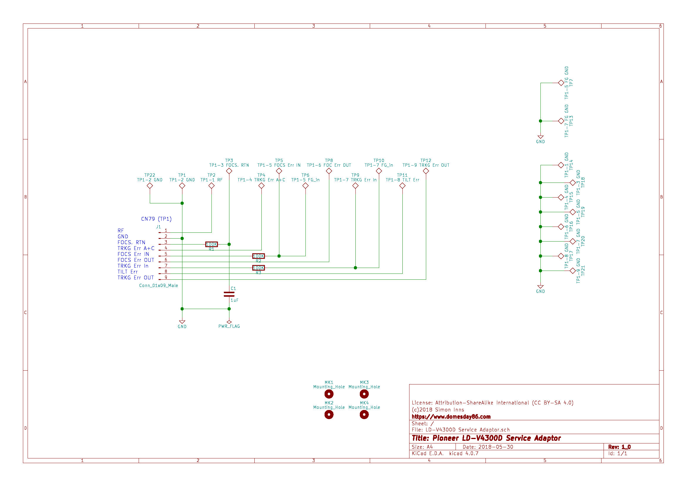

_LD-V4300D Service Adaptor schematic_

The following picture shows the calibration board attached to the correct header of the player:

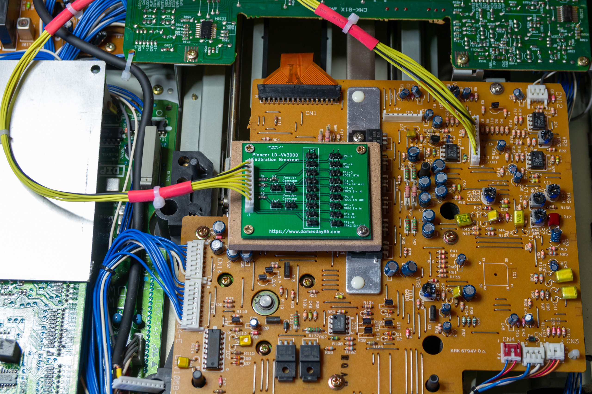

_The calibration board attached to the correct test header_

## Disassembly of the player
To disassemble the player ready for calibration first remove the two screws located on the back of the player:

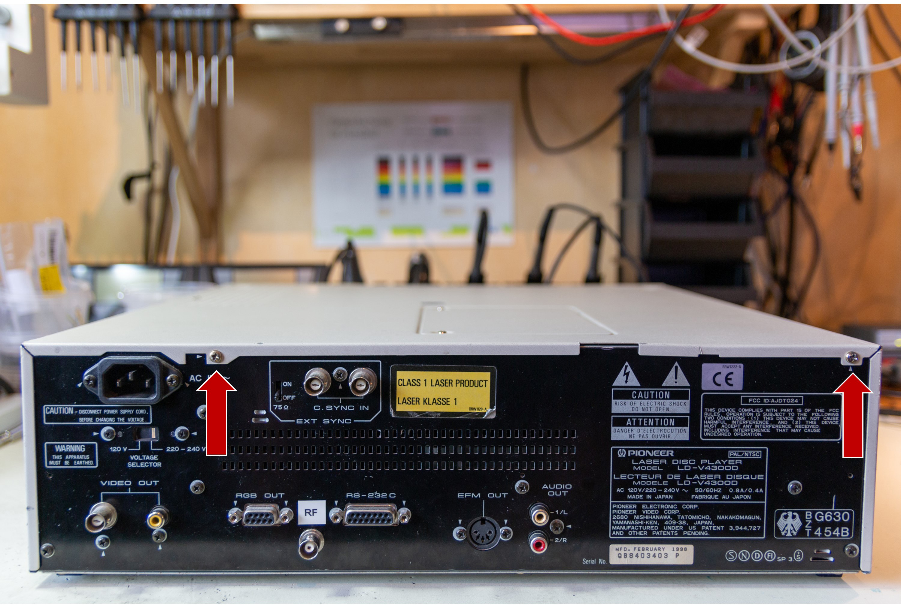

_Remove the two case screws located on the back of the player_

Next remove the 6 screws at the sides of the case (3 on each side) as shown in the following picture:

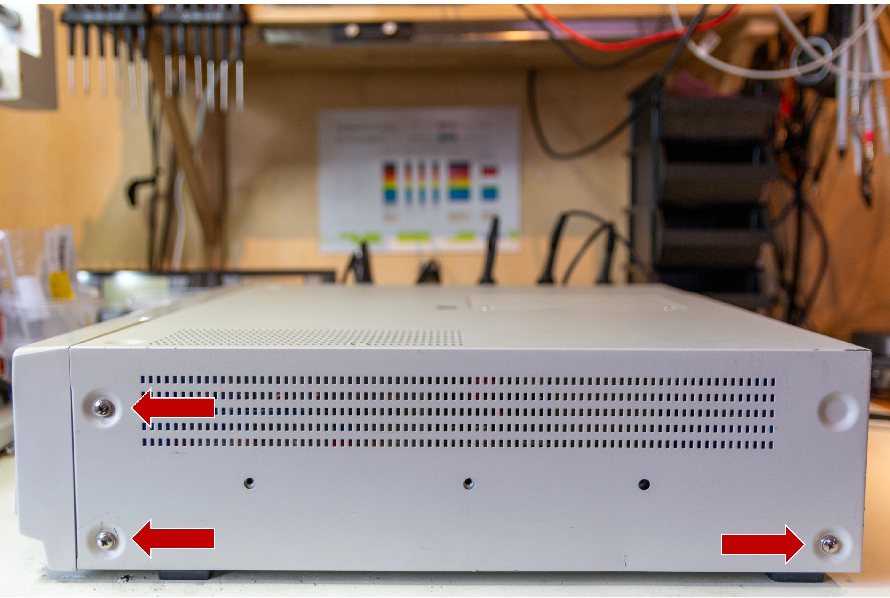

_Side case screws_

Once the screws are removed, take off the top cover by prying it gently from both sides at the back, then lift the back of the case pivoting on the front. Once lifted, remove the top case by lifting it out towards the back of the player.

Now flip the player over onto it's top and remove the 6 screws holding in the bottom case plate as shown in the following picture:

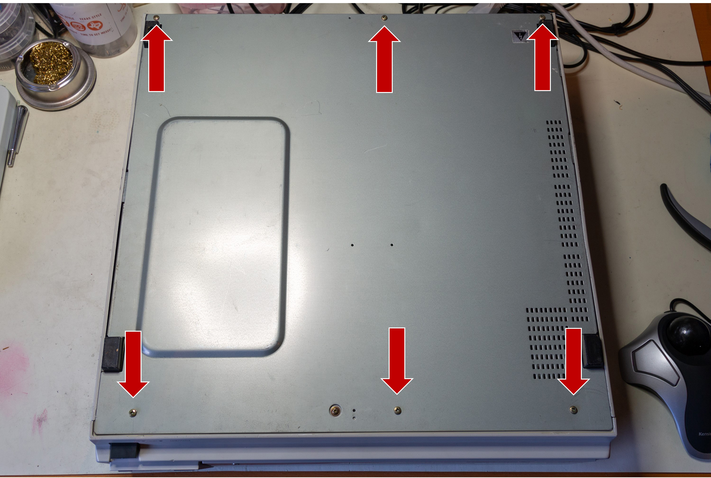

_Removing the bottom case plate_

Once the screws are removed the plate should lift easily off the player.

Next flip the player back over, power up and eject the disc tray (be very careful of the live power supply when operating the player without a case!). Once the tray is ejected remove the three screws and the plastic plunger indicated in the following picture:

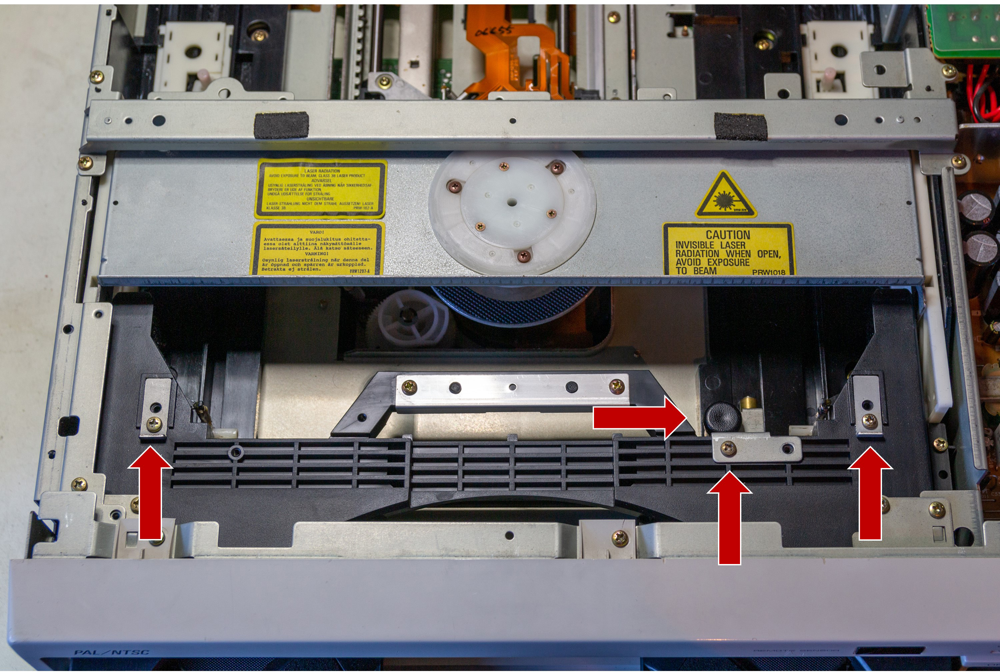

_Removing the disc tray_

Once the screws are removed take the metal mounting brackets completely out of the player. Then pull the disc tray gently to remove it completely from the player.

## Verifying the lens condition
The lens of the player should be clean and scratch free and should be checked before calibration (if the lens is damaged, calibration will not be possible). Check the lens by examining it under a microscope or using a strong magnifying glass. A clean undamaged lens is shown in the following picture:

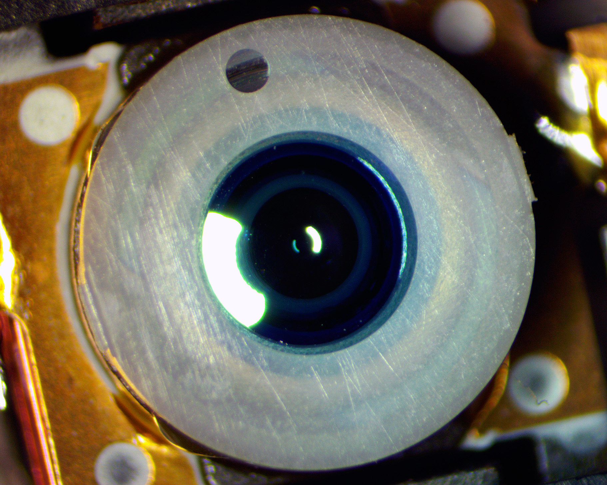

_A clean, undamaged lens_

If there are any scratches visible on the lens surface the lens will required replacement before calibration. Although calibration may be possible, a damaged lens will severely effect the player's noise levels causing poor playback. The following picture shows an example of a lens which has been damaged by spinning debris during use:

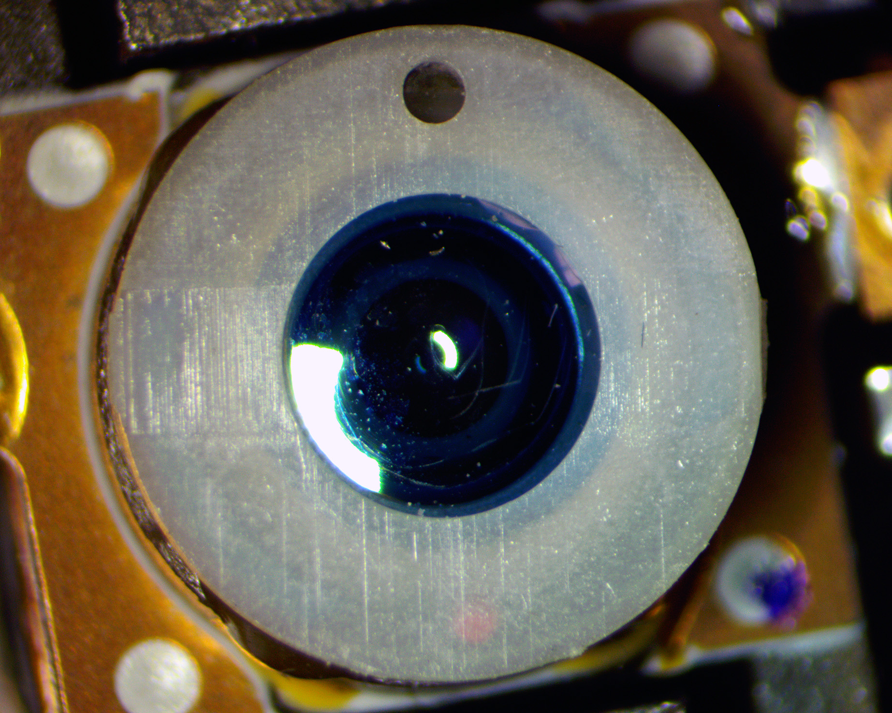

_A damaged lens_

## Inserting the test disc
As the is no disc tray during calibration it is necessary to insert the test disc (GGV1069) by hand.

Insert the disc from the back of the player as shown in the following picture whilst being careful not to touch the disc's surface on the mechanics of the player:

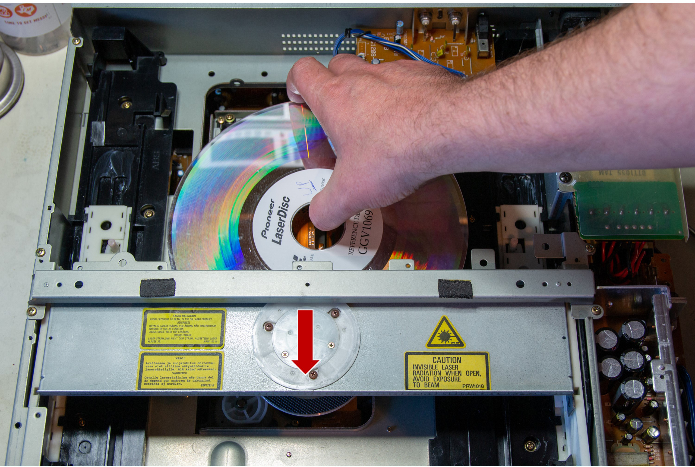

_Inserting the test disc into the player_

Once the disc is in place on the player's spindle push up the two white levers to clamp the disc in place as shown in the following picture:

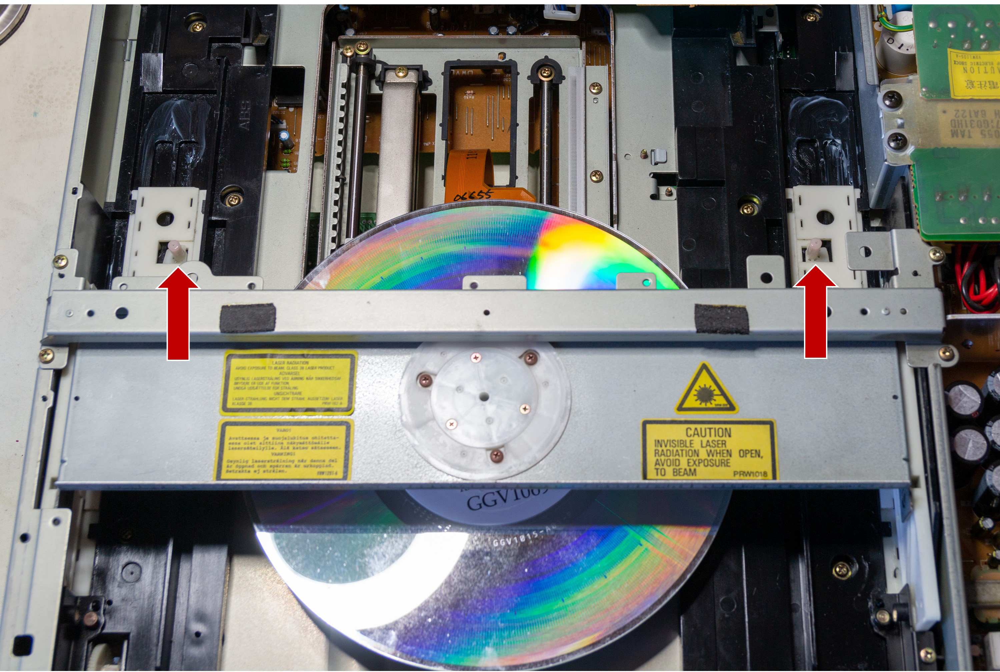

_Clamping the disc in place_

Once clamped, the disc should be able to rotate freely on the spindle. Note that, when the player is first power up (with the disc tray removed) the player will think that the tray is ejected and attempt to load the tray. This should be stopped by briefly pressing the tray closed microswitch at the back-right of the player (under the external sync board).

## Placing the player in test mode
To place the player in test mode power up the player as normal, then press the ESS button (on the RMC12010 remote) followed by the TEST button. This will place the player in test mode. Pressing TEST once more will place the player in diagnostic mode. Pressing the DISPLAY button twice on the player's front-panel will return the player to normal playback mode. It is also possible to enter test mode by holding DISPLAY on power up or by using a jumper on the main processor board of the player - since the remote can be used it is recommended to use it instead of the other methods.

## Lifting the player during calibration
Many of the adjustments require you to access the underside of the player to reach the adjustment screws and potentiometers.  When the player is horizontal on the workbench lift from the left side of the player so the power supply (on the right) is on the bench when the left side is raised.  This lowers the chances of you putting your fingers into the live power supply during calibration.  Putting your fingers inside the power supply during testing will lead to a very quick end to your adventures in player maintenance and repair.  **Be very careful of the power supply at all times**.

It is also possible to lift the player by simply suspending it between two boxes; this reduces the need to lift the player during calibration.

## Location of calibration potentiometers
There are 9 calibration potentiometers located on the FTSB module which are required for the mechanical calibration. The potentiometers are numbered from 1-9. The location of the potentiometers is shown in the following picture:

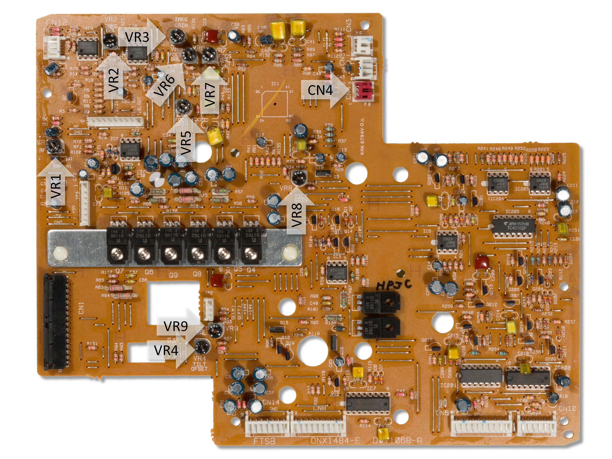

_FTSB Module calibration points_

The functions of the calibration potentiometers are as follows:

* VR1 – RF Gain
* VR2 – Tracking Balance
* VR3 – Tracking Gain
* VR4 – Tilt Offset
* VR5 – Focus Gain
* VR6 – Focus Balance (maximum)
* VR7 – Focus Balance (normal)
* VR8 – Tilt Gain
* VR9 – Tilt Balance

The potentiometers are generally fixed in place (at the factory) by heating a small point on the side of the potentiometer. In order to adjust you will need to use a small sharp knife to ensure the rotational part of the potentiometer is free of the base. Carefully slice across the melted point until the knife slides slightly under the top (black) part of the potentiometer. Once freed you can use the melted spot as a marker to place the potentiometer back to it's factory set position before beginning calibration.

# Calibration steps
**READ THIS FIRST**: If you are not experienced in calibrating LaserDisc players it is recommended that you first read through every step paying close attention to any warnings. Then dry-run the calibration steps by performing all of the measurements (and ensuring you understand how to take them) before finally running through the calibration and making adjustments. It is very easy to damage a player due to poor attempts at calibration.

**READ THIS SECOND**: Before attempting calibration ensure that the lens of the LaserDisc player is clean and unscratched. The lens should be carefully examined (preferably using a good microscope) and then cleaned with optical lens cleaning material such as 'OpticPrep' - absolutely **DO NOT** use materials such as cotton buds or any type of Q-Tip - you **WILL** damage the lens.

## Step 1 - Tilt gain adjustment
Note: All calibration steps should be performed with the test disc in place and the player in test mode unless otherwise noted.

### Purpose
The tilt sensor is a small photodiode located to the right of the lens which detects the proximity of the assembly to the LaserDisc. When manufactured the tilt sensor is given a 'gain rank' indicated by a coloured dot on the tilt sensor PCB as shown in the following picture:

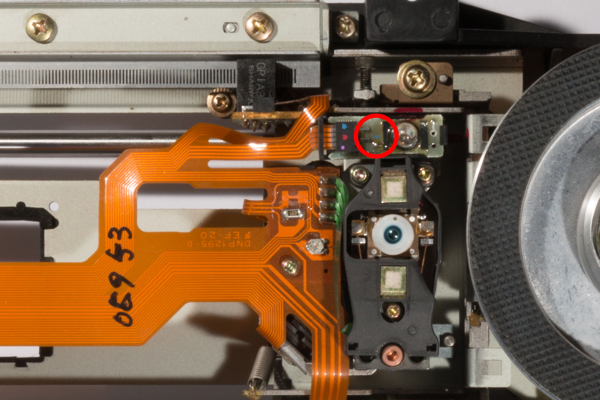

_Tilt gain dot location_

The presence and colour of the dot indicates the rank of the sensor.

### Procedure
Move the optical deck from under the test disc using the SCAN FWDs button on the RMC12010 until the tilt sensor is visible (note it is also possible to simply move the deck by hand - do this from the left-hand side of the deck without touching the lens or tilt sensor).

Note the colour of the dot located on the tilt sensor as shown above.

Lift the player onto it's side and adjust VR9 to its mechanical centre (simply swing the potentiometer both ways and then put it in the centre of the two extremes).

If the sensor has a red dot, turn VR8 fully clockwise. If the sensor has a blue dot turn VR8 fully anti-clockwise. If the sensor has no dot, turn VR8 to it's mechanical centre point.

## Grating temporary adjustment
### Purpose
The laser diffraction grating is an optical component responsible for splitting the laser beam and must be correctly aligned to ensure the laser output (at the lens) is correct. Incorrect setting can cause playback to be impossible or can make the player jump tracks randomly during playback.

**CAUTION**: This adjustment will make all other adjustments incorrect - if you alter the grating you will need to perform a compete calibration. If you are inexperienced at calibration **avoid** this step unless all other calibration steps fail to bring your player to an acceptable performance level. Generally the fine adjustment of the grating (later in the process) will be enough to fully correct this setting and course adjustment is not necessary.

The adjustment of the laser grating is rotational and is adjusted using a small V shaped lever on the optical assembly as shown in the following picture (the red line shows the neutral point of the adjustment):

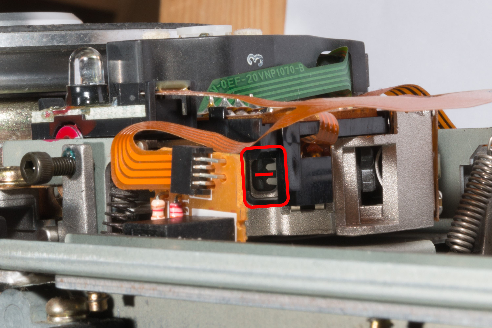

_Grating adjustment screw_

The only way to examine the adjustment point (if you would like to see the alignment before making any adjustments) is to remove the optical assembly from the player (see the service manual for details of how to do this) - this is not required for calibration however.

**CAUTION**: If you haven't performed this calibration step before it is recommended to remove the optical deck and get a good look at the calibration point before reassembling and adjusting. It can be very difficult to get a 'feel' for the adjustment without making yourself very familiar with the construction and shape of the adjustment point. If in doubt, skip this calibration step.

Note that this adjustment can effect the pick-up tracking calibration (see below) - so, if the calibration is very inaccurate, it may take several back-and-forth adjustments between these steps to achieve a satisfactory result.

### Procedure
Connect channel 1 of the oscilloscope to TP1-9 (TRKG error). Set channel 1 to DC 500 mV/div (vertical) with 5 mS/div (horizontal).

Ensure that the tracking is open (press STILL/STEP FWD on the RMC12010), tilt is off (SPEED- on the RMC) and Focus Balance is 0 (MULTI-FWD on the CU-V113A remote).

Press the play button on the front-panel to start the disc playing and move the deck to around frame 20,000. Once in place, lock the optical deck using the plunger (press the red power button on the RMC). Note that you may need to move the optical deck slightly to cause the plunger to lock.

To adjust the grating you will need to insert a small flat-bladed screwdriver into the adjustment point as shown in the following picture:

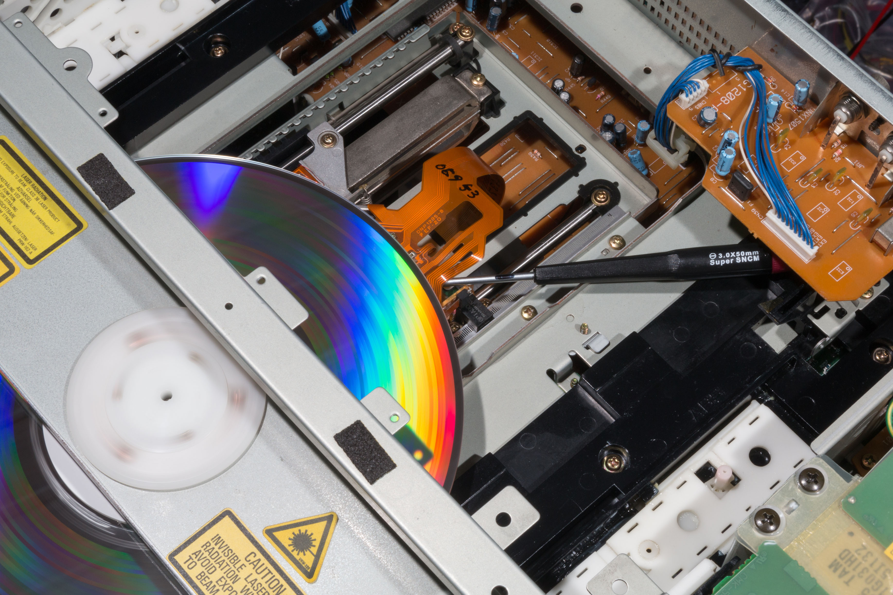

_Laser grating adjustment - with the screwdriver in place_

Mark the shaft of the screwdriver to show when the blade is parallel to the deck (since adjustment should start from that point). This will help you to insert the screwdriver into the adjustment point with the correct orientation. If you don't follow this advice you may potentially **snap and damage the adjustment point.**

Note that the adjustment of the grating requires **very little** rotation of the screwdriver - ensure that the screwdriver is correctly engaged with the lever and do not use any force (or you will break the lever). The adjustment usually requires just slight pressure on the adjustment point rather than twisting. If you apply twisting pressure and nothing happens, your screwdriver is not correctly engaged.

The adjustment is performed in two steps. Firstly the adjustment point should be rotated (either clockwise or anticlockwise) to find the 'on-track' position where the peak-to-peak amplitude of the average wave is as small as possible. Once the on-track position is found the adjustment lever should be rotated anti-clockwise until the waveform has the highest achievable peak-to-peak amplitude.

The following video of the oscilloscope output shows the initial setting of the on-track position followed by the final setting of the maximum amplitude position:

[Link to video](https://lbry.tv/$/embed/Pioneer-LD-V4300D-Grating-temporary-adjustment/d9a2f74fbabfcd7c6cb77bc3766c60fde38d3d25)

Once the grating is adjusted select focus balance 1 (MULTI-REV on the CU-V113A remote). Raise the player on it's side (to access the potentiometers) and then adjust VR6 until the amplitude of the waveform is the maximum possible amplitude (this will generally be at or near the mechanical extent of the potentiometer). Once adjusted the wave form should resemble the following picture:

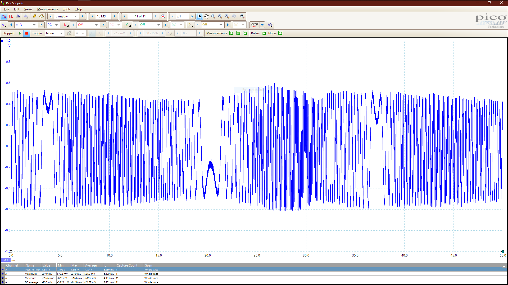

_Waveform after VR6 adjustment_

After calibration is complete unlock the plunger (using PAUSE on the RMC) and press the stop button on the front-panel to stop the player.

**Note**: If the maximum possible peak-to-peak of the tracking waveform (after the temporary grating adjustment) is below 1V-PtP then it's likely that the tracking angle adjustment screw is very poorly aligned (the signal should be around 1.2V-PtP). If this is the case set the player up as per the instructions above, but move the deck to around frame 100-1000. Next place the player on it's side and turn the tracking adjustment screw (see pictures below for the location of this screw) until the waveform amplitude increases (if it decreases, turn it the other way). The waveform amplitude will get greater until a certain point when it starts to decrease again. When you find this point, turn the adjustment back again to reach the maximum and then repeat the grating temporary adjustment again. Once the tracking adjustment is corrected you can fine tune the maximum amplitude by adjusting the tangential adjustment using the same technique. You **must** repeat the temporary grating adjustment after modifying the tracking and tangential angles if you performed this step.

## Tracking balance adjustment
### Purpose
The tracking balance adjustment sets the offset voltage for the tracking control. Tracking servo adjustment in both directions should be equal so, for maximum tracking performance, the centre-point of the tracking signal should be 0V (ground).

### Procedure
Connect channel 1 of the oscilloscope to TP1-9 (TRKG error). Set channel 1 to DC 1V/div (vertical) with 5 mS/div (horizontal).

Ensure that the tracking is open (press STILL/STEP FWD on the RMC12010), tilt is off (SPEED- on the RMC) and Focus Balance is 0 (MULTI-FWD on the CU-V113A remote).

Press play on the front-panel to begin playing the disc. Once an image is displayed raise the player on its side to access the calibration potentiometers.

Adjust VR2 until the maximum positive amplitude and maximum negative amplitude are equal (i.e. the waveform is centred on ground). The waveform after adjustment can be seen in the following picture:

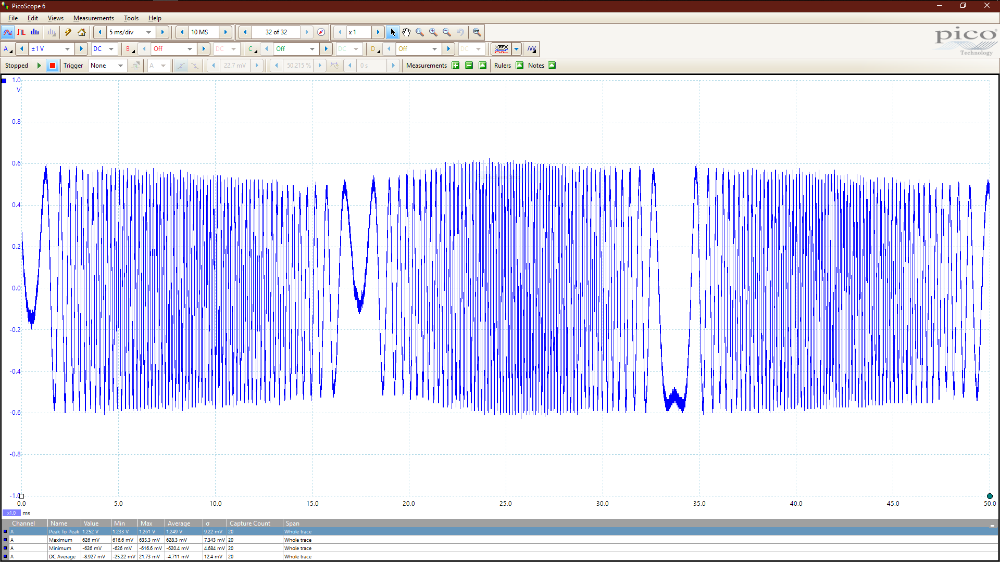

_Waveform after VR2 adjustment_

After calibration is complete press the stop button on the front-panel to stop the player.

## Pick-up height adjustment
### Purpose
The pick-up height adjustment screw changes the physical height of the laser pick-up (i.e. the average distance between the lens and the disc). The height should be adjusted to provide the maximum movement of the focus servo without the lens contacting the disc's surface for optimal performance.

If this setting is incorrect the lens may collide with the disc and playing warped discs will be impossible.

### Procedure
**Note**: If you are not using the calibration break-out board suggested above you will need to connect a low-pass filter between the test-point and the oscilloscope as shown in the following diagram:

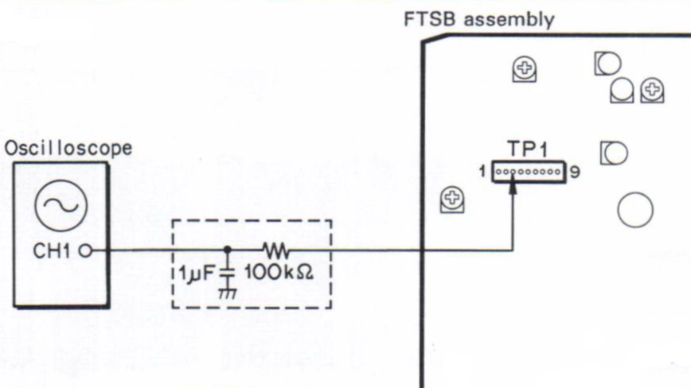

_Focus return low-pass filter_

The position of the pick-up height adjustment screw is shown in the following picture:

_Pick-up height adjustment screw_

Note that turning the screw clockwise lowers the height of the pick-up and anti-clockwise raises the height.

Connect channel 1 of the oscilloscope to TP1-3 (FOCS RTN). Set channel 1 to DC 500 mV/div (vertical) with 5 mS/div (horizontal).

Ensure that the tracking is open (press STILL/STEP FWD on the RMC12010), tilt is off (SPEED- on the RMC) and Focus Balance is 0 (MULTI-FWD on the CU-V113A remote).

Press the play button on the front-panel to start the disc playing and move the deck to around frame 10,000. Once in place, lock the optical deck using the plunger (press the red power button on the RMC). Note that you may need to move the optical deck slightly to cause the plunger to lock.

Raise the player onto it's side and use a 2mm hex-wrench to adjust the pick-up height adjustment screw shown until the signal level shown by the oscilloscope is within 10mV (plus or minus) of 0V (ground). If your oscilloscope features a DMM (Digital MultiMeter function) or can measure the average DC level, use that setting to assist.

Once adjusted, lower the player to the horizontal position again and verify that the level is still correct (if not, repeat the process). Once adjusted the oscilloscope trace should look similar to the following picture:

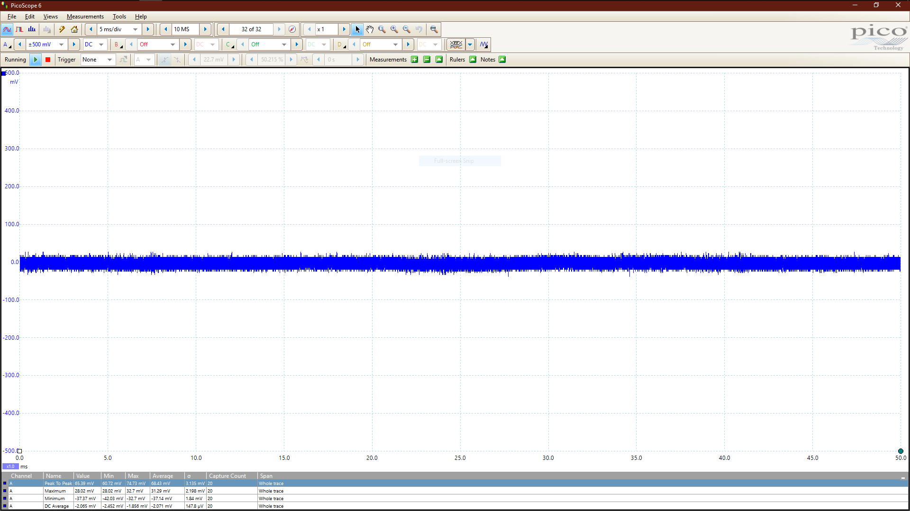

_Signal level after pick-up height adjustment (note DC average measurement)_

After the adjustment is complete unlock the plunger (using PAUSE on the RMC). Next confirm that the pick-up track is level by moving the deck to frame 22,000. If the signal level isn't within +-10mV of ground, use the tilt up and down controls (CHAPTER SKIP FWD and CHAPTER SKIP REV) on the RMC and ensure it is possible to bring the signal to the correct level. Repeat the same test at frame 115.

If it is not possible to get the correct signal level across the disc then something has not been adjusted correctly. Repeat all of the calibration steps again until the test is successful.

## Tracking and tangential direction inclination adjustment
### Purpose
This adjustment sets the roll and yaw angles of the pick-up in relation to the disc and ensures that the laser is perpendicular to the disc. If the angle of the pick-up is incorrect the laser will be off-track which usually results in excessive cross-talk (as the laser is picking up information from the adjacent track as well as the current track). If the alignment is extremely bad, it may not be possible to play a disc at all (in this case your only hope is to slowly move the adjustment points until the player functions).

**Note**: Incorrect setting of the temporary grating adjustment can also cause this calibration step to fail.

The calibration uses 3 adjacent frames on the test disc (114, 115 and 116). These frames contain a black bar on a white background, on the left, in the middle and on the right. When the tracking angle adjustment is out the bar from the frame on either side of the centre frame will 'bleed' into the picture showing the cross-talk. When the tangential adjustment is out the laser will not hit the disc at a right angle causing the frame RF to be weak (resulting in a more fuzzy picture). Therefore the tracking angle is usually the primary adjustment with the tangential angle acting as 'fine tuning'.

### Procedure
Connect the LaserDisc player to a monitor or TV capable of displaying NTSC video. The connection should be made using the composite (RCA plug) output from the player. Adjust the contrast and brightness of the monitor to around 75% (this will make it easier to see the cross-talk). Ensure that the screen of the monitor is clean.

Press play on the front-panel to start the disc playing and then close the tracking servo loop using the STILL STEP/REV key on the RMC. Enter 115 on the RMC and press the yellow SEARCH key to move to the correct frame.

**Note**: If the player cannot search to the required frame slowly adjust the tracking angle until the player performs correctly and then try again. If it isn't possible to get the player to search to frame 115 then it may be necessary to repeat all the calibration steps paying attention to the temporary grating adjustment especially.

When adjusting start with the tracking angle screw and move it small amounts at a time, when the output is close to correct use the tangential screw to fine tune the output. The following picture shows the location of the adjustment screws (note that the bottom screw is the Tangential adjustment and the top screw is the Tracking adjustment):

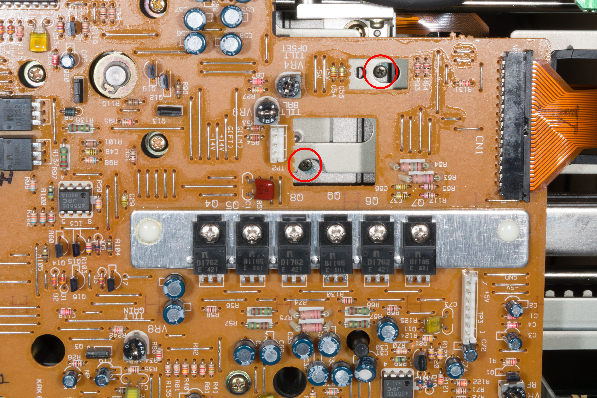

_Tracking and Tangential angle adjustment screws_

The aim with this adjustment is to remove as much as the crosstalk interference as possible (even if it's not possible to completely remove all crosstalk, the interference should be symmetrical on both sides). The crosstalk will appear on the left or the right of the central bar as shown by the following diagram:

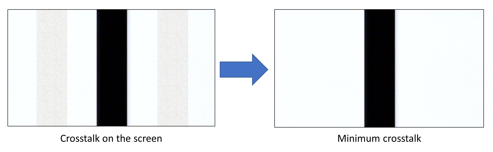

_Location of crosstalk within frame 115_

The following picture shows an incorrectly adjusted player exhibiting cross-talk on frame 460 (note this image has been over exposed to make the crosstalk area easier to see as the effect can be quite subtle on a real monitor). Note that frame 115 is a black bar on a white background - frame 460 is used as it's easier to see here:

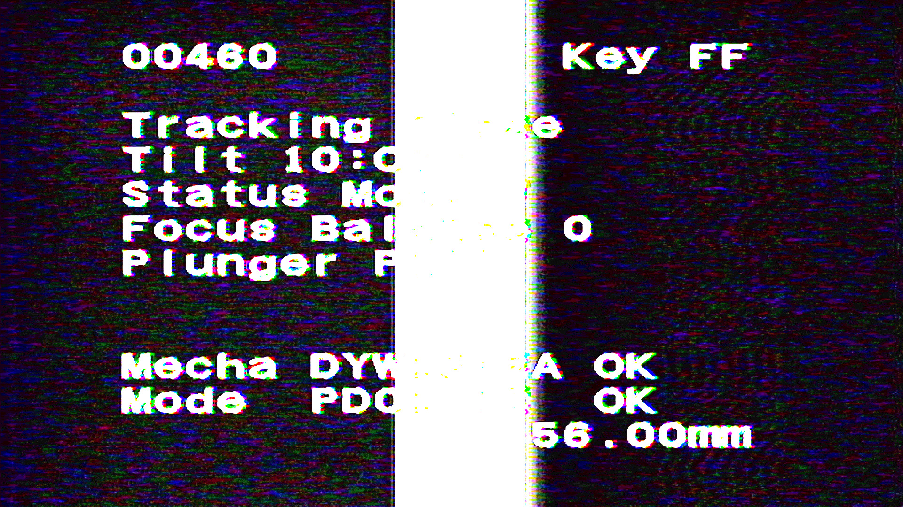

_Exposure enhanced frame showing crosstalk_

The crosstalk is the wavy pattern visible on the right-hand side of the frame (this is frame 460).

The following picture shows a correctly adjusted player displaying frame 460 after crosstalk adjustment:

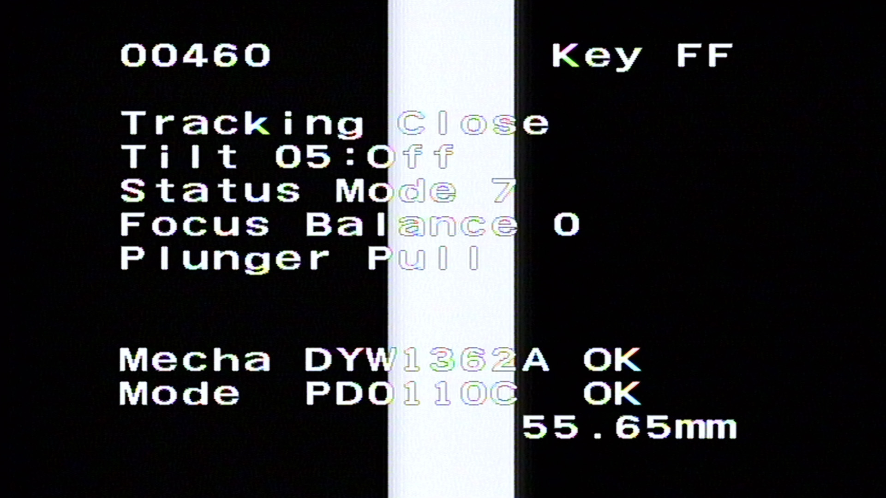

_Frame 460 after crosstalk adjustment_

Once adjustment is complete search for frame 460 (which is the inverse of 115) and verify the cross-talk again. Certain conditions are easier to see if you use both 115 and 460 for adjustment.

## Focus error balance adjustment
### Purpose
The focus error balance sets the lens in the optimal position within the focus servo's range so it works correctly across the whole disc (with the tilt adjustment functioning).

### Procedure
Connect channel 1 of the oscilloscope to TP1-9 (TRKG ERROR). Set channel 1 to DC 1 V/div (vertical) with 5 mS/div (horizontal).

Note: With a focus balance of "1" VR6 sets the focus balance amplitude with maximum trigger error. With a focus balance of "0" VR7 sets the focus balance amplitude with normal error.

Connect the LaserDisc player to a monitor or TV capable of displaying NTSC video. The connection should be made using the composite (RCA plug) output from the player. Adjust the contrast and brightness of the monitor to around 75% (this will make it easier to see the cross-talk). Ensure that the screen of the monitor is clean.

In test mode, press the play button on the front-panel to start the disc playing and move the deck to around frame 1,000 (with the tracking servo open). Set the focus balance to 1 (MULTI-REV on the CU-V113A remote). Ensure that the tilt function is off and that the tilt value is around 0F-10 (use the tilt up/down controls on the RMC to adjust - CHAPTER SKIP REV/FWD) Write down the peak-to-peak level of the waveform (this is the current maximum amplitude of the error signal set by VR6) and note that this is the "A" measurement.

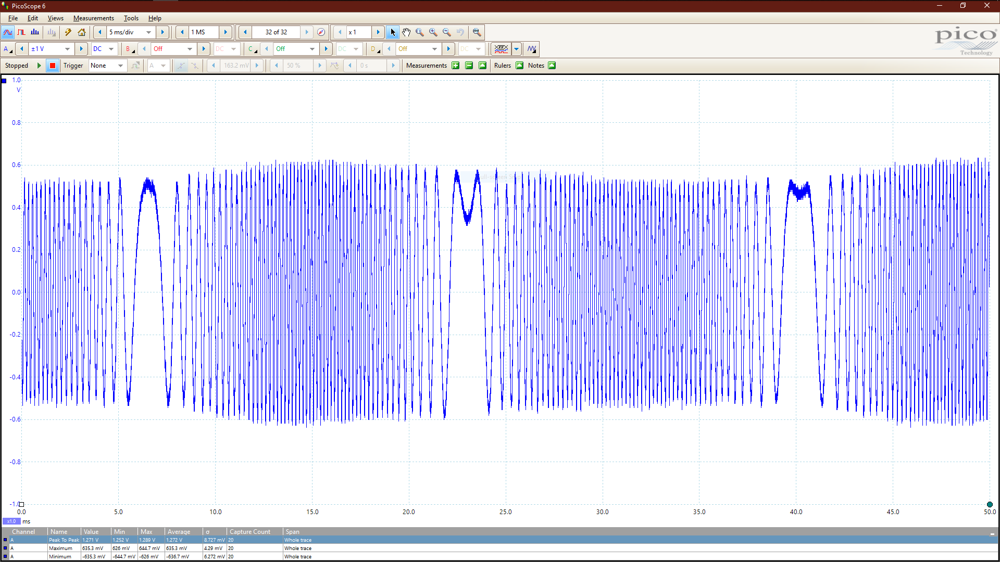

_Example of the A measurement (1.27V PtP)_

Now close the tracking servo loop using the STILL STEP/REV key on the RMC. Next, set focus balance to 0. Enter 115 on the RMC and press the yellow SEARCH key to move to the correct frame.

If crosstalk is observed adjust VR7 until the crosstalk is minimized. Now ensure the tracking servo is open and focus balance is still set to '0' and move the deck to around frame 1,000 (so the oscilloscope shows basically the same thing as the 'A' measurement but now with focus balance 0). Write down the peak-to-peak level of the waveform and note that this is the "B" measurement.

If the difference between measurements A and B is less than 30% (i.e. B / A >= 0.7) the adjustment is complete. If the difference is greater than 30% adjust VR7 so that it becomes within 30%.

Close the tracking servo loop using the STILL STEP/REV key on the RMC. Enter 115 on the RMC and press the yellow SEARCH key to move to the correct frame. If no crosstalk is observed this adjustment is complete. If crosstalk is still present you must repeat tracking and tangential direction inclination adjustment again as the adjustment is not sufficient (then repeat this whole calibration step).

## Pick-up assembly centering adjustment
### Purpose
This adjustment is to ensure that the centre-point of the laser beam is aligned with the centre of the spindle motor to ensure correct and accurate tracking of the disc. If this setting is incorrect it can cause track jumping and longer search times.

### Procedure
Connect channel 1 of the oscilloscope to TP1-9 (TRKG ERROR). Set channel 1 to DC 1 V/div (vertical) with 5 mS/div (horizontal). Connect channel 2 of the oscilloscope to TP1-4 (TRKG A+C). Set channel 2 to **AC** 500 mV/div (vertical) with 5 mS/div (horizontal).

Set the horizontal mode of the oscilloscope to X-Y mode.

In test mode, press the play button on the front-panel to start the disc playing and move the deck to around frame 1,000 (with the tracking servo open). Record the Y-axis amplitude of the Lissajous waveform (i.e. the PtP amplitude of channel 2). Now move the deck to frame 20,000 and record the Y-axis amplitude of the Lissajous waveform.

The observed waveform should be both as flat as possible (minimum Y-axis PtP) and as equal as possible on frames 1,000 and 20,000. The following scope trace shows a badly adjusted centering point:

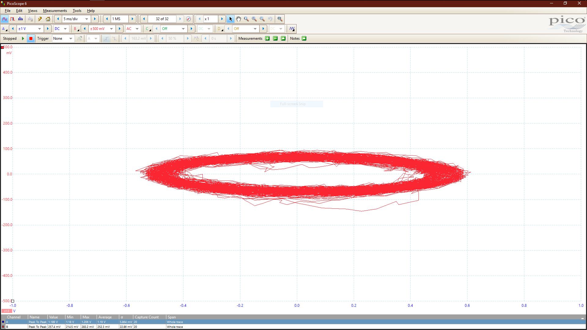

_Incorrectly adjusted centering point_

If the waveform isn't flat and equal, move the deck to frame 20,000 and adjust the centering screw as shown in the following picture:

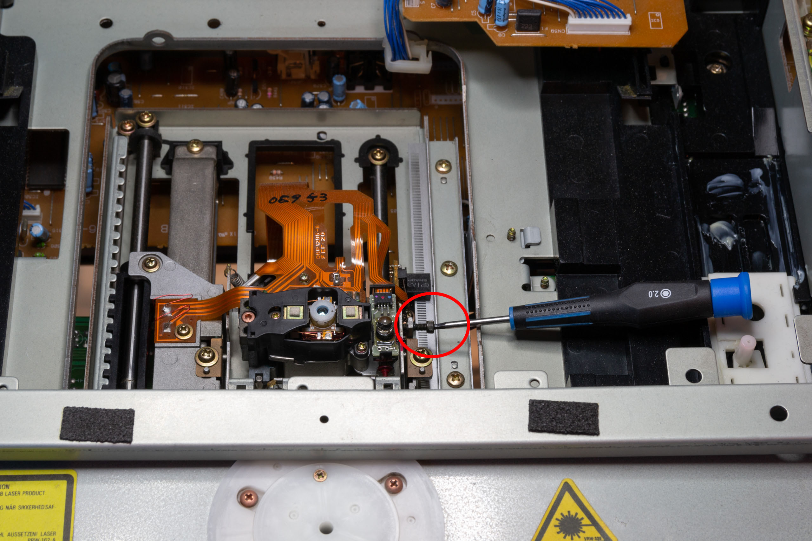

_Centering adjustment screw_

Turn the adjustment screw until the Y-axis of the wave form is as flat as possible (i.e. has the lowest PtP value). Then move the deck back to 1,000 and check if the Y-axis value is approximately equal. If the values are not similar (i.e. you observe the Y-axis expanding and contracting between frames 20,000 and 1,000) move the deck to frame 20,000 and adjust the setting to move the Y-axis towards the value seen at frame 1,000. Repeat the instructions until the two Y-axis values are sufficiently similar.

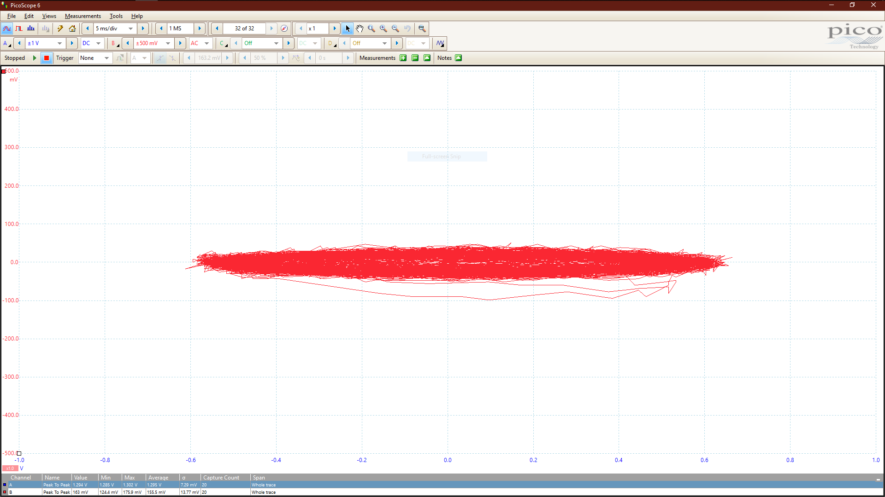

_Trace at frame 20,000 after adjustment_

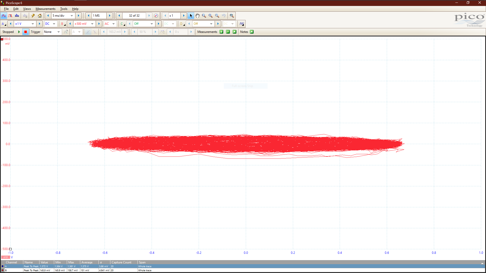

_Trace at frame 1,000 after adjustment_

## Tilt sensor inclination adjustment
### Purpose
The tilt sensor controls the tilt angle of the optical deck during playback. Detection of the disc angle is performed by a photodiode; as the angle of the disc moves from perpendicular (to the deck) the reflected light decreases, so the player moves the tilt angle to compensate. This calibration step sets the physical angle of the tilt sensor and the balance of the photodiode (VR4).

### Procedure
Connect channel 1 of the oscilloscope to TP1-8 (TILT ERROR). Set channel 1 to DC 5 V/div (vertical) with 5 mS/div (horizontal).

In test mode, press the play button on the front-panel to start the disc playing and move the deck to around frame 5,000 (with the tracking servo open). Set the focus balance to 1 (MULTI-FWD on the CU-V113A remote). Measure the DC offset voltage of TP1-8 using the oscilloscope. Ensure that the tilt setting is off and around 0F-10. Lock the plunger before adjustment (red power button on the RMC).

Lift the player on to it's side and set VR4 to it's mechanical centre point. Then set the player horizontal and adjust the tilt adjustment screw as shown in the following picture:

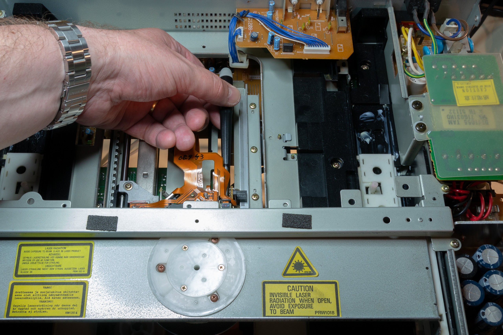

_Tilt sensor inclination adjustment_

When you touch the deck or press lightly on the adjustment screw with the screwdriver the sensor level will vary widely making this very difficult to accurately adjust. You also need to be careful of the small board on the side of the optical deck (as you can short the connection with the shaft of the screwdriver). It is recommended to wrap the shaft with electrical tape or masking tape in order to avoid shorts whilst adjusting.

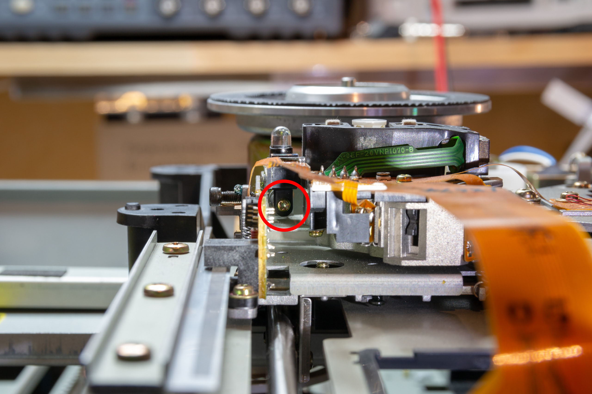

_Tilt sensor inclination adjustment screw_

Adjustment is a series of short turns; make an adjustment, remove the screwdriver and wait for the deck to settle, then take a measurement. Keep adjusting the screw until the signal level is as close to ground as possible.

_Signal level after mechanical adjustment_

Once your mechanical adjustment is as close as possible read the current signal level and make a note 'A'. Now lift the player on to it's side. Take another measurement 'B'. Then calculate B - A = C. Now adjust VR4 to the value of 'C' (i.e. A = 256, B = 1152, 1152 - 256 = 896). Then place the player horizontally again and ensure that the signal is as close to 0V as possible. Once you are within +- 200mV the calibration is complete. If the adjustment is incorrect, repeat the adjustment again (without resetting the position of VR4).

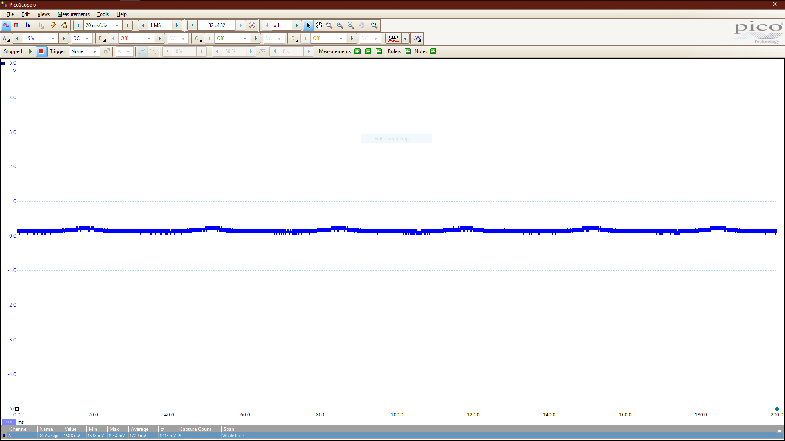

_Signal level after adjustment of VR4_

After adjustment is complete unlock the plunger (PAUSE on the RMC). Close the tracking servo loop (using the STILL STEP/REV key on the RMC) and set focus balance to '0' (MULTI-FWD on the CU-V113A). Enter 115 on the RMC and press the yellow SEARCH key to move to the crosstalk test frame. Turn the tilt function on (using SPEED+ on the RMC) and verify that the crosstalk interference is acceptable. After the check, turn the tilt function off (SPEED-) and stop the player.

## Grating fine adjustment and tracking balance check
### Purpose
To perform the fine adjustment of the laser grating making sure that the tracking is optimum and also to ensure that, after the previous calibration steps, the tracking signal is balanced on 0V. Accurate tracking calibration assures that the player does not jump tracks when playing.

### Procedure
Connect channel 1 of the oscilloscope to TP1-9 (TRKG ERROR). Set channel 1 to DC 1 V/div (vertical) with 5 mS/div (horizontal). Connect channel 2 of the oscilloscope to TP1-4 (TRKG A+C). Set channel 2 to AC 200 mV/div (vertical) with 5 mS/div (horizontal).

Set the horizontal mode of the oscilloscope to X-Y mode.

In test mode, press the play button on the front-panel to start the disc playing and move the deck to around frame 16,000 (with the tracking servo open). Set the focus balance to '1' (using the MULTI-REV on the CU-V113A). Lock the optical deck using the plunger (press the red power button on the RMC).

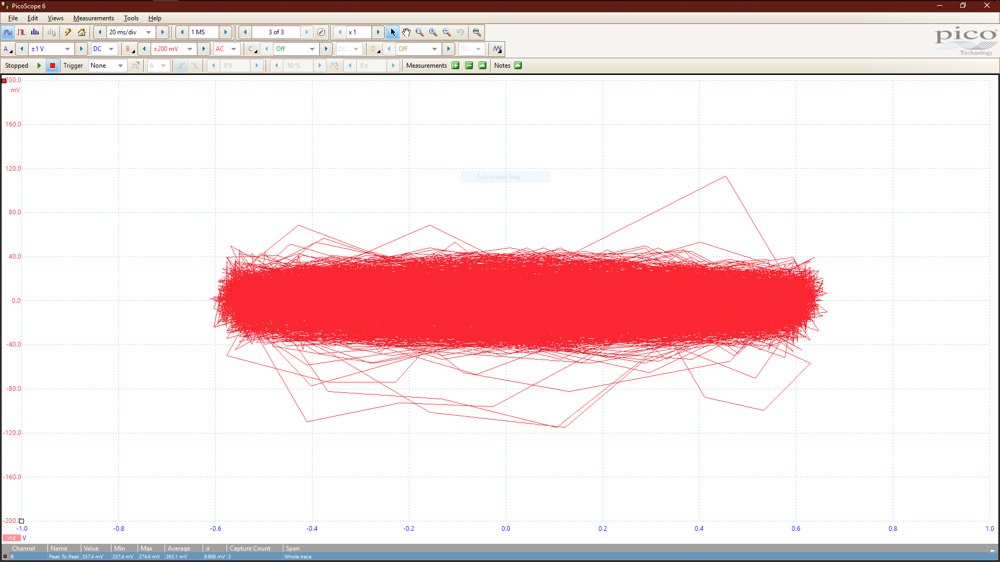

_Lissajous waveform before fine grating adjustment_

Now fine adjust the grating to make the Y-axis of the Lissajous waveform is as small as possible. Be careful to not over-adjust the grating which could cause the grating to move to a different 'on track' point. If over adjustment occurs repeat the temporary grating adjustment again, then repeat this calibration step.

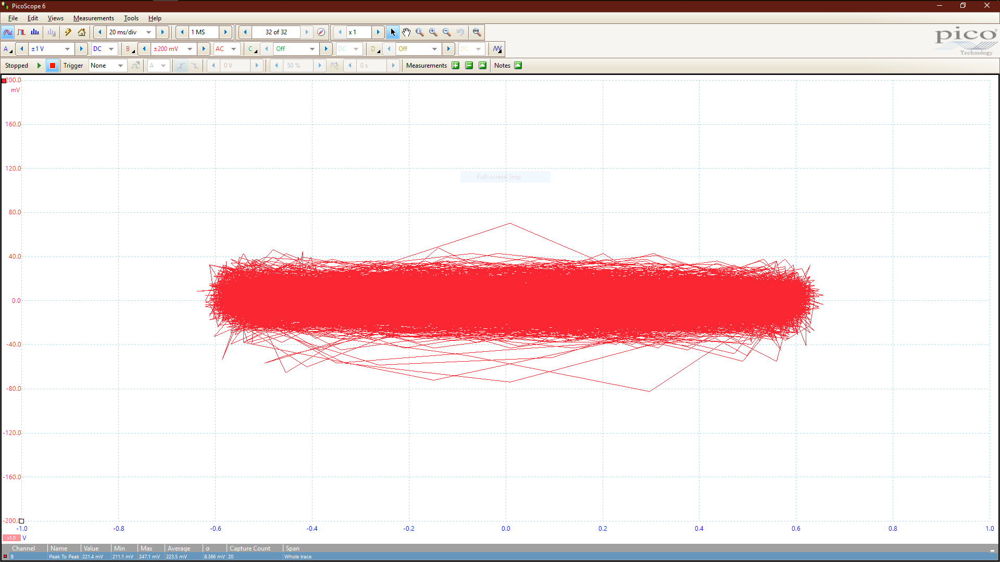

_Lissajous waveform after fine grating adjustment_

Once the fine grating adjustment is complete switch the scope back to channel 1 only and check that the positive and negative amplitudes are still equal; if the tracking balance has noticeably shifted (the variance should be no more than a few millivolts on average) you will need to go back and perform tracking and tangential direction inclination adjustment again.

Unlock the plunger, set focus balance to '0' and close the tracking servo. Ensure that the player produces a good picture when playing (if you maladjusted anything, playback will be degraded).

## RF Gain adjustment
### Purpose
To set the amplitude of the RF signal from the optical deck to the optimum recommended value.

### Procedure
Connect channel 1 of the oscilloscope to TP1-1 (RF out). Set channel 1 to DC 200 mV/div (vertical) with 5 mS/div (horizontal).

In test mode, press the play button on the front-panel to start the disc playing and set the focus balance to '1' (using the MULTI-REV on the CU-V113A). Close the tracking servo loop using the STILL STEP/REV key on the RMC. Enter 15000 on the RMC and press the yellow SEARCH key to move to the correct frame.

Adjust VR1 until the average peak-to-peak RF output is 300mV.

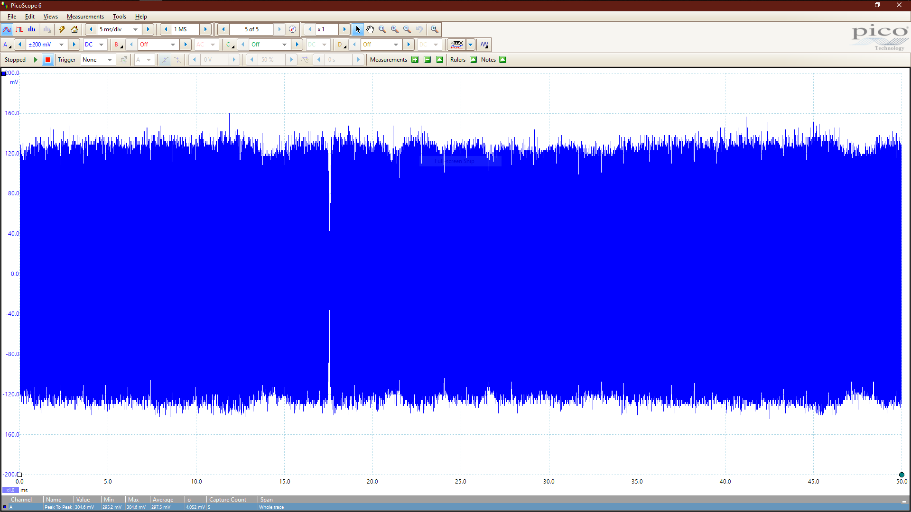

_RF Level after adjustment of VR1_

## Focus servo loop gain adjustment
### Purpose
To set the loop gain of the focus servo to the optimum value. The loop gain controls the reaction speed of the focus mechanism - too fast and it will overshoot, too slow and it will not adjust fast enough to correctly track the disc being played. When incorrectly adjusted it can cause playback to degrade and the player plays through a disc.

### Procedure
This calibration step requires the use of both an oscilloscope and a signal generator (an AWG is used in this description but a audio signal generator or standard signal generator would be suitable).

Connect channel 1 of the oscilloscope to TP1-5 (FOCS ERR IN). Set channel 1 to DC 10 V/div (vertical) with 10 mS/div (horizontal). Connect channel 2 of the oscilloscope to TP1-6 (FOCS ERR OUT). Set channel 2 to DC 500 mV/div (vertical) with 10 mS/div (horizontal).

Set the horizontal mode of the oscilloscope to X-Y mode.

If you are not using the calibration breakout board a 100K resistor should be placed before the CH1 input to the oscilloscope as shown in the following diagram:

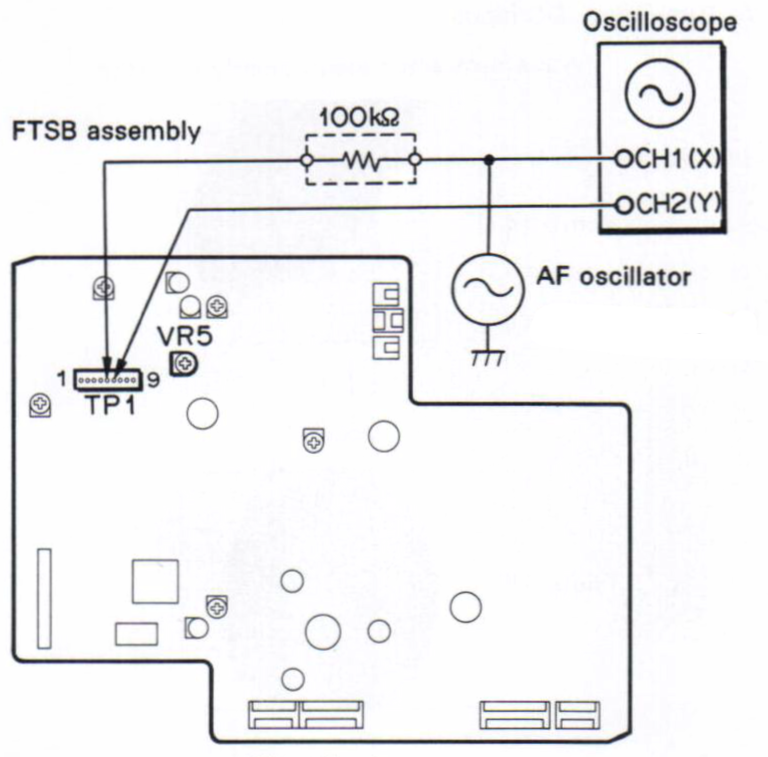

_FTSB Assembly - Focus servo loop gain adjustment_

The AWG should be connected between the oscilloscope channel 1 and the resistor. Set the AWG to output 1.8KHz with a 10V peak-to-peak (output impedance should be high-Z).

In test mode, press the play button on the front-panel to start the disc playing and set the focus balance to '1' (using the MULTI-REV on the CU-V113A). Close the tracking servo loop using the STILL STEP/REV key on the RMC. Enter 15000 on the RMC and press the yellow SEARCH key to move to the correct frame.

If VR5 is too low the oscilloscope trace will look similar to the following:

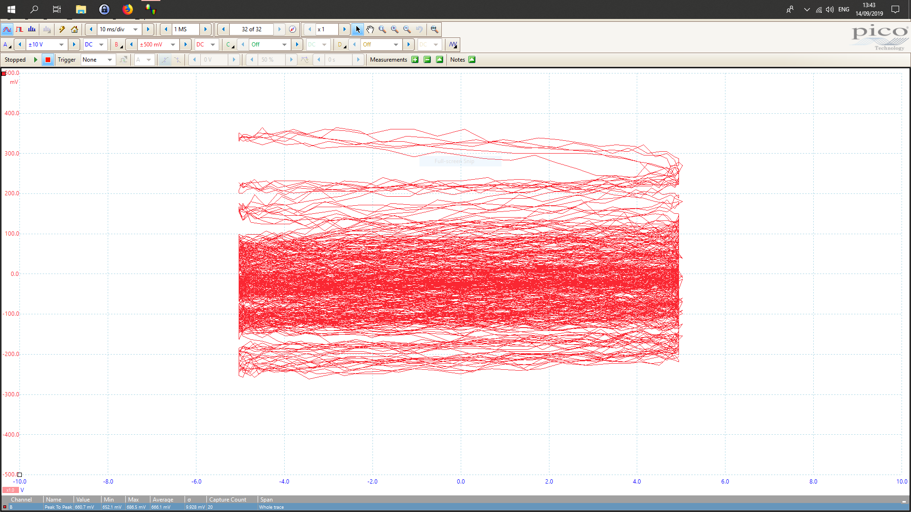

_VR5 set too low_

Adjust VR5 until the oscilloscope output looks similar to the following trace - note the symmetry of the output in both axis:

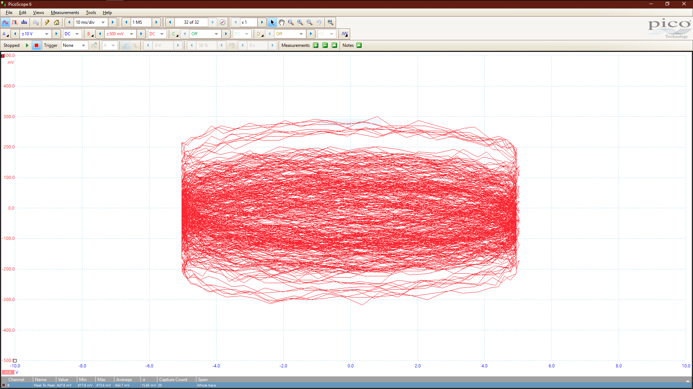

_VR5 adjusted correctly_

If VR5 is set too high the oscilloscope output will look like the following trace (if this occurs simply turn the gain down again until correct):

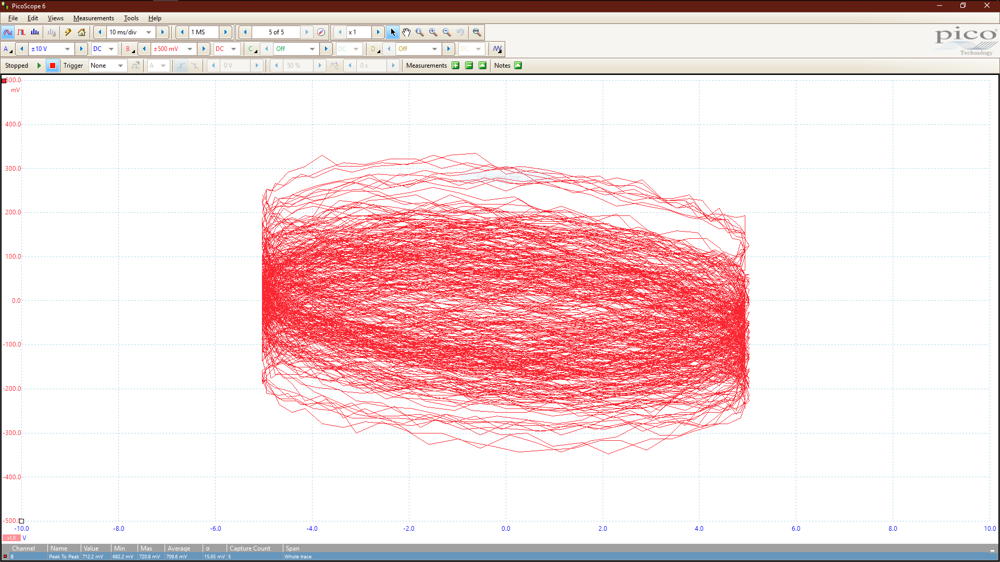

_VR5 too high_

Enter 25,000 on the RMC and press the yellow SEARCH key to move to the end of the disc. Examine the frame for signs of distortion (the image will 'tear' if the value of VR5 is too low).

## Tracking servo loop gain adjustment
### Purpose
To set the loop gain of the tracking servo to the optimum value. The loop gain controls the reaction speed of the tracking mechanism - too fast and it will overshoot, too slow and it will not adjust fast enough to correctly track the disc being played. When incorrectly adjusted it can cause playback to degrade and the player plays through a disc.

### Procedure
This calibration step requires the use of both an oscilloscope and a signal generator (an AWG is used in this description but a audio signal generator or standard signal generator would be suitable).

Connect channel 1 of the oscilloscope to TP1-7 (TRKG ERR IN). Set channel 1 to DC 10 V/div (vertical) with 5 mS/div (horizontal). Connect channel 2 of the oscilloscope to TP1-9 (TRKG ERR OUT). Set channel 2 to DC 1 V/div (vertical) with 5 mS/div (horizontal).

Set the horizontal mode of the oscilloscope to X-Y mode.

If you are not using the calibration breakout board a 100K resistor should be placed before the CH1 input to the oscilloscope as shown in the following diagram:

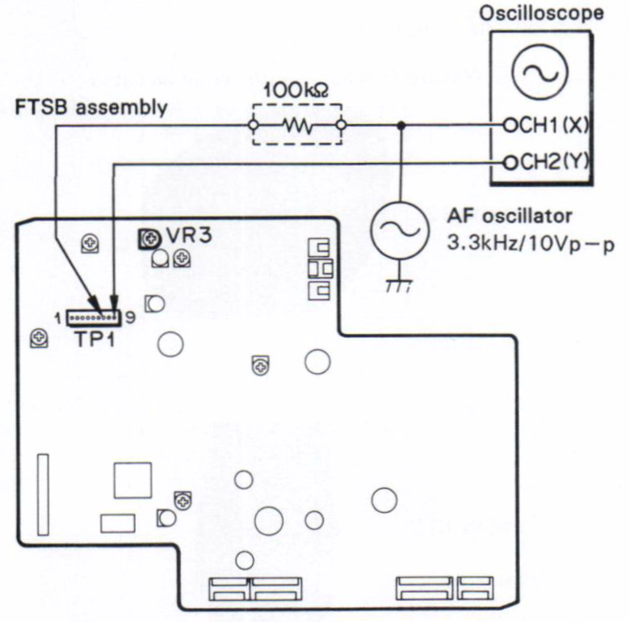

_FTSB Assembly - Tracking servo loop gain adjustment_

The AWG should be connected between the oscilloscope channel 1 and the resistor. Set the AWG to output 3.3KHz with a 10V peak-to-peak (output impedance should be high-Z).

In test mode, press the play button on the front-panel to start the disc playing and set the focus balance to '1' (using the MULTI-REV on the CU-V113A). Close the tracking servo loop using the STILL STEP/REV key on the RMC. Enter 15000 on the RMC and press the yellow SEARCH key to move to the correct frame.

Adjust VR3 until the waveform is symmetrical in both the X and Y axis. The following trace shows an incorrectly adjusted VR3:

_Incorrect adjustment of VR3_

The following trace shows the expected waveform with VR3 correctly adjusted:

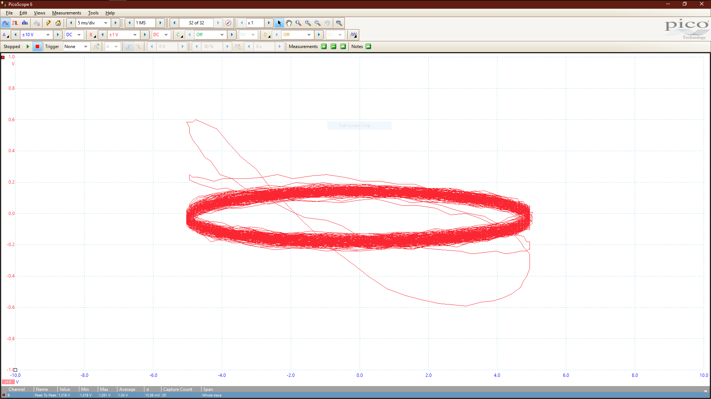

_Correct adjustment of VR3_

## Checking the tilt operation
### Purpose
Test to verify that the tilt mechanism returns to the correct position after calibration.

### Procedure
In test mode, press the play button on the front-panel to start the disc playing and set the focus balance to '0' (using the MULTI-FWD on the CU-V113A). Close the tracking servo loop using the STILL STEP/REV key on the RMC. Enter 15000 on the RMC and press the yellow SEARCH key to move to the correct frame.

Turn the tilt mechanism on (press SPEED+ on the RMC). Once the tilt mechanism is stable turn the tilt off (press SPEED- on the RMC). Move the tilt mechanism downwards (press CHAPTER SKIP/REV on the RMC). Turn the tilt mechanism on (press SPEED+ on the RMC). Ensure that the tilt returns to 10 (acceptable range is 0F to 11).

Turn the tilt off and move the tilt mechanism upwards (press CHAPTER SKIP/FWDs on the RMC). Turn the tilt on and ensure that the tilt returns to 10 (acceptable range is 0F to 11).

# Post-calibration
## Fixing adjustment points
Once calibration is complete all adjustment points and potentiometers should be fixed in place to prevent vibration and movement disturbing the calibration (especially if the LaserDisc player is to be transported).

Use a locking agent such as "Crosscheck Torque Seal" to fix all adjustment screws in place:

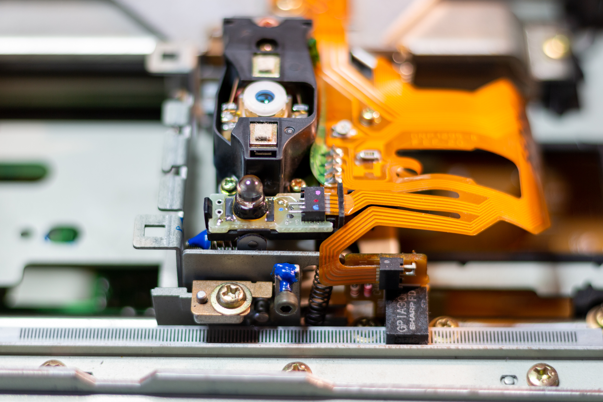

_Locking the calibration adjustment screws_

In addition the same locking agent can be used on the potentiometers, simply place a small blob of the locking agent on the side of the potentiometer covering both the base and the top-part of the component.

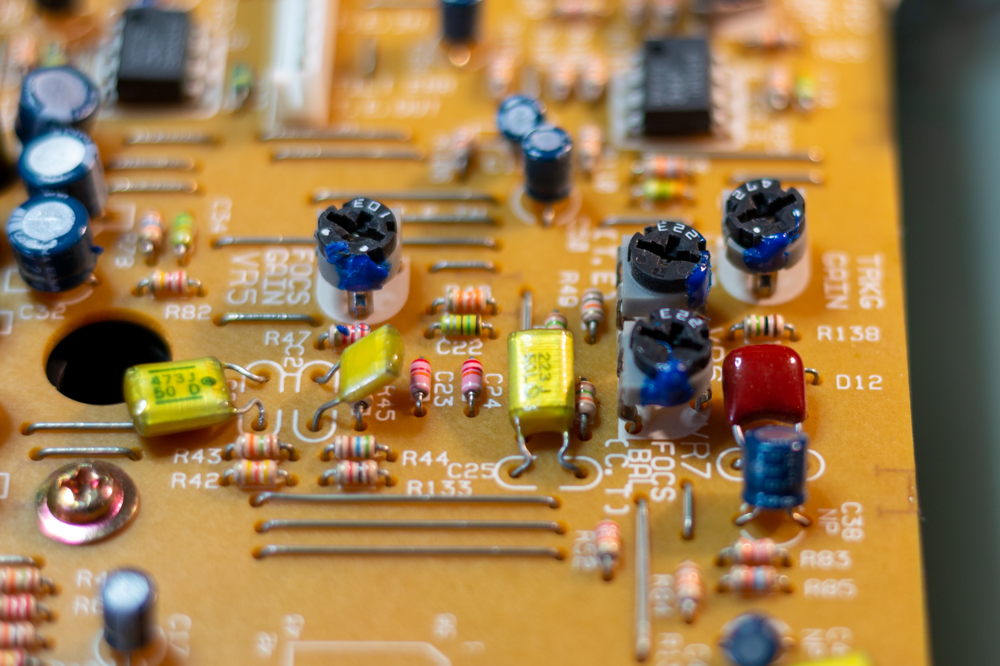

_Locking the calibration potentiometers_

If further adjustment is needed later, the locking agent can be easily removed using a small knife.

## Reassembly
To reassemble the player simply follow the disassembly instructions in reverse. When refitting the disc tray ensure that the left-hand cog is aligned correctly; there is a small gap on one side of the cog which must be facing upwards in order for the tray to be reinserted.

## Verifying the calibration
If you have access to a Domesday Duplicator board and ld-decode you can verify the calibration by capturing the GGV1069 disc and decoding the contents. The ld-analyse application will provide you with a graph of the SNR performance across the disc. The following chart is an example SNR graph from a calibrated player (**note**: LaserDisc players are analogue devices - there will always be variance between them regardless of the calibration):

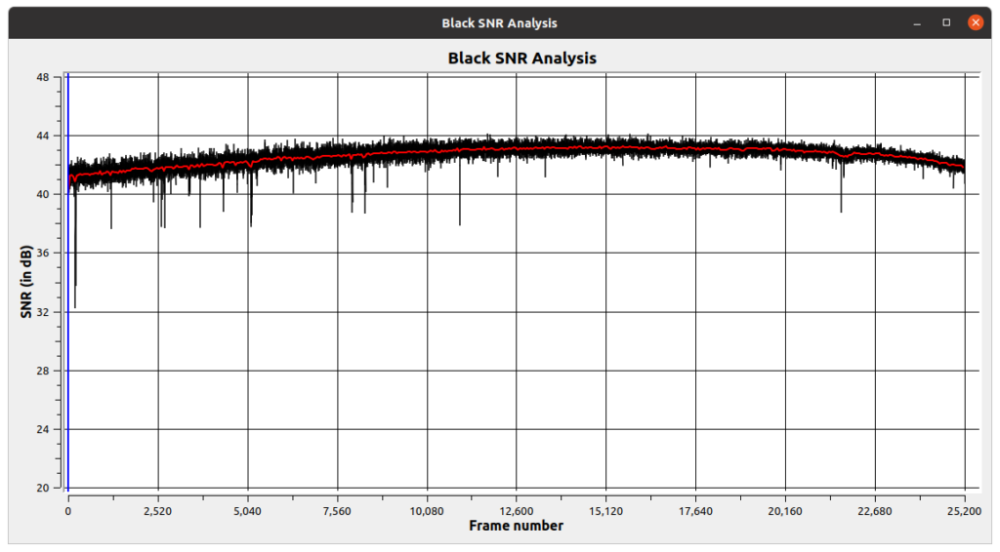

_GGV1069 Black SNR from a calibrated player_

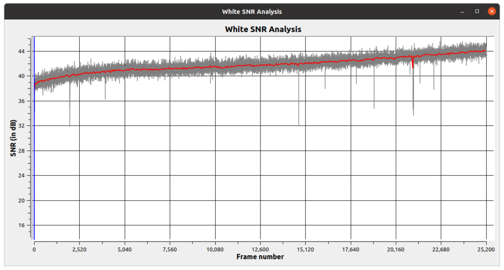

_GGV1069 White SNR from a calibrated player_

In addition you can also use ld-analyse to examine the crosstalk test frames (115 and 460) for signs of crosstalk. For this it is better to use the source image (without comb-filtering). Here is frame 115 from a calibrated player:

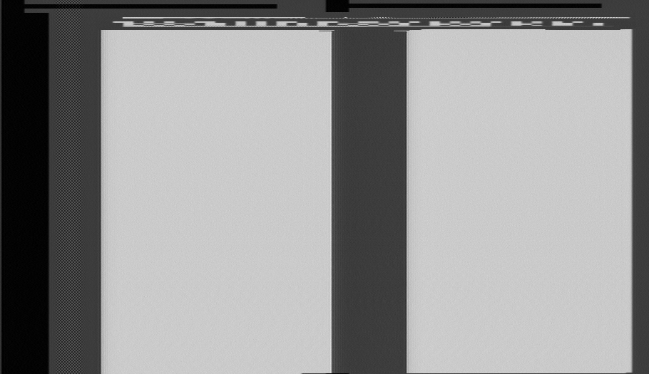

_Frame 115 source image from ld-analyse (GGV1069)_

The following picture is of frame 460 from the same disc:

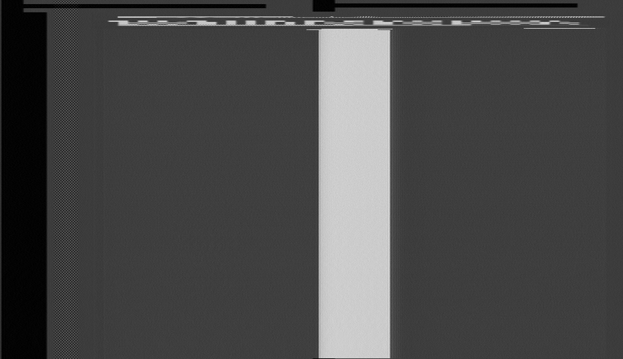

_Frame 460 source image from ld-analyse (GGV1069)_
