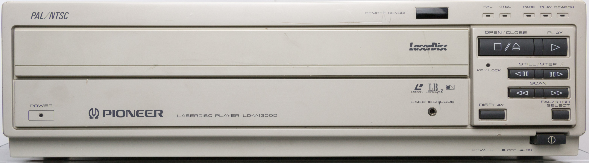
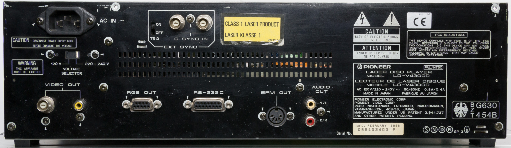
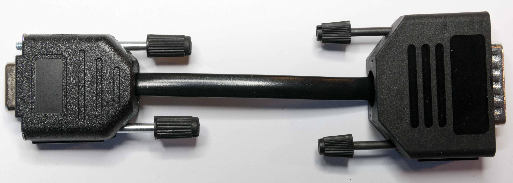
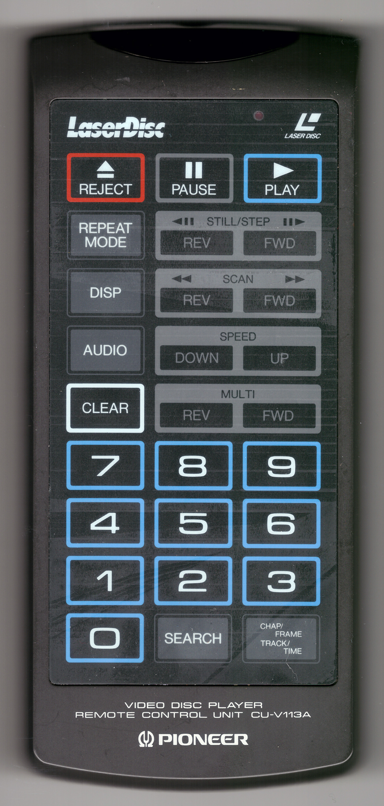

# LDV4300D Overview

# Introduction
The Pioneer LD-V4300D is the reference Laserdisc player for the Domesday Duplicator board.  The player was chosen for several reasons:

* Single-sided industrial player - The player is well constructed and the single-sided design means the optical assembly has strong linear tracking mechanics
* PAL and NTSC compatible - The player is can be switched for both PAL and NTSC discs
* Digital and Analogue audio - The player supports both the analogue audio (used by the AIV laserdiscs) and digital audio (used by more modern discs)
* Serial remote control - The player can be controlled by a computer using the serial control port.  This port supports both RS232C and TTL level serial communication
* Relatively modern player - Most players were constructed around 1998 making the LD-V4300D fairly modern by laserdisc standards
* Documentation - The service guide and other documentation is available for the player
* RF output - The player has an 50 Ohm RF test point that is relatively easy to access and provides a reasonable strong signal
* Head interlock mechanism - The player features an automatic head interlock mechanism that fixes the optical assembly in place when not in use.  This makes the player easier (and safer) to transport

# Front and rear panels
The following image shows the front-panel of the LD-V4300D:



_LD-V4300D Front Panel_

The following image shows the back-panel of the LD-V4300D:

 

_LD-V4300D Back Panel_

# Documentation
The following links provide PDF versions of the documentation for the player:

[Pioneer LD-V4300D Specifications](https://www.domesday86.com/wp-content/uploads/2017/12/Pioneer-LD-V4300D-Specifications.pdf)

[Pioneer LD-V4300D Operating Instructions EN](https://www.domesday86.com/wp-content/uploads/2017/12/Pioneer-LD-V4300D-Operating-Instructions-EN.pdf)

[Pioneer LD-V4300D Service Manual](https://www.domesday86.com/wp-content/uploads/2018/09/Pioneer-LD-V4300D-Service-Manual-DD86_2.pdf)

# Restoration, repair and calibration guides
A guide to the disassembly, cleaning and reassembly of the LD-V4300D is available [here](LDV4300D-Cleaning.md).

A guide to adding a RF output connector (for connection to the Domesday Duplicator) is available [here.](LDV4300D-RF-Output.md)

# Serial control adapter
The Pioneer LD-V4300D provides access to the serial control features of the player via a 15-pin DSUB connector on the back panel of the player.  This type of connector is a non-standard output as it provides pins for both RS-232-C level (12V) signals as well as TTL (5V) level signals.  In order to connect the player to a computer using a standard USB to 9-pin DSUB connector an adapter should be made using a male 15-pin DSUB and female 9-pin DSUB with the following connections:

Player pin 1 (GND) - Host pin 5  
Player pin 2 (TxD) - Host pin 2  
Player pin 3 (RxD) - Host pin 3  
Player pin 4 (DTR) - Host pin 6

 

_Pioneer LD-V4300D Serial Adapter_

Note that this is a DTE to DTE cable (rather than the DTE to DCE cable shown in the manufacturer's documentation).  The pin out in the manufacturer's document will require a DTE to DCE converter if used with a modern USB adapter.

# IR remote control
The Pioneer CU-V113A consumer remote control can be used to control the LD-V4300D.  The remote control is shown in the following image:



_Pioneer CU-V113A IR Remote Control_

The IR remote control codes generally available on the web are not correct for this remote (specifically the codes for Multi-REV and Multi-FWD are incorrect in all the LIRC and IR blaster configurations found).  The correct hex-codes for this remote are as follows:

```
# Pioneer CU-V113A Hex IR Codes   
# Simon Inns - 20180413   
#   
0xa816 KEY_REJECT   
0xa818 KEY_PAUSE   
0xa817 KEY_PLAY   
0xa844 KEY_REPEAT_MODE   
0xa850 KEY_STILL_STEP_REV   
0xa854 KEY_STILL_STEP_FWD   
0xa843 KEY_DISP   
0xa811 KEY_SCAN_REV   
0xa810 KEY_SCAN_FWD   
0xa81e KEY_AUDIO   
0xa846 KEY_SPEED_DOWN   
0xa847 KEY_SPEED_UP   
0xa845 KEY_CLEAR   
0xa855 KEY_MULTI_REV   
0xa858 KEY_MULTI_FWD   
0xa807 KEY_7   
0xa808 KEY_8   
0xa809 KEY_9   
0xa804 KEY_4   
0xa805 KEY_5   
0xa806 KEY_6   
0xa801 KEY_1   
0xa802 KEY_2   
0xa803 KEY_3   
0xa800 KEY_0   
0xa842 KEY_SEARCH   
0xa813 KEY_CHAP_FRAME_TRACK_TIME   `
```

# Using the LD-V4400 NTSC version
It has been reported that the LD-V4400 (which is the NTSC only version of the LD-V4300D) can be used to play both PAL and NTSC discs if the on-board EPROM is changed for the 4300D version. Note that the player will not output PAL video via the composite or RGB outputs as the circuitry is missing; but it will capture PAL using the Domesday Duplicator.

The following zip file contains both BIN and HEX images of both the LD-V4300D EPROM and the LD-V4400 EPROM for use with an EPROM programmer:

[Pioneer\_4400-4300\_ROMs](https://www.domesday86.com/wp-content/uploads/2020/10/Pioneer_4400-4300_ROMs.zip)

Note that any modification of a player is risky and can result in permanent damage. Use these ROM images at your own risk.