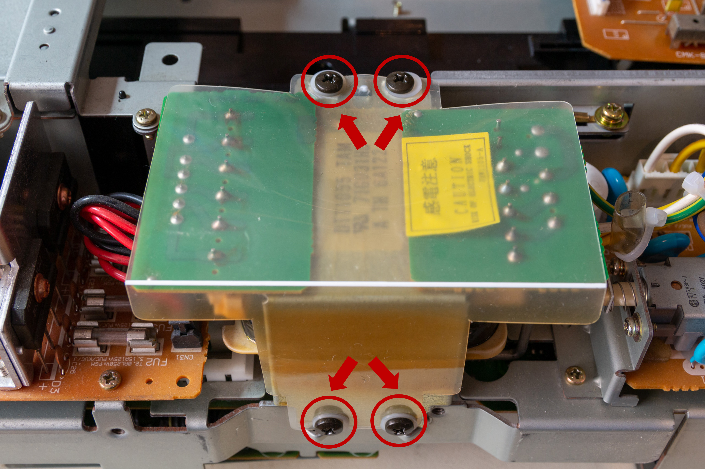
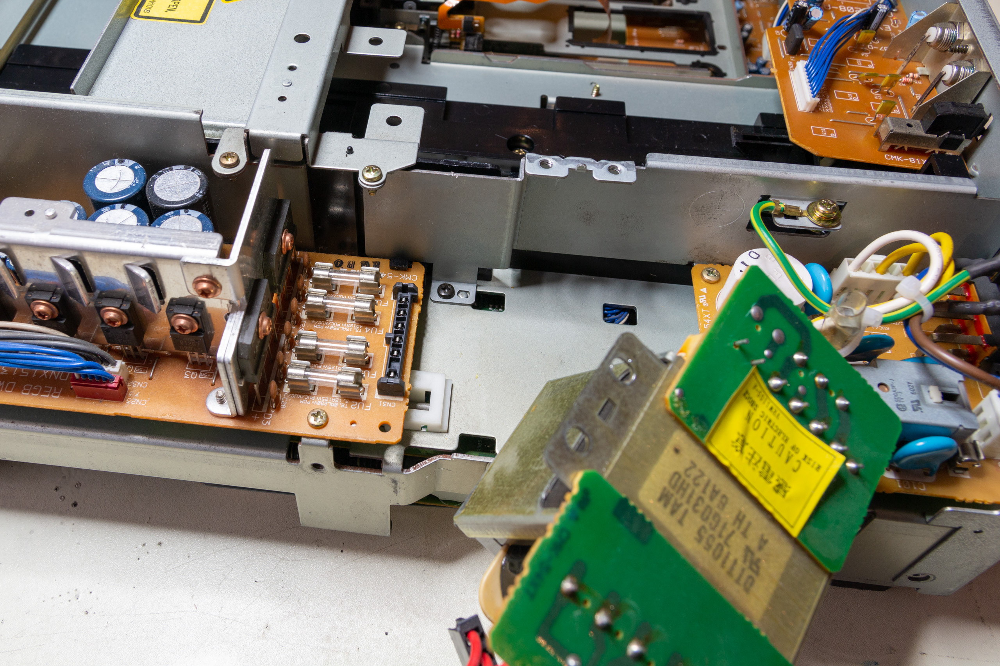
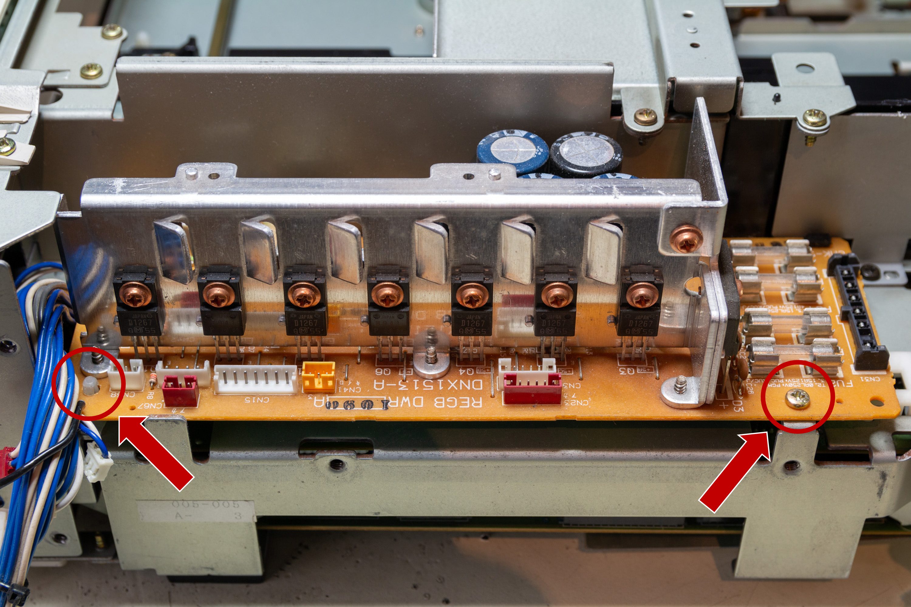
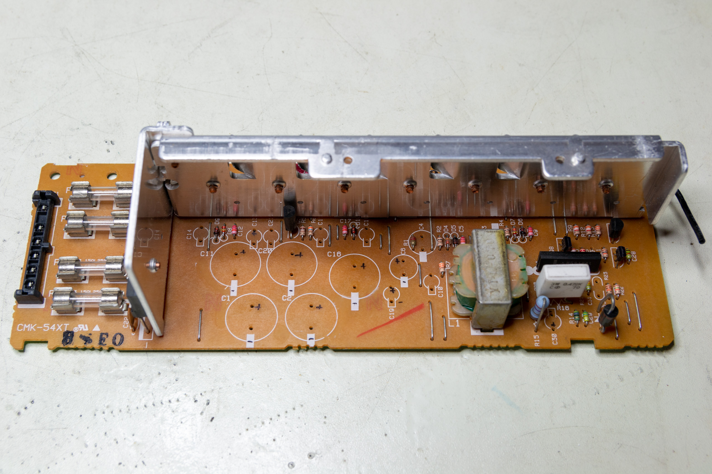
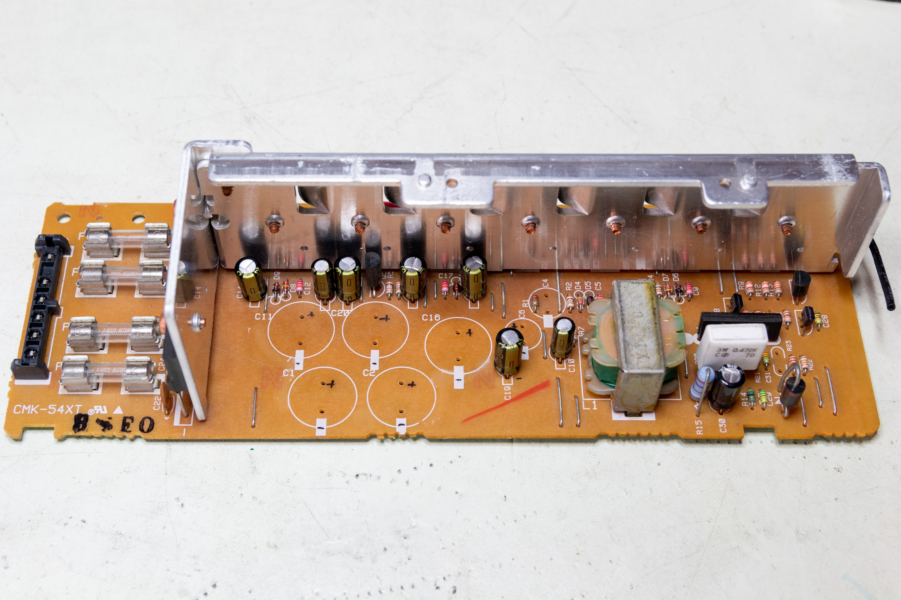
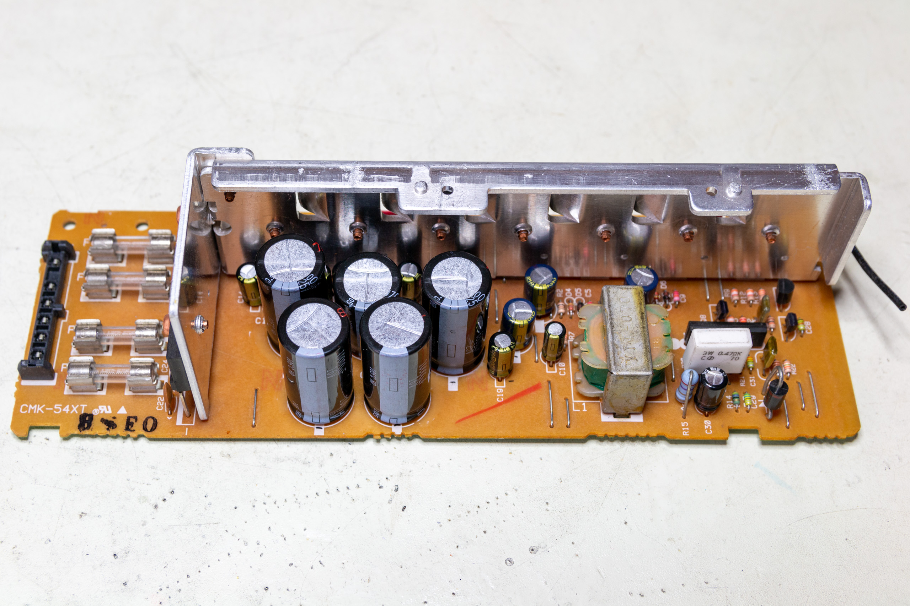
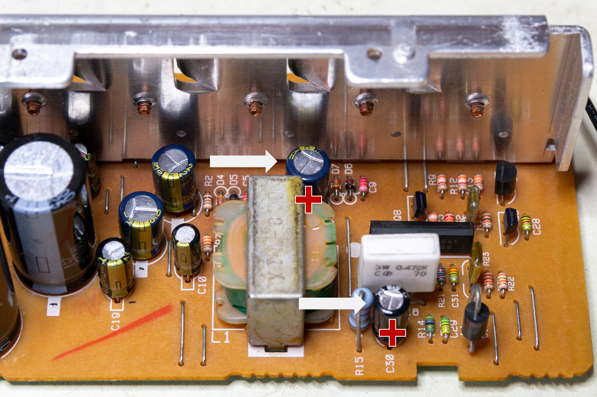

# LDV4300D Power-supply re-capping 

# Overview
In this article details the procedure for the removal and replacement of the Pioneer LD-V4300D power supply capacitors with high quality long-life replacements to improve the power supply output and extend the lifetime of the player.

The original power supply module is shown in the following photograph:

_The original Pioneer LD-V4300D power supply module_

Always ensure that the player is completely disconnected before attempting servicing of the power supply module. The power supply deals with high-voltages so, if you are unsure, consult a qualified electronics engineer before attempting.

# Original Capacitors
The original capacitors are a mixture of general purpose capacitors and long-life capacitors (both 2000h @ 85C and 2000h at 105C). The general purpose capacitors are 1000h @ 85C. There are no low-ESR or other specialised capacitors. The capacitor values are as follows (measurements are lead-spacing/diameter):

| Component | Value | Spacing/Diameter |
| --- | --- | --- |
| C1 | 6800uF 25V | 8mm/18mm |
| C2 | 4700uF 25V | 8mm/18mm |
| C4 | 220uF 25V | 4mm/8mm |
| C6 | 220uF 25V | 4mm/8mm |
| C8 | 220uF 25V | 4mm/8mm |
| C10 | 47uF 25V | 2.5mm/5mm |
| C11 | 10000uF 16V | 8mm/18mm |
| C13 | 47uF 10V | 2.5mm/5mm |
| C14 | 100uF 10V | 2.5mm/5mm |
| C15 | 100uF 10V | 2.5mm/5mm |
| C16 | 6800uF 16V | 8mm/16mm |
| C18 | 330uF 6V3 | 2.5mm/6mm |
| C19 | 100uF 10V | 2.5mm/5mm |
| C20 | 10000uF 16V | 8mm/18mm |
| C21 | 100uF 10V | 2.5mm/5mm |
| C30 | 3.3uF 50V | 2.5mm/5mm |

# Replacement Capacitors
The replacement capacitors are all Panasonic long-life capacitors (2000h @ 105C). All capacitors are replaced with either the same or greater voltage ratings as appropriate (this is to lower the number of different capacitors required). The required capacitors are given in the following list (which includes the article number from RS Components and Digikey as well as the manufacturer's part number (which can be used to order the parts from other suppliers):

| Quantity | Components | Value | RS | Digikey | Manufacturer |
| --- | --- | --- | --- | --- | --- |
| 1x | C2 | 4700uF 25V | 744-2054 | P15136-ND | EEUHD1E472 |
| 1x | C30 | 3.3uF 200V | 365-4571 | P19451-ND | ECA2DHG3R3 |
| 3x | C4, C6, C8 | 220uF 25V | 315-0552 | P10271-ND | EEUFC1E221 |
| 2x | C10, C13 | 47uF 25V | 526-1531 | P12923-ND | EEUFM1E470 |
| 2x | C1, C16 | 6800uF 25V | 744-2066 | P15138-ND | EEUHD1E682 |
| 1x | C18 | 330uF 6.3V | 526-0998 | P12918-ND | EEUFM0J331 |
| 2x | C11, C20 | 10000uF 16V | 744-2029 | P15100-ND | EEUHD1C103 |
| 4x | C14, C15, C19, C21 | 100uF 25V | 526-1430 | P12924-ND | EEUFM1E101 |

# Removing the power supply module
To remove the power supply module first move the transformer out of the way (this makes it easier to remove the connector between the transformer and the power supply module). To remove the transformer, remove the four screws shown in the following picture:

_Transformer fixing screws_

Once the fixing screws are removed, the transformer can be moved out of the way and the connector to the PSU module can be removed:

_The transformer is removed and disconnected from the power supply module_

Once the transformer and connector are removed the power supply module can be removed from the player by first disconnecting the wire-to-board connectors and then unscrewing the single mounting screw and releasing the plastic clip as shown in the following picture:

_Removing the power supply module from the player_

# Removing the original capacitors
Before desoldering the larger capacitors it is necessary to loosen the glue holding the larger capacitors to the PCB. This can be done using a knife to carefully cut under the glue (there is no need to completely remove the glue until after all the capacitors are removed):

_Power supply module with capacitors removed_

Desoldering the capacitors can be done using a combination of desoldering braid and a solder sucker (the solder sucker is only required for the larger capacitor terminals). Make sure as much of the old solder is removed as possible as shown in the following picture:

_The underside of the power supply module after the capacitors are removed_

# Refitting the new capacitors
Start by soldering in the new capacitors beginning with the smallest ones. Solder in the capacitors at the back of the module first:

_Start with the smaller capacitors_

Once the smaller capacitors are in place solder in the larger capacitors starting from the back and working forwards:

_The power supply module after recapping_

Pay attention to the orientation of the capacitors when soldering them in. The majority of the capacitors have the negative terminal to the front of the board, however there are two exceptions C8 and C30, these capacitors have the positive terminal to the front of the board:

_C8 and C30 have the opposite mounting direction_

Once you are done check and then double-check the orientation of all the capacitors - reversing the polarity of a capacitor can result in an 'exciting' failure of the capacitor and potential damage to the player.

To refit the power supply module simply follow the disassembly instructions in reverse. First fit the power supply module, reconnect the wire-to-board connectors. Then reconnect the transformer and fix the transformer back in place (do not forget to included the plastic safety shield).

# Conclusions
Recapping the power supply module will help ensure a smooth, ripple-free supply of power to the LaserDisc player which can help increase the signal-to-noise ratio and the overall playback quality. Since electrolytic capacitors can dry-out over time (and the power supply is a hot environment), capacitor replacement can also extend the working lifetime of the player.