# LDV4300D RF Output

# Overview
In order to use the Pioneer LD-V4300D with the Domesday Duplicator, it is necessary to add an 'RF tap' to the player.  This is simply a BNC connector that outputs the raw RF from the LaserDisc player's optical assembly.  Like most LaserDisc players the LD-V4300D exposes the RF signal as a test-point in the player.  In this article we will remove the back panel, fit a new BNC connector and wire the connector up to the correct test-point in the player.  Note that it is possible to make a simple cable to tap the RF (without modifying the back panel of the player) however, since the addition of the RF BNC does not effect normal operation, it's a better (safer) idea to mount the new connector so the player can be fully assembled for operation.

# Required items
You will need the following items:

* A soldering iron
* Some solder
* Heatshrink tubing (2-3mm diameter)
* Chassis mounted 50 ohm BNC connector
* 36cm of thin high-quality 50 ohm coaxial cable
* JST EH series 9 pin connector (and crimp connectors)
* Screwdriver
* Crimping tool (for the JST EH)
* Zip-ties (small)

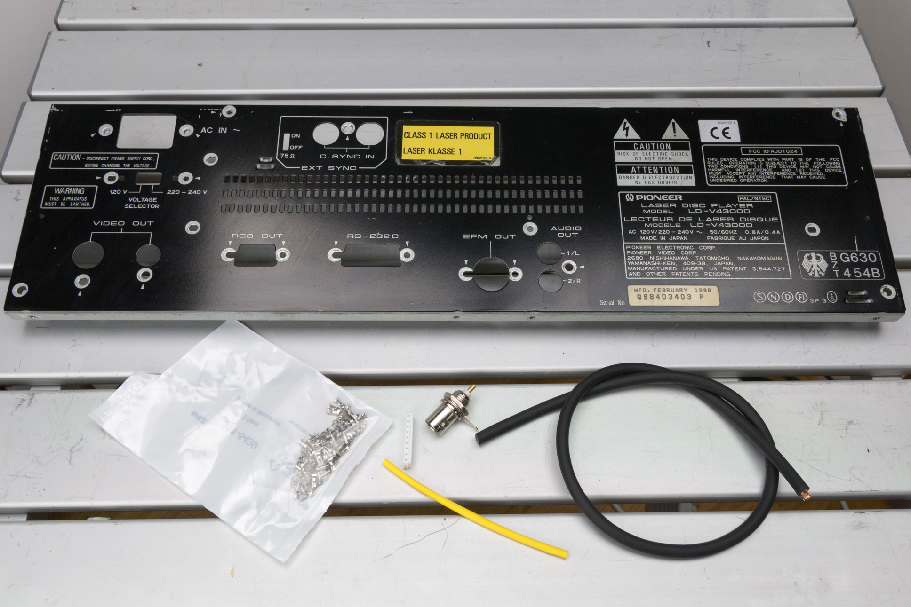 

_Some of the required items_

# Removing the back panel from the LD-V4300D
The screws marked with red dots in the following picture are all the same size, remove them all: 

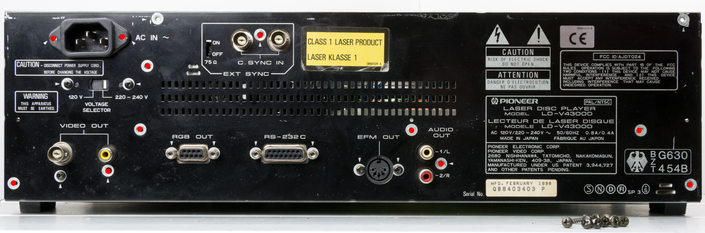 

Next remove the four bolts from the RGB and serial connectors.  Then unscrew the remaining screws being careful to note which screw goes where (as they are varying types): 

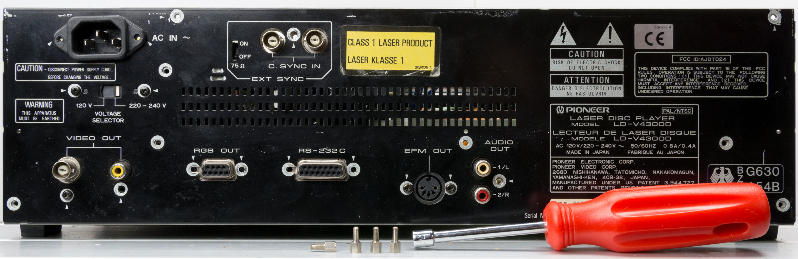 

There is a single screw on the right side of the back panel holding the panel to the side-frame of the player, remove this: 

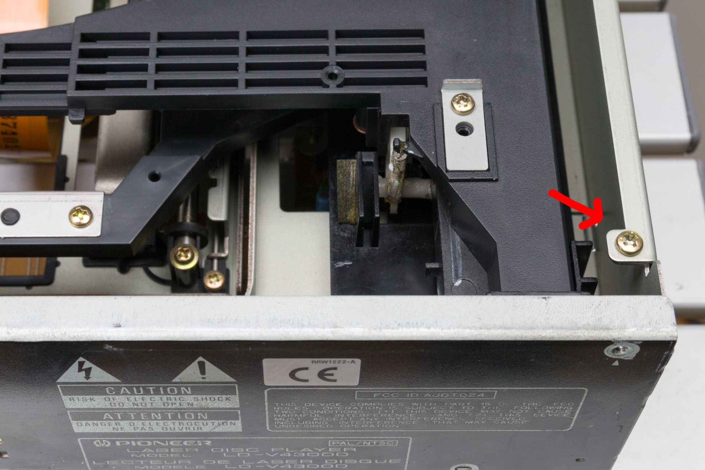 

Now, on the other side of the player cut the two zip-ties (being careful not to cut the actual cables): 

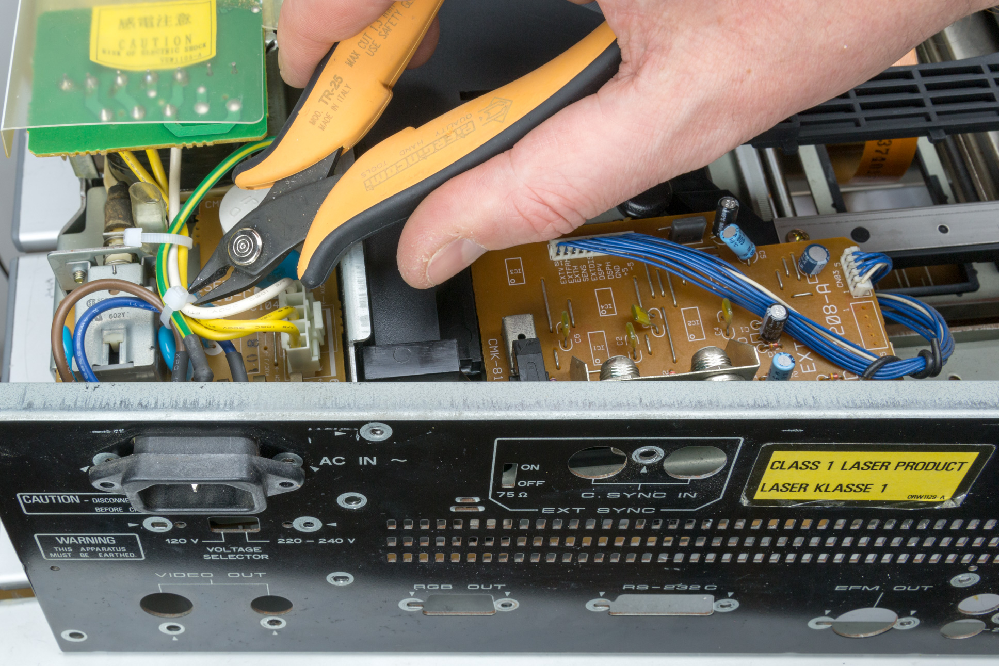 

Now remove the earth connector: 

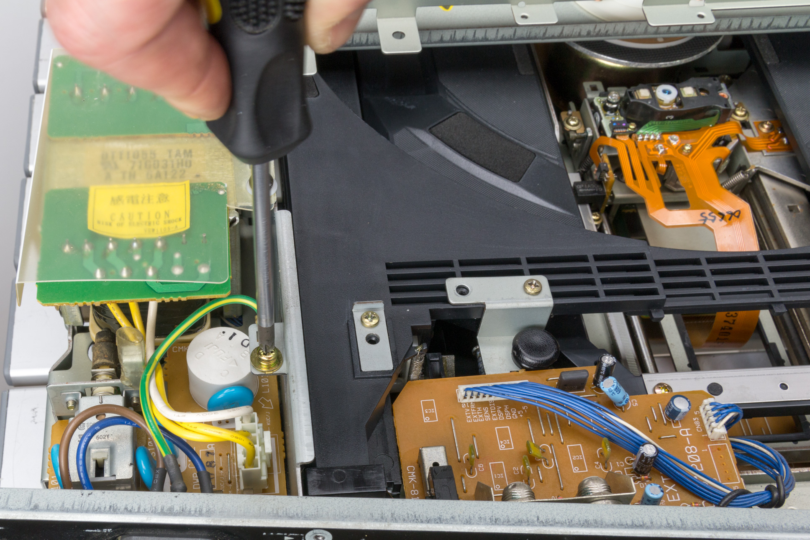 

Finally remove the mains connector from CN48 and the back panel will become free of the player's frame and can be removed: 

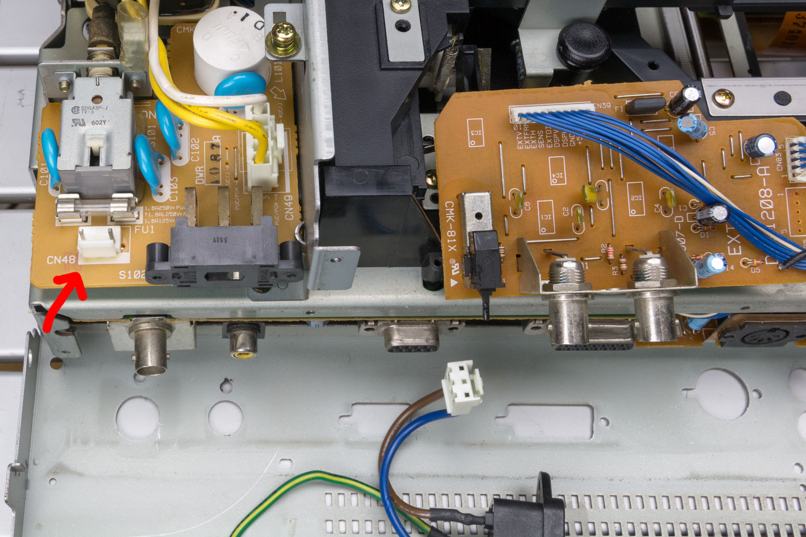

# Adding the BNC connector to the back panel
Once the panel is removed, turn it over to the bare-metal size.  Measure the gap between the RGB and serial connector bolt holes (it should be approximately 20mm) and mark the 10mm centre point.  Now draw a line perpendicular to the edge of the back panel up to the centre-point of the two connectors (you can simply use a metal ruler for this, press it against the base of the panel to ensure it is true).  Measure from the base of the panel up the centre-line you just drew.  Make a mark at 15mm from the base of the panel.  The back panel should look like the following photo: 

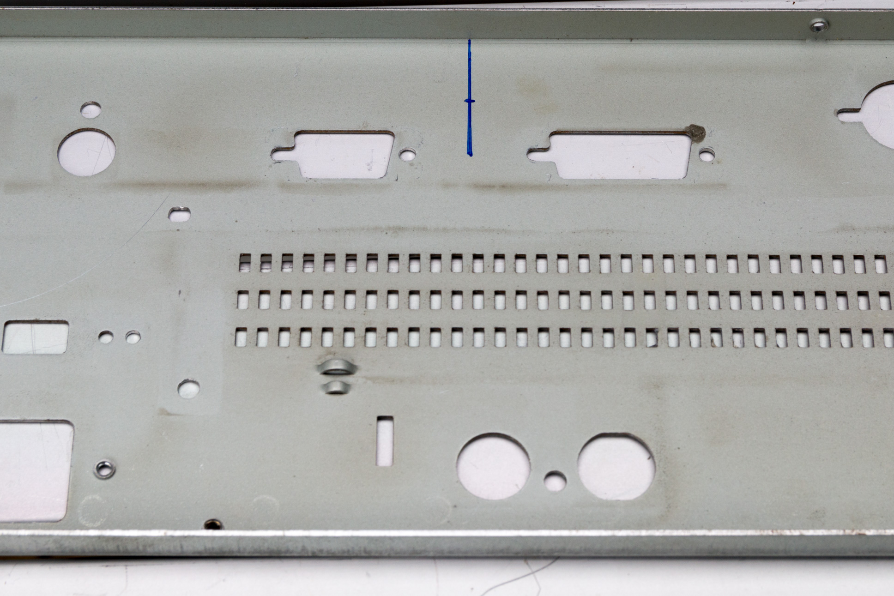 

Before hammering or drilling ensure that you protect the back panel from scratches.  Simply placing some strips of masking tape across the back panel is enough to prevent any damage in most cases. Dot punch the mark and use a small (3-4mm) drill to cut a pilot hole into the panel.  Now flip the panel over and use the appropriate drill bit for the width of the BNC connector you selected (as the panel is steel it will burr when drilled, therefore it's better to drill from the outside of the panel since the burring will be on the side that the drill exits the material.  If the BNC connect is oblong (they usually are to prevent them rotating), then drill the narrowest dimension and then file the metal at the top and the bottom of the hole until the BNC connector fits snugly into the slot.  Make sure you remove any metal particles and burrs from the panel. Fix the BNC connector into the slot you have created.  The back panel should now look like this: 

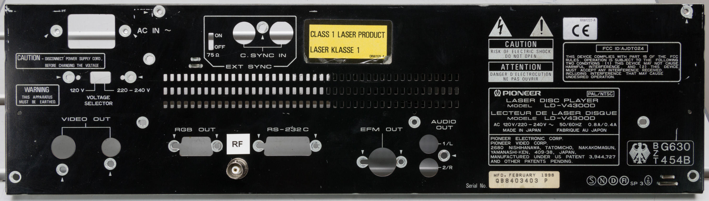 

Now reassemble the back panel on to the player ensuring that all the different screw types are put back in the correct places.

# Connecting the BNC to the RF output
The direct RF output from the player is available on the TP1 (Test Point 1) connector located on the FTSB assembly.  This is a male JST EH series 2.5mm 9-pole connector and has the following pin out:

1. RF
2. GND
3. Focus return
4. Tracking error A+C
5. Focus error in
6. Focus error out
7. Tracking error in
8. Tilt error
9. Tracking error out

The location of the connector inside the player is shown in the following picture, note that the connector is accessible by removing the bottom cover of the player: 

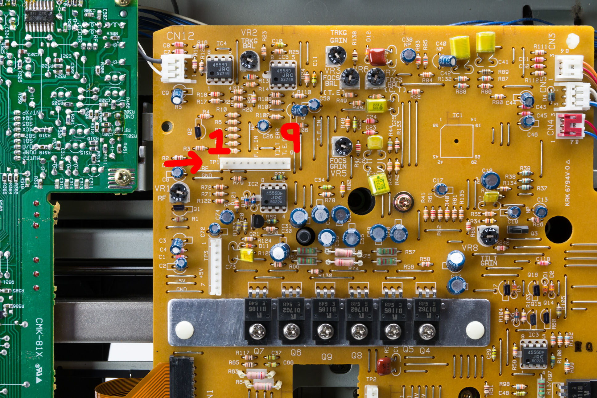 

_Location of test point 1_

To connect the TP1 connector with the RF BNC cut a piece of coxial cable to a length of 36cm.  Strip one end of the cable and crimp on two JST EH connector pins.  Insulate the shield earth wire with a little shrink wrap tubing.  Then place the centre wire of the coaxial into pin 1 of the female JST EH connector and the shield/earth in pin 2. Next strip the other end of the cable and solder to the BNC connector in the back panel.  When finished the cable should look similar to the following photo: 

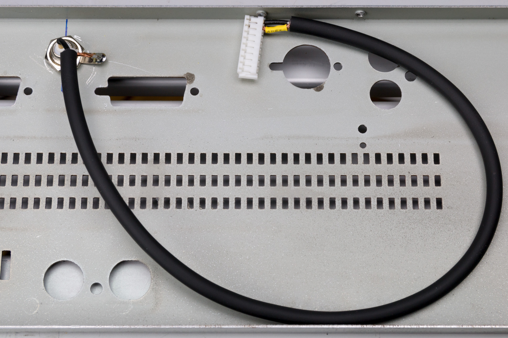 

_Completed RF tap cable_

Now reassemble the back panel onto the player (making sure you get the correct screws in the right places as noted above).  Once the back panel is assembled, connect the RF tap cable to the test point connector and then zip-tie the new cable to ensure it doesn't get snagged as the player is reassembled: 

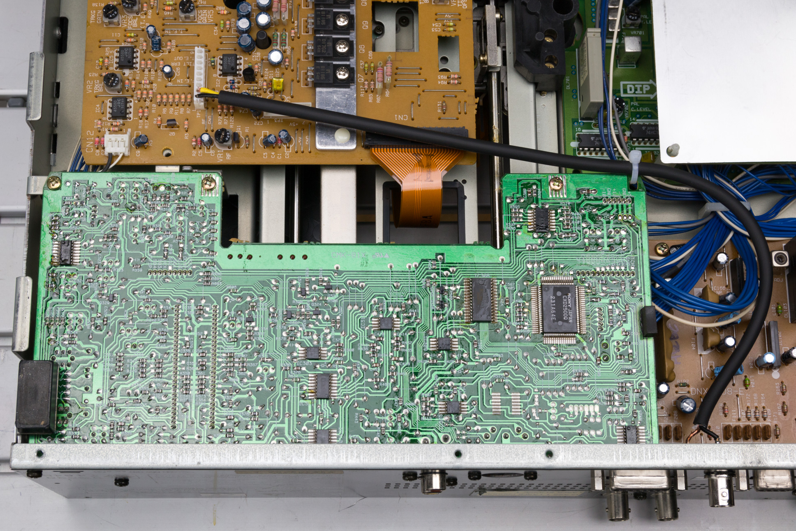 

Now you have an RF connection suitable for the Domesday Duplicator board.  To use the player normally, simply leave the RF BNC connector unplugged, it will not have any effect on the player.  If your RF output hasn't been calibrated then it's a good idea to perform the RF calibration before reassembling the players case.  Please see the service guide for details of this adjustment.