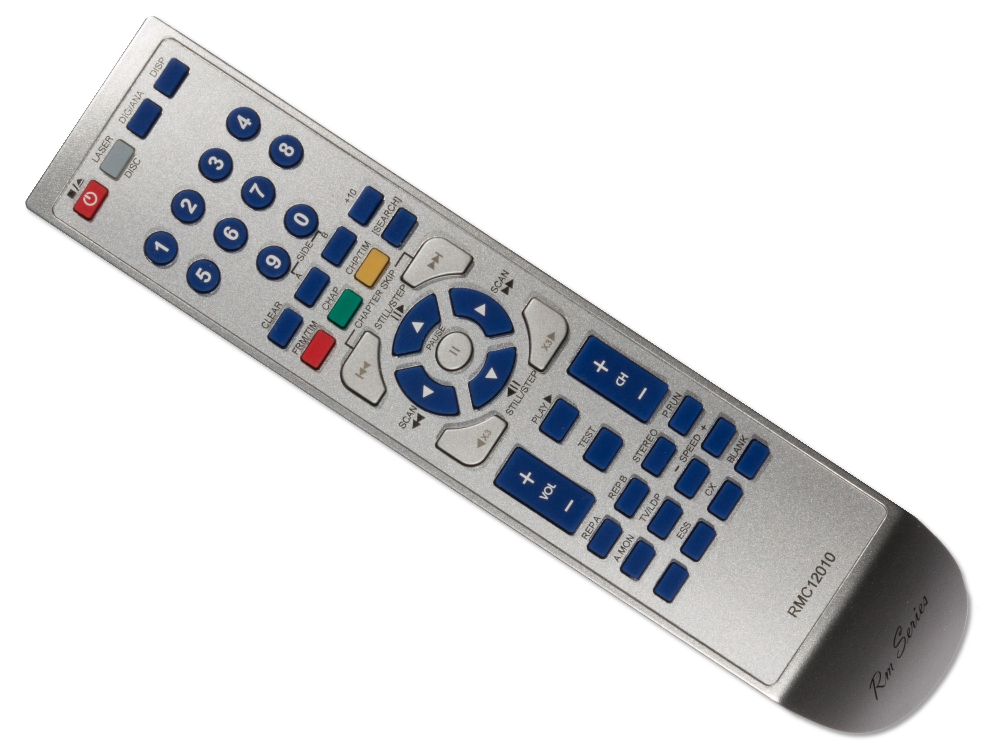

# The RM Series RMC12010 Remote

A service remote control is required for calibration. The RM Series RMC12010 remote is a 3rd party service remote clone available from sites such as Ebay. The RMC12010 remote required is shown in the following picture:

# RM Series RMC12010 Remote
Please note that the RMC12010 remote does not correctly map the MULTI-REV and MULTI-FWD buttons for the LD-V4300D (and these buttons are required for the calibration process). The correct codes for these buttons are given in the [Pioneer LD-V4300D Overview.md](https://www.domesday86.com/?page_id=1176) page. You can use either a combination of the RMC12010 and the Pioneer CU-V113A remote, or use a programmable remote and the key-codes provided on the linked page from this site.

Pioneer service remote controls produced after the GGF1067 do not seem to produce the correct key-codes for MULTI-REV or MULTI-FWD either.  Again, a combination of the CU-V113A and the service remote can be used.

The mapping of the RMC12010 service remote keys (to the original service remote keys) are shown in the following table (note: the most important one to know is ESS followed by TEST which switches the player into test mode (there is no need to power on holding DISPLAY or use any DIP switch settings on the LD-V4300D)):

|**LD-V4300D**|**Service Remote**|**RMC12010 remote**|
|:----|:----|:----|
|Open|Press the [OPEN/CLOSE] key in the stop mode.|Press the [REPEAT MODE (REPEAT B)] key.| |
|Stop|Press the [OPEN/CLOSE] key in the play mode.|Press the [REPEAT A] key. Press the [REJECT] key in the play mode.| |
|Play Video and audio are on Tracking is open|Press the [PLAY] key in the stop mode.|Press the [TV/LDP/ key. Press the [PLAY] key in the stop mode.| |
|Still|Press the [PLAY] key during TRACKING OPEN in the play mode.|Press the [CX] key in the play mode. Press the [PLAY] key during TRACKING OPEN in the play mode.| |
|Tracking open|Press the [STEP FWD] key in the play mode. Press the [PLAY] key in the play mode.|Press the [STEP FWD] key in the play mode. Press the [PLAY] key in the play mode.|[BLUE UP]|
|Tracking closed|Press the [STEP REV] key in the play mode. Press the [PLAY] key during TRACKING OPEN in the play mode.|Press the [STEP REV] key in the play mode. Press the [PLAY] key during TRACKING OPEN in the play mode.|[BLUE DOWN]|
|Slider in|Press the [SCAN REV] key.|Press the [SCAN REV] key.|[BLUE RIGHT]|
|Slider out|Press the [SCAN FWD] key.|Press the [SCAN FWD] key.|[BLUE LEFT]|
|Tilt servo off| |Press the [SPEED DOWN] key.|[SPEED-]|
|Tilt servo on| |Press the [SPEED UP] key.|[SPEED+]|
|Tilt decrease & servo off| |Press the [SKIP REV] key.|[CHAPTER SKIP REV]|
|Tilt increase & servo off| |Press the [SKIP FWD] key.|[CHAPTER SKIP FWD]|
|Display on| |Press the [DISPLAY] key.| |
|Display off| |Press the [AUDIO MONITOR] key.| |
|Search address entry|Press the [+10] key in the play mode.|Press the [+10] key. The last address searched will be displayed| |
|Search address input| |Input the address using [0] through [9] keys.| |
|Search execute| |Press the [CHAPTER/FRAME] key.| |
|Focus balance = 0| |Press the [MULTI FWD] key during playback.| |
|Focus balance = 1| |Press the [MULTI REV] key during playback.| |
|Plunger pull| |Press the [PAUSE] key.|[PAUSE]|
|Plunger release| |Press the [REJECT] key.|[POWER]|
|Return to test mode menu|Press the [DISPLAY] key.| | |
|Go to diagnosis mode| |Press the [TEST] key.|[ESC] then [TEST]|
|Cancel test mode| |Press the [ESC] key.|[ESS]|

Test menu navigation:

|**Front panel**|**Service remote**|**RMC12010 remote**|**Function**|
|:----|:----|:----|:----|
|DISPLAY|N/A| |Exit from test mode|
|STEP FWD|STEP FWD|BLUE UP|Next selection item|
|STEP REV|STEP REV|BLUE DOWN|Previous selection item|
|PLAY|PLAY|PLAY|Execute selected item|
|N/A|0 - 6|0 – 6|Execute the item corresponding to the number|
