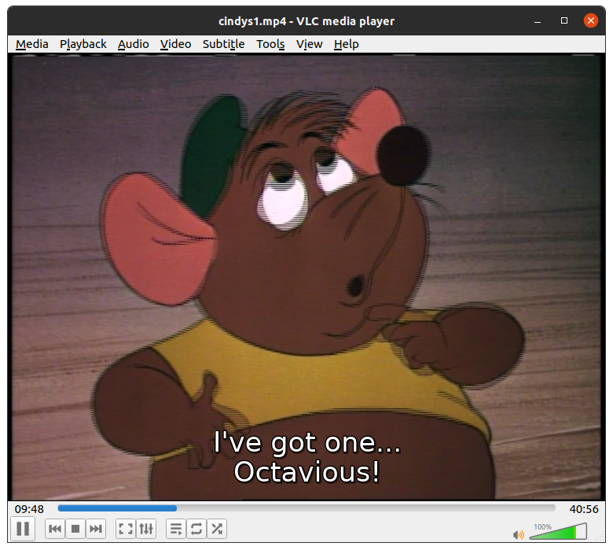
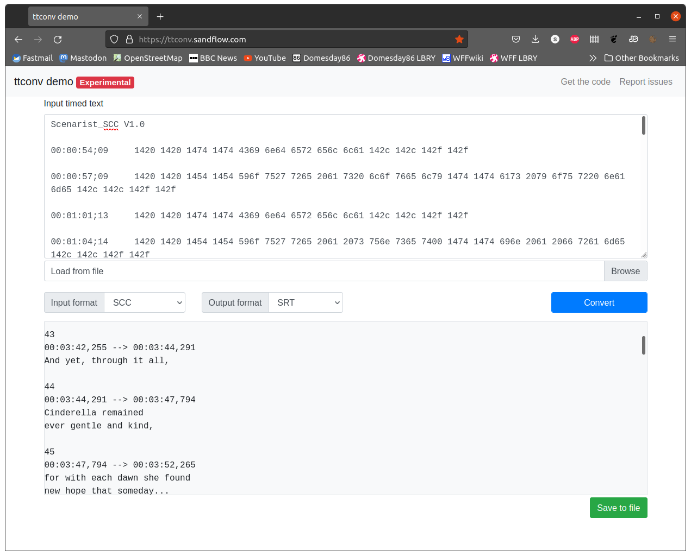

# Working with subtitles

The NTSC LaserDisc format fully supported standards-based Closed Caption data that allowed various consumer equipment to super-impose subtitles over video.

It should be noted that only NTSC format discs can support Closed Caption.

## Generating the Closed Caption data

The ld-decode tool does not generate the Closed Caption data as the data is encoded into the visible frame area of the picture.  Due to this it is necessary to run ld-process-vbi on the resulting TBC file in order to generate the NTSC CC fields in the JSON metadata.

Simply use a command line such as:

    ld-process-vbi my_ntsc_source.tbc

## Generating a SCC file

SCC is the Scenarist Closed Caption format V1.0 and uses .scc as the file extension.  SCC is the only supported output from ld-decode tools as the format keeps the closed caption data intact (i.e. no commands or other special data is lost in the convertion).

To generate an SCC file use a command line such as:

    ld-export-metadata --closed-captions /home/sdi/Decodes/cinder/cindys1.scc /home/sdi/Decodes/cinder/cindys1.tbc.json

This will create the required SCC file (this file is readable in any text editor if you'd like to view the contents).

## Converting the SCC file to SRT

SRT is a format commonly used in tools such as the VLC media player and allows the player to overlay subtitles during video playback:

To convert the SCC format file into SRT (and other common formats) you can use a tool like ttconv.  The tool has an online test page allowing you to upload the SCC file and get a converted SRT in return:

This tool is available from [the ttconv github](https://github.com/sandflow/ttconv), the test page is available from [this link](https://ttconv.sandflow.com/)
