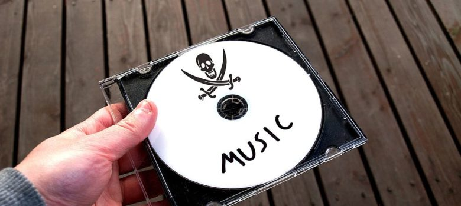
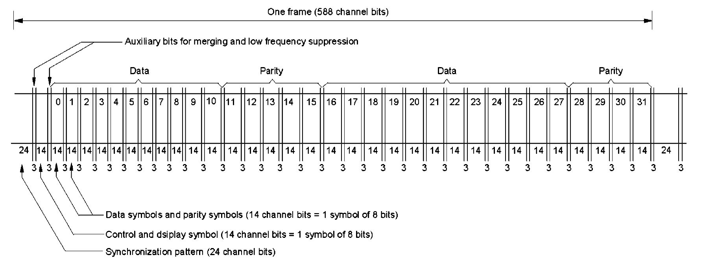
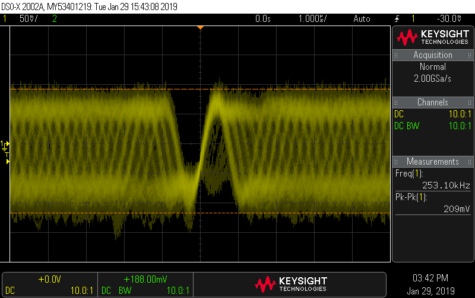
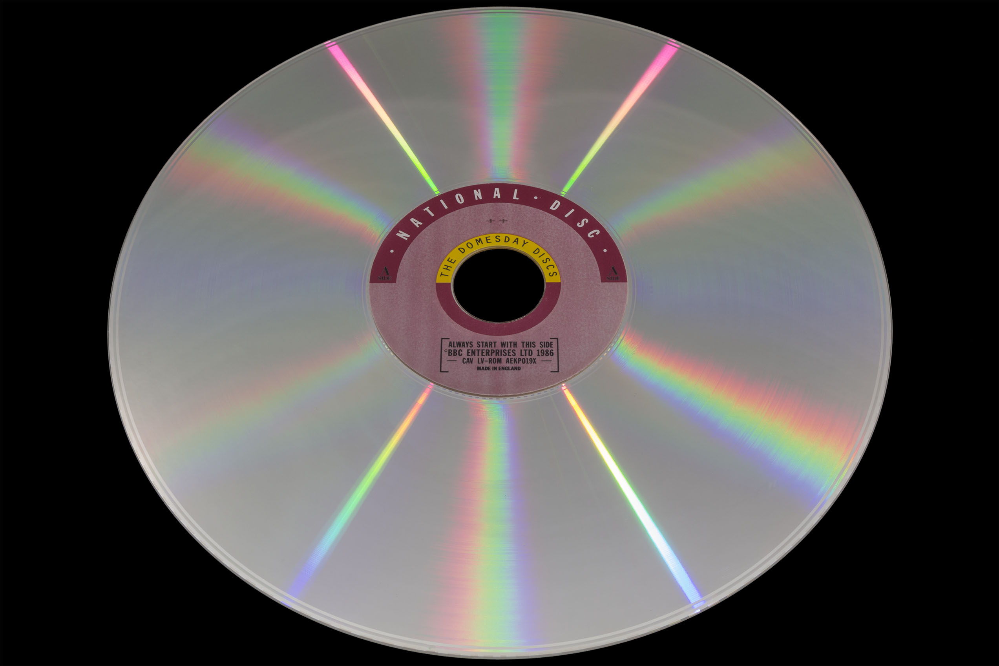

# Digital media preservation – Why you’re doing it wrong…

Ok, so the statement “you’re doing it wrong” is a strong one but, in most cases it’s quite true.  There are many projects out there that state they are preserving things; however, in most cases, what they are really doing is preparing copies suitable for some form of emulation.  There is a lot of confusion between the end-user’s perspective of “can I play it?” and the technical question of “is it preserved?”.  Projects like [MAME](https://www.mamedev.org/) aim for the latter, but most aim for the former.  

This doesn’t mean that any of these projects have no worth, in most cases they are performing a useful service, <u>however that doesn’t mean that it’s preservation</u>.

Let’s take a simple case, the humble audio CD (Compact Disc).  Most people realise that you can’t preserve the CD by simply sampling the audio, the process would be digital to analogue and then back to digital again, as well as the inaccuracy of re-sampling you will also introduce noise and other undesirable effects into the copy.  So, how about putting it in your CD-ROM player and making a direct digital copy?  Well, that’s better no doubt, but what have you made a copy of?  You have copied the digital audio data represented by the data on the CD – but (and here’s the important bit) not the actual CD itself.

> _An audio CD (Santeri Viinamäki CC BY-SA 4.0)_

The simple test of copying versus preservation is (in the author’s humble opinion) – Can you (in theory) take the representation you created and turn it back into the source media?  Even an audio CD has a lot more data than just audio, there is track data, channel data and other types of ‘metadata’ (i.e. data about the data).  To make matters more complex, most technical people understand that there is error-correction even on the humble audio CD, but what happens to the data that is used to perform the error-correction when you copy only the audio data?  At even lower levels there is EFM ([Eight to Fourteen Modulation](https://en.wikipedia.org/wiki/Eight-to-fourteen_modulation)) and ‘merging bits’ (used to maintain the DC offset when the data is read by the laser) – all of this is lost when the data is interpreted and converted into audio (the same is true of CD-ROMs, even the data you get back isn’t the original data mastered onto the disc).

> _One frame of of a CD showing how much is really data_

So how can preservation be achieved?  Many will state that you must be able to make two copies and ‘hash’ them to prove they are the same; however, if that is a requirement, you are not preserving the original disc, merely making a high-quality representation...

Continuing with the example of a CD (although most issues are common to all ‘digital’ media); when a player ‘reads’ a disc what it’s really doing is scanning the surface of the disc with a laser (there are also the physical issues of tracking and avoiding cross talk, etc. but that’s a subject in itself though!).  The result of this is a RF signal.  The RF signal is not digital it’s **analogue**.  Let me repeat that one more time as it’s really important… The RF signal is not digital it’s **analogue**.  There is really no such thing as ‘digital media’, it simply _does not_ and cannot exist.  All media is analogue.  When the laser scans the pits of digital zeros and ones on the CD surface what it actually produces is a sinusoidal signal caused by the laser passing in and out of the pits which are really slopes not sharp ridges.

> _EFM RF data from a disc via a digital store ossiliscope_

The CD player takes the analogue RF from the laser and (typically) passes it through a phase-locked loop, the output from there is then measured from zero-cross (the point at which the sine wave passes through the centre point of the signal) to zero-cross.  This measurement is then divided by a known time period to convert it back to a digital representation (in the case of CDs this is known as T3 to T11 – the maximum and minimum allowed periods).  So, at this point we have a ‘perfect repeatable copy’ right?

Unfortunately not - the analogue surface is not perfect.  Anything from manufacturing defects to surface dirt and damage can throw the process off and cause errors.  The way to understand this is to imagine that you take two photographs of the same disc (at really high-resolution) – in both pictures you will see the same disc, but are the two pictures ‘the same’?  Of course not, there will be minor variation in both.  If you take two pictures of two different discs (containing the same data) then the difference is even greater.  So there goes the ‘hash two copies and verify theory’.

The simple fact is that the best you can hope for is to preserve one individual disc (at a time) at the highest possible resolution.  Later you can play with combining representations of the same disc, hashing and all that but, for preservation, that isn’t really important (even if the disc is damaged so badly it cannot be read or used, it’s still possible to preserve it; again, preservation and a ‘usable representation’ are not the same thing).

There’s another important factor here which I haven’t yet mentioned.  If you make a representation of what you ‘think’ is on the disc, how do you know it’s complete?  There are many examples of people discovering new facts about the content of a medium; unless you preserve the contents of the media there is no way to ensure you captured everything.  Analogue level capture is the closest thing to ‘getting everything’ – even if there are things on the medium that you don’t understand (or know about at the time of capture).

This all becomes even more important for analogue content such as that stored by LaserDiscs.  In the case of an audio or data CD there are methods to ‘know’ if your representation is correct (by examining the error correction process for example) but, for analogue content such as video on a LaserDisc or a VHS cassette, there is no such luxury.

> _The Domesday National Laserdisc_

For analogue content the only hope for preservation is to capture the contents of the medium at a higher resolution than it was possible to master it.  Ideally you would capture it at an infinitely high-resolution, however technology, practicality and cost are always factors.

If cost was not an issue, the best method to preserve optical media would be to make a picture of the disc using a very high resolution microscope (such as electron microscopes) and then decode the contents from there; however that is out of reach for the hobbyist, so some other means is required.  Clearly there is a need to capture the optical disc as an analogue source and the most practical way to do that is to scan the surface with a laser.  It’s not a coincidence that LaserDisc players and CD players do exactly that.  What’s needed is some way to capture the analogue data as the player ‘scans’ which is exactly what FM RF Archival solutions like the [Domesday Duplicator (DdD)](Overview.md) & [MISRC](https://github.com/Stefan-Olt/MISRC) are designed from the ground up to do.  

The disadvantage of this type of approach is that the captured image isn’t directly usable, requiring post-processing. 

> _VHS PAL FM RF --> Baseband PAL --> YUV "full 4fsc frame" Image Example_

It requires fairly complex decoding in order to be turned back into a ‘usable’ visual/audio representation (which is why projects such as [LD-Decode](https://github.com/happycube/ld-decode/wiki) / [VHS-Decode](https://github.com/oyvindln/vhs-decode/) / [HiFi-Decode](https://github.com/oyvindln/vhs-decode/wiki/HiFi-Decode) / [CVBS-Decode](https://github.com/oyvindln/vhs-decode/wiki/CVBS-Composite-Decode) / [MUSE-Decode](https://bitbucket.org/staffanulfberg/ldaudio/src/master/musecpp/) and even [CD-Decode](https://github.com/happycube/cd-decode) exist today).

Stepping away from optical media for a second, the same is true for preservation of even simple things like computer game cassettes.  A digital representation is just that, you’ll never be able to get back the analogue original recording from it.  Of course cost and practicality come back to play here too; if 99% of people think ‘who cares?’ or ‘what difference will it make?’ then it will be a difficult task to actually perform the preservation.  It’s actually easier to justify the extra preservation effort for purely analogue content as there isn’t the luxury of being able to ‘cheat’ (and high-resolution preservation provides opportunity to create extremely good representations – even better than a real ‘player’ would or could achieve with orignal hardware).  Most people are happy with an accurate digital representation of the audio on a CD as it’s the content that’s viewed as the important part (until some unexpected content pops up, usually in the form of copy protection).  For a LaserDisc game like [Dragon’s Lair](https://en.wikipedia.org/wiki/Dragon%27s_Lair) or a historically important system like the [BBC Domesday](https://www.domesday86.com/?page_id=2140), the preservation becomes far more important than the possibility to immediately emulate.

