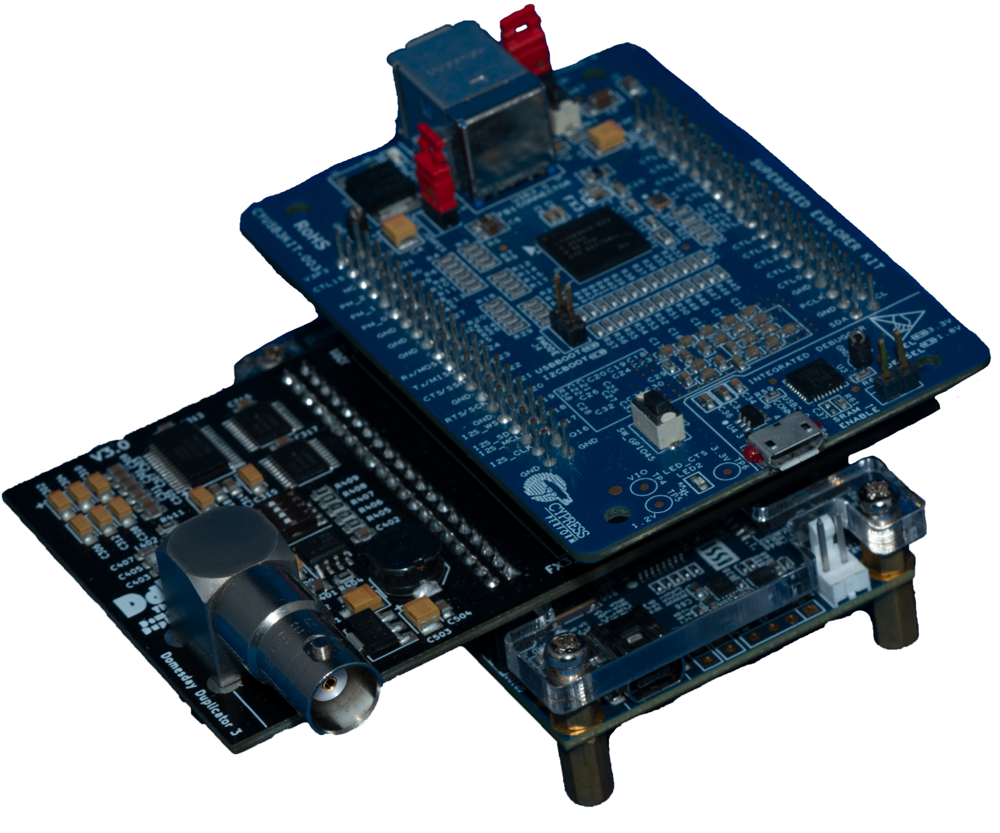
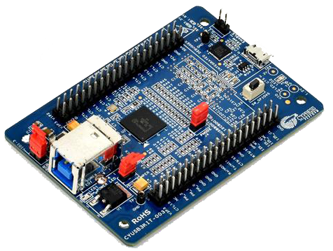
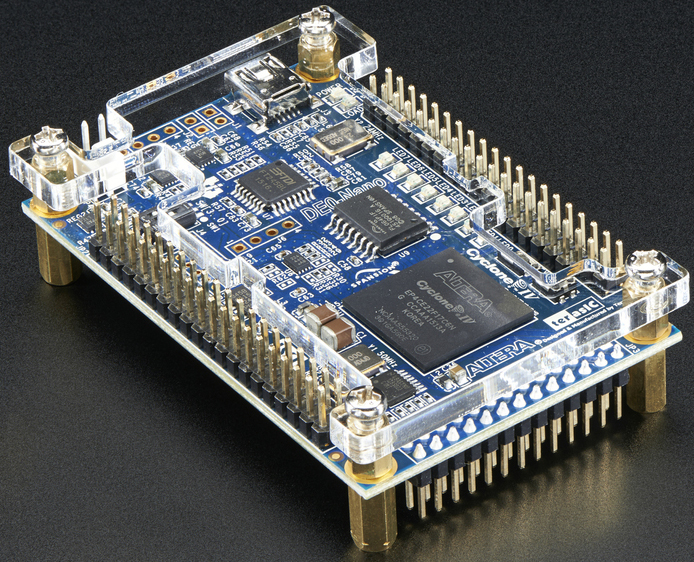
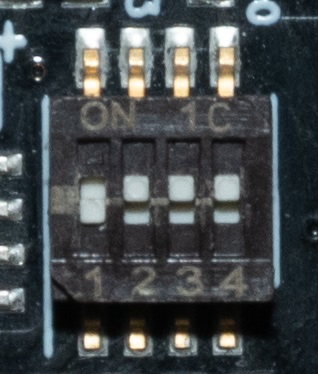

# Firmware Flashing Guide 

This is the firmware flashing guide and basic software user guide.  

This is based around Windows 10.

## Software To Install

[Download Software & Firmware Bundle Here!](https://drive.google.com/file/d/1rqnqQy7h8KjSP-bJ-Y6uXyeQgXAMRrB6/view?usp=drivesdk)

- `FX3 SDK Setup 1.3.4.exe`
- `dotnetfx35.exe`  
- `IQuartusLiteSetup-18.0.0.614-windows.exe`

## Hardware Required 

- USB 2.0 Mini Cable - For flashing the DE0  
- USB 3.0 Type-B Cable - For Flashing & using the FX3   
- M3 Nuts / Bolts & screwdriver bit or allen key (if 3D printing a case)  
- Copper Tape (for shield lining a 3D printed case)

> [!NOTE]  
> - FX3 comes with a USB 3.0 Type-B to Type-A cable.
> - DE0 comes with a USB 2.0 Mini to Type-A cable.

### Assembled DdD Reference:

# FX3 Flashing

If assembled with the DdD / DE0 Nano, disassemble them with vertical pulling. You may want to wiggle it side to side a little.

1) Ensure `FX3 SDK 1.3.4` is installed.

2) Add a new or us the red/orange jumper connector from the `VBUS_JUMPER` pins (below the USB port) onto the `PMODE J4` pins (in the middle of the board) in order to bridge J4 which enables flashing.

3) Connect the FX3 via the USB 3.0 Type-B cable. DO NOT use the USB 2.0 mini as then the board will fail to flash.

4) Open Device Manager, and find "West Bridge". (normally in "Other Devices")

5) Right click on the device. Properties -> Driver -> Update Driver -> Browse my computer for drivers -> Let me pick from a list of available drivers on my computer. 

Now browse to the folder location of the Software/Firmware package. 

`DomesDayDuplicator Firmware Deployment\FX3-Firmware\USB Driver\bin\Win10\x64` 

(This will install `cyusb3.inf`. There are also XP/Win7, etc drivers.)

1) Unplug and reconnect the FX3. Now the device name should be "Cypress FX3 USB BootLoader Device".

2) You should have the "USB Control Center" application open. Select the "FX3 BootLoader Device".

3) Hover over "Program" (top menu bar) and "FX3", then click on "I2C EEPROM". It'll flash automatically.

4)  You should see success on the bottom of the USB Control Center screen. Disconnect your device and **MOVE THE JUMPER BACK TO ITS ORIGINAL POSITION**

# DE0-NANO Flashing

Ensure `dotnetfx35` and `QuartusLiteSetup` are installed.

1) Connect the DE0 via the USB 2.0 mini.

2) Open Device Manager, and find "USB-Blaster". (normally in "Other Devices".)

3) Right-click on the device. Properties -> Driver -> Update Driver -> Browse my computer for drivers -> Let me pick from a list of available drivers on my computer. Now browse to the folder location of the Software/Firmware package. 

`DomesDayDuplicator Firmware Deployment\DE0-Nano-Firmware\USB Device Drivers`

4) You should now see "Altera USB-Blaster" in the device manager and your device should have green lights - this means flashing is enabled.

5) Open "Quartus" (Prime 18.0 Lite Edition) and click "Hardware Setup...". Double click on "USB-Blaster" and close the window.

6) Hover over "Tools" (top menu bar) and select "Programmer".

7) Select "Add File" (on the left) and select "DomesdayDuplicator.jic". you can pick the 2023 'V2' Firmware (which stops captures if dropped samples are detected) or the original firmware.

8)  Select the "Program/Configure" and "Verify" checkboxes.

9)  Click "Start" (on the left) and observe the progress bar in the top right corner, a blinking LED will indicate the process. A striping blinking pattern indicates the DE0 is flashed properly.

10) Disconnect your device.

11) The boards can now be assembled. 

# DdD USB Device Driver Install (Windows)

(required to re-do on each new system)

Open Device Manager and check if the device is present and flashed properly.

Use Windows DdD Device Driver \-\> zadig-2.5.exe \-\> WinUSB

Or manually install the WinUSB driver to complete the DdD setup 

# DdD Gain Control (4 DIP Switch)

0000 is 1-2-3-4 dips, In orientation to bottom numbers up is 1 and down is 0

All selected in this up position is 1111 or 2.02 Minimum Gain When dip’s 2-3-4 are down it's 1000 this is the maximum gain of 8.5, the table below shows all possible positions.

| **Configuration** | **Switch Position** | **Gain** |
| ----------------- | ------------------- | -------- |
| 15                | 1111                | 2.02     |
| 7                 | 0111                | 2.17     |
| 11                | 1011                | 2.27     |
| 13                | 1101                | 2.45     |
| 3                 | 0011                | 2.54     |
| 14                | 1110                | 2.59     |
| 5                 | 0101                | 2.79     |
| 6                 | 0110                | 3.02     |
| 9                 | 1001                | 3.04     |
| 10                | 1010                | 3.34     |
| 1                 | 0001                | 3.8      |
| 12                | 1100                | 4        |
| 2                 | 0010                | 4.4      |
| 4                 | 0100                | 6        |
| 8                 | 1000                | 8.5      |

## Finishing Things to Note

- The .sha3-512 files are checksums that can be used to validate if a file is damaged and is easy to verify with [GTKHash](https://github.com/gtkhash/gtkhash/releases/tag/v1.5) or [RapidCRC](https://www.ov2.eu/programs/rapidcrc-unicode).

- Only use the DdD on its own USB 3.0 controller. Other devices can crash it. (You may want to add a dedicated USB 3.2 Gen 2 card if a desktop user who already uses your ports.)

- 16-bit sample mode outputs `.raw` rename to `.s16` for decoders to be able to use them.

- Start capture before starting player this applies to tapes more so.

- Keep RF cable runs as short as possible 15-20cm and ideally 100cm max externally with no harsh bends or kinks in the run inside or from the player.

- Windows control/capture application is portable, the installation directory does not matter.

- LED’s should be a striping blinking pattern when the DE0 is flashed correctly. 

- The DdD is not immune from stray RF and EMI, a shielded case is ideal to prevent this.

# Capture Application Setup

Downloads:

- [Linux](https://github.com/simoninns/DomesdayDuplicator/wiki/User-Guide\#installation)
- [Windows](https://github.com/simoninns/DomesdayDuplicator/releases/)
- [MacOS](https://github.com/simoninns/DomesdayDuplicator/releases/)

## RF Capture Modes 

40msps `.lds` (10-bit packed)

40msps `.raw` (singed 16-bit raw)

10msps `.cds` (4:1 decimated not used/supported anymore)

## Proper Readout Measurement

We now have a measurement of the signal in real-time, this allows you to adjust the gain level in real-time during your initial test capture and see if something is wrong or clipping in general.

In order to assemble the boards, you will need to cut two pins on the DdD board where the FX3 has 2 blank holes. A generic pair of flush cutters will do the trick.

Simply line up the boards and press carefully in the centre and sides to push the pin headers together.

DomesdayDuplicator should now show up in Device Manager.

DdD USB Device Driver Install (Windows) - required to re-do on each new system.

1) Open Device Manager and check if the device is present and flashed properly.

2) Use Windows DdD Device Driver -> zadig-2.5.exe -> WinUSB (or manually install the WinUSB driver to complete the DdD setup).

