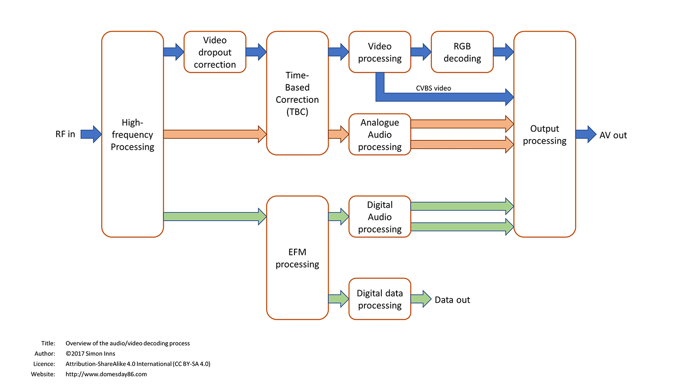
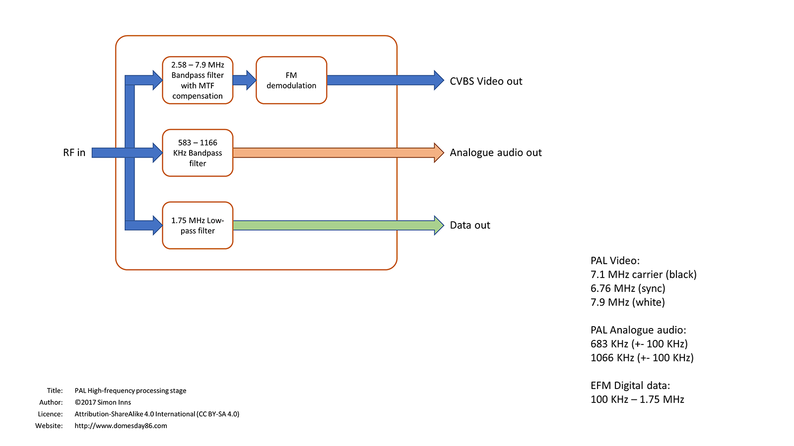
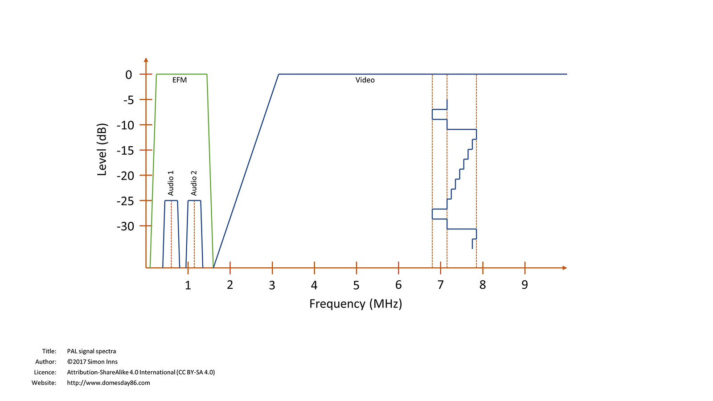
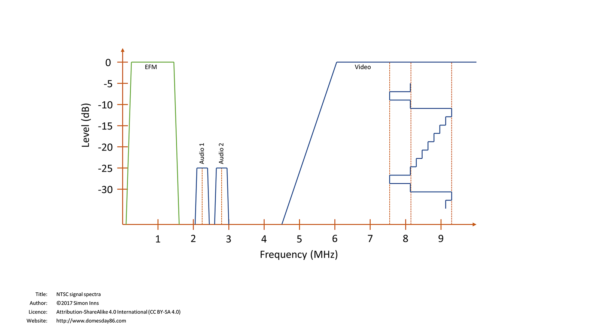
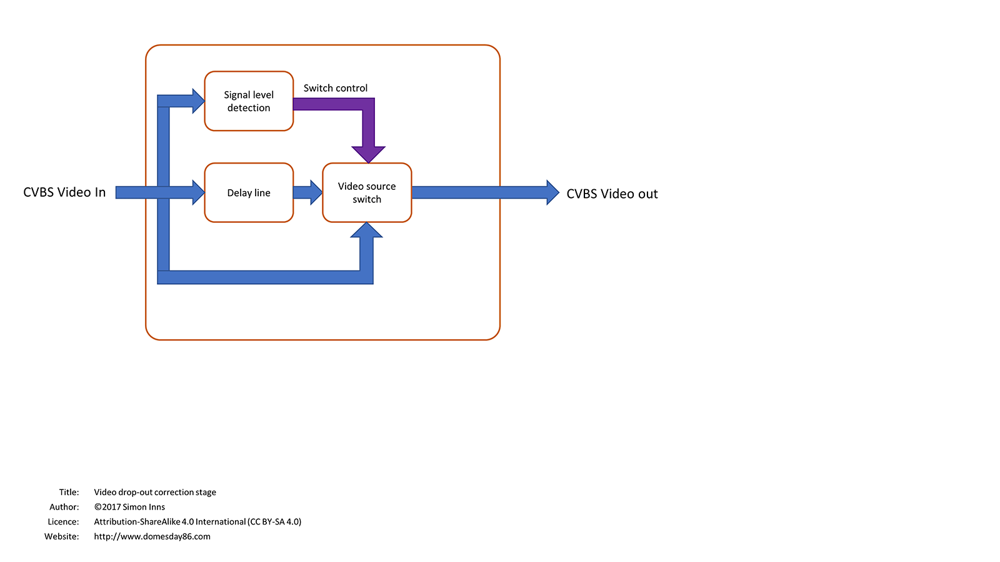
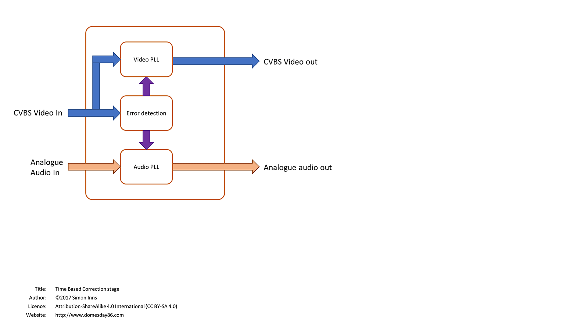
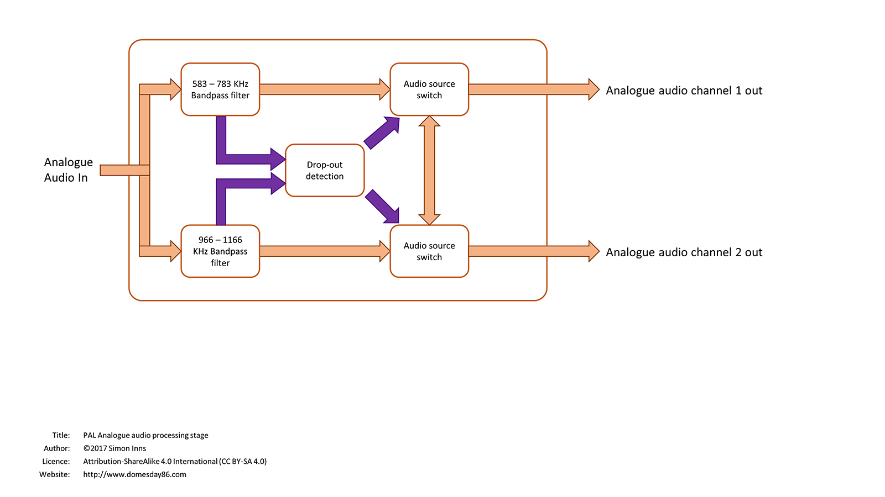
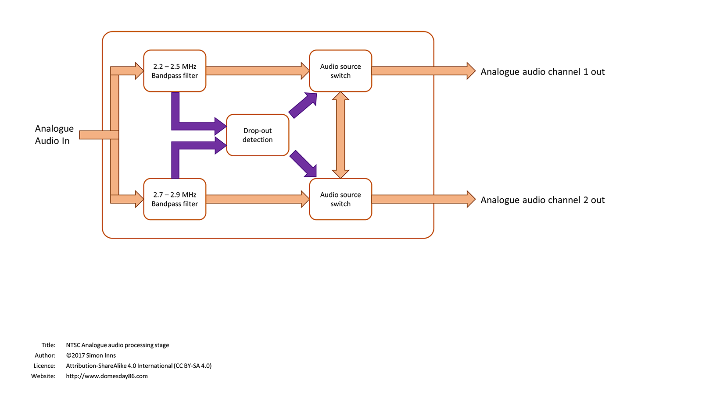
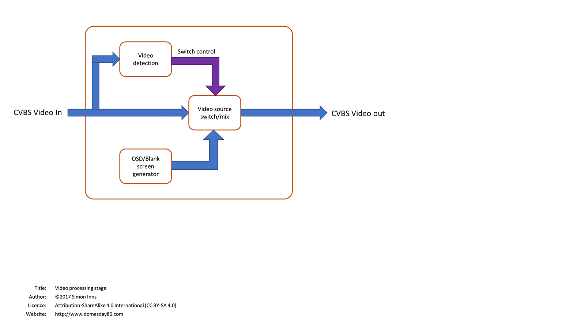
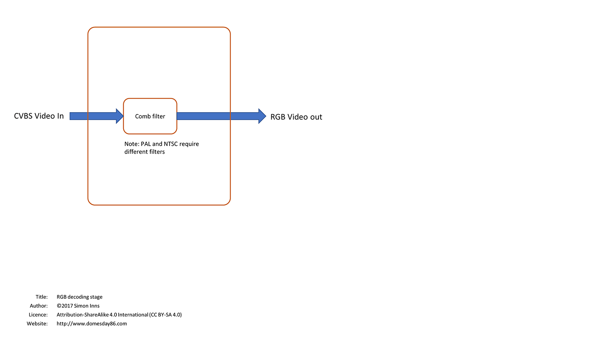

# The LaserDisc Player

The Domesday Duplicator is a high-speed DAQ for capturing the RF output from a laserdisc player. In order to use the RF capture it is necessary 'decode' the captured RF sample into video, audio and data. Understanding what's involved in the decoding process requires a basic knowledge of the design of a laserdisc player. The following diagram shows the audio/visual processing flow of a hypothetical laserdisc player: 

 

The modulated signal generated by a laserdisc is a combination of FM signals modulated at different frequencies.  The frequencies are different for both PAL and NTSC (and are specified by IEC 60856 (PAL) and IEC 60857 (NTSC)):

* PAL
  * Audio 1 – 683,593.75 Hz (0.68 MHz)
  * Audio 2 – 1,066,406.25 Hz (1.06 MHz)
  * EFM (digital) – Approximately 100,000 Hz (0.1 MHz) – 1,500,000 Hz (1.50 MHz) - see notes below
  * Video carrier – 7,100,000 Hz (7.1 MHz)
* NTSC
  * Audio 1 – 2,301,136 Hz (2.30 MHz)
  * Audio 2 – 2,812,499 Hz (2.81 MHz)
  * EFM (digital) - Approximately 100,000 Hz (0.1 MHz) – 1,500,000 Hz (1.50 MHz) - see notes below
  * Video carrier – 8,100,000 Hz (8.10 MHz)

Please note that this page is a work in progress and will be updated with further details over time.  References are given to various specifications and any implementation should be verified against the original specifications.

# PAL front-end
The following diagram shows the high-level processing required by a PAL signal processing front-end: 

## PAL RF Spectra
The following diagram shows the approximate spectra for the modulated RF signal generated from a PAL laserdisc: 

_PAL RF Spectra_

## PAL video high-pass filter design
The IEC specification (60856) states that the video carrier frequency is equivalent to 30 IRE of the video level (blanking level) which ranges from 0 IRE (black) to 100 IRE (white). 

The IEC specification states that the deviation between the ‘30 IRE over blanking level’ and white is 800,000 Hz (0.8 MHz) meaning that the white level of a PAL signal is 800,000 Hz above the carrier, i.e. 7,900,000 Hz (7.9 MHz). 

Since the IEC specification does not state the 0 IRE frequency this can be calculated from the other levels.  If white is 7,900,000 Hz and 30 IRE above black is 7,100,000, the black level (0 IRE) must be 6,757,143 Hz (6.75 MHz). 

A PAL signal has a chrominance carrier frequency of 4,430,000 Hz (4.43 MHz) meaning that the (first order) lower-sideband is 4,430,000 Hz (4.43 MHz) below the carrier frequency (7.1 MHz).  Therefore, the lowest frequency of the PAL signal is 2,580,000 Hz (2.58 MHz). 

**Note**: See [Digital Audio Modulation in the PAL and NTSC Optical Video Disk Coding Formats](https://www.domesday86.com/wp-content/uploads/2018/01/Digital-Audio-Modulation-in-the-PAL-and-NTSC-Optical-Video-Disk-Coding-Formats.pdf) from Philips Research Laboratories, page 884 for details.

To filter the PAL video signal from the audio signals a high-pass filter can be used (as there are no frequencies in use above the video signal).  The high-pass filter should have a stop-band of 0 Hz to 1,066,406 Hz (1.06 MHz) and a pass-band of 2,580,000 Hz (2.58 MHz) to infinity.  Note that the IEC specification states a ± 50,000 Hz (0.05 MHz) deviation of the carrier frequency.

## Analogue Audio 1 band-pass filter
The IEC 60856 specification states that the audio 1 channel has a maximum deviation of ± 100,000 Hz (0.1 MHz) from the audio 1 carrier frequency meaning that the pass-band of the band-pass filter should be 583,593.75 – 783,593.75 Hz (0.58 MHz – 0.78 MHz).  The upper-stop band of the filter needs to be at most 966,406 Hz (0.96 MHz) to avoid the lower-edge of the audio 2 channel.

## Analogue Audio 2 band-pass filter
The IEC 60856 specification states that the audio 2 channel has a maximum deviation of ± 100,000 Hz (0.1 MHz) from the audio 2 carrier frequency meaning that the pass-band of the band-pass filter should be 966406.25 – 1,166,406.25 Hz (0.96 MHz – 1.16 MHz).  The upper-stop band of the filter needs to be at most 2,580,000 Hz (2.58 MHz) to avoid the lower-edge of the video signal.

#  EFM digital low-pass filter
The required design for the PAL EFM low-pass filter (pre-modulation) is given by the IEC specification 60856 (amendment 2) and is as follows: The frequency response shall be as follows:

* Up to 1.6 MHz ±0.5 dB (ref. 0.5 MHz)
* 75 MHz (-3 ± 0.5) dB
* 2 MHz (-26 ± 2) dB
* \>2.3 MHz < -50 dB

The group delay shall be as follows:

* <0.5 MHz (0 ± 20) ns (ref. 0.5 MHz)
* 8 MHz (-50 ± 20) ns
* 1 MHz (-100 ± 50) ns
* 2 MHz (-180 ± 50) ns
* 1.4 MHz (-350 ± 75) ns

# NTSC front-end
The following diagram shows the high-level processing required by a NTSC signal processing front-end: 

## NTSC RF Spectra
The following diagram shows the approximate spectra for the modulated RF signal generated from an NTSC laserdisc: 

_NTSC RF Spectra_

## NTSC video high-pass filter design
The IEC specification (60857) states that the video carrier frequency (8,100,000 Hz) is equivalent to 0 IRE of the video level (blanking level) which ranges from 0 IRE (black) to 100 IRE (white). 

The IEC specification states that the deviation between the -40 IRE level and 100 IRE (white) is 1,700,000 Hz (1.7 MHz) meaning that the white level of an NTSC signal is 9,314,286 Hz (9.31 MHz). 

A NTSC signal has a chrominance carrier frequency of 3,580,000 Hz (3.58 MHz) meaning that the (first order) lower-sideband is 3,580,000 Hz (3.58 MHz) below the carrier frequency (8.1 MHz).  Therefore, the lowest frequency of the NTSC signal is 4,520,000 Hz (4.52 MHz). 

**Note**: See [Digital Audio Modulation in the PAL and NTSC Optical Video Disk Coding Formats](https://www.domesday86.com/wp-content/uploads/2018/01/Digital-Audio-Modulation-in-the-PAL-and-NTSC-Optical-Video-Disk-Coding-Formats.pdf) from Philips Research Laboratories, page 884 for details. 

To filter the NTSC video signal from the audio signals a high-pass filter can be used (as there are no frequencies in use above the video signal).  The high-pass filter should have a stop-band of 0 Hz to 2,812,499 Hz (2.81 MHz) and a pass-band of 4,520,000 Hz (4.52 MHz) to infinity.  Note that the IEC specification states a ± 50,000 Hz (0.05 MHz) deviation of the carrier frequency.

## Analogue Audio 1 band-pass filter
The IEC 60857 specification states that the audio 1 channel has a maximum deviation of ± 100,000 Hz (0.1 MHz) from the audio 1 carrier frequency meaning that the pass-band of the band-pass filter should be 2,201,136 – 2,401,136 Hz (2.20 MHz – 2.40 MHz).  The upper-stop band of the filter needs to be at most 2,712,499 Hz (2.71 MHz) to avoid the lower-edge of the audio 2 channel.

## Analogue Audio 2 band-pass filter
The IEC 60857 specification states that the audio 2 channel has a maximum deviation of ± 100,000 Hz (0.1 MHz) from the audio 2 carrier frequency meaning that the pass-band of the band-pass filter should be 2,712,499 – 2,912,499 Hz (2.71 MHz – 2.91 MHz).  The upper-stop band of the filter needs to be at most 4,520,000 Hz (4.52 MHz) to avoid the lower-edge of the video signal.

## EFM digital low-pass filter
The required design for the NTSC EFM low-pass filter (pre-modulation) is given by the IEC specification 60857 (amendment 2) and is as follows: The frequency response shall be as follows:

* up to 1.6 MHz ±0.5 dB (ref. 0.5 MHz)
* 75 MHz (-3 ± 0.5) dB
* 2 MHz (-26 ± 2) dB
* \>2.3 MHz < -50 dB

The group delay shall be as follows:

* <0.5 MHz (0 ± 20) ns (ref. 0.5 MHz)
* 8 MHz (-50 ± 20) ns
* 1 MHz (-100 ± 50) ns
* 2 MHz (-180 ± 50) ns
* 4 MHz (-350 ± 75) ns

# Signal drop-out detection
Laserdiscs can suffer from 'drop-out' when reading a laserdisc. These temporary losses of signal are caused by scratches, dust, fingerprints on the disc surface and any number of other issues when reading the disc's contents. Ordinarily a drop-out would appear as a black line in the resulting video output. The drop-out correction stage attempts to hide these imperfections by holding the previous line of video (using something called a delay line) and then inserting this into the present line of video if a drop-out is detected:

# Time-based correction
As the laserdisc spins in the player the rotational speed of the disc varies due to the mechanical nature of the player. This rotational error causes 'jitter' in the resulting video and audio signals. The jitter has the effect of making video and audio stretch and compact causing distortion in the signal. The laserdisc player employs a time-based correction technique to the signal by monitoring the timing of the video and comparing this to a reference clock. The TBC then stretches or compacts the video lines to compensate for the mechanical error (there are different techniques for this but most use a phase-locked-loop or PLL method). As the video signal is more complex than the audio (and contains sync details) it is used to compensate both the audio and the video:

# Analogue audio processing
The audio processing stage separates out the two audio channels using bandpass filters and then demodulates the audio signal. Some players provide drop-out detection for the audio signal (similar to the video drop-out detection). If drop-out occurs the player will route the audio from the other channel to mask the interruption in sound. Of course this only works for stereo sound (which is most common) however, technically a laserdisc provides two independent sound channels; so this is not a fool-proof technique:

 

For NTSC players the techniques are the same as PAL players however, the filter frequencies are different: 

# Additional video processing
Often players provide an additional video processing stage that can detect if video is being output from the RF processing stages (i.e. a disc is playing and a valid video signal is being created). When no video is present from the disc the player replaces the video signal with either a black screen, on screen display graphics or a combination of the two: 

# CVBS to RGB conversion (comb filter)
Converting the CVBS video produced by the laserdisc into RGB (to make the signal suitable for certain types of TVs/monitors) is a complex process involving a mathematical filter known as a comb filter. This step is optional as most players provide a direct CVBS output (i.e. the composite video output): 

# EFM digital data processing
In addition to the stages described there is also a digital data decoding process called EFM. The digital data on a laserdisc is usually digital audio however, in the case of AIV discs and other LV-ROM formats, this can also be digital data for processing by a computer. EFM decoding is a complex subject by itself and more details can be found on the web.