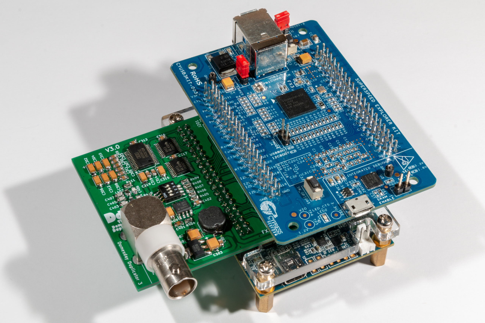
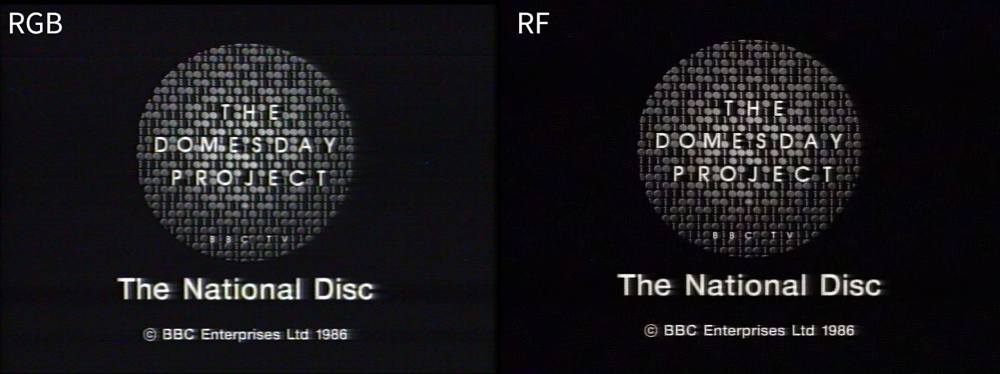
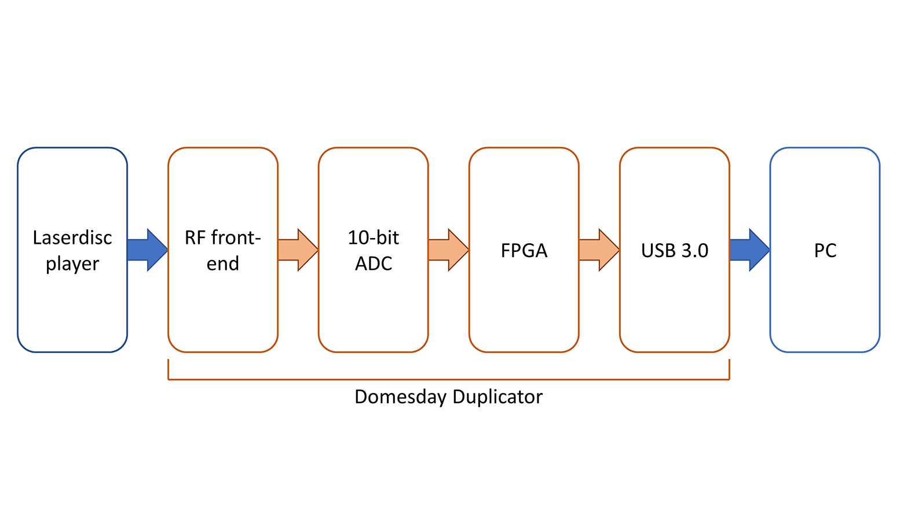
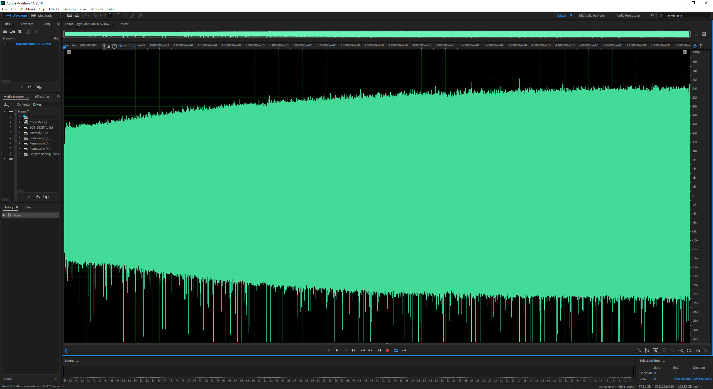
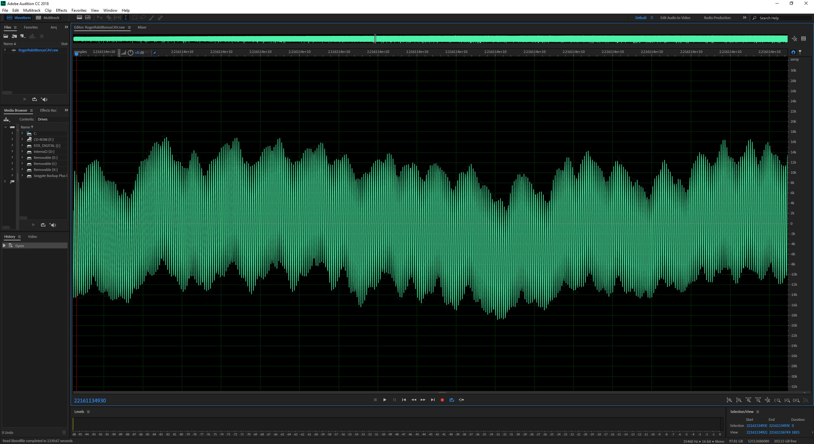
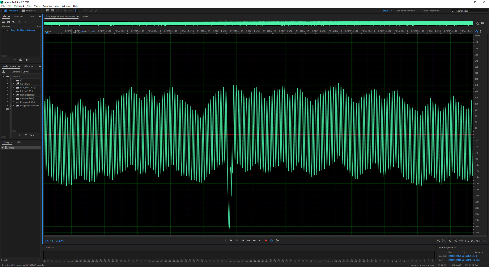

# Overview of the Domesday Duplicator

The Domesday Duplicator is intended to allow high-quality back-ups of the analogue information contained on the BBC Domesday laserdiscs by bypassing most of the 30-year-old electronics in the Philips VP415 player. Direct RF sampling also allows all information on the laserdiscs to be duplicated (unlike conventional RGB sampling of the video output). Since the BBC Domesday AIV laserdiscs are a combination of video, pictures, sound and data (as well as numerous VBI streams), direct RF sampling is the preferred method of preservation.  The Domesday Duplicator is not limited to duplicating just Domesday AIV laserdiscs and can be used to capture any type of laserdisc supported by the attached laserdisc player.

Note that the Pioneer LD-V4300D is used as a **reference and test player** by the project (and is noted as such in the documentation and guides) however, the Domesday Duplicator is proven to work with any well calibrated LaserDisc player (i.e. the player **does not** have to be a 4300).  Your chosen player should have a service manual available so you can a) find and access the RF test-point and b) calibrate the player according to the service manual instructions.

The Domesday Duplicator captures the raw RF signal from a laserdisc player’s laser.  The player provides the mechanical tracking, focus and movement of the laser over the disc’s surface and the duplicator records the signal.  This effectively turns the laserdisc player into a highly accurate optical scanner.  The resulting sample is the spiral of analogue data represented by the continuous track on the disc. The aim is to ensure that the sample resolution is higher than the resolution by which the disc was originally recorded.  This way you could (in theory) produce another disc from the copy – and that ‘round-trip’ preservation loop means you capture everything on the disc, even if you can’t decode it yet (or if there is data you didn’t know about).

Since the resulting sample is still a laserdisc, you need a laserdisc player to play it. Therefore, the next stage of development is to produce an emulated laserdisc player in software that will play the ‘disc’ and output the resulting sound, video and data (data being a complex mix of Acorn VFS partitions, frame data, VBI, teletext, etc.).  Of course, the better the emulator, the better the resulting video and sound – and it’s fairly easy to see how a fully digital emulated player could out-perform a 30 year old analogue VP415 (and the ‘samples’ won’t wear out or degrade like physical discs). 

The Domesday Duplicator project is completely open-source and open-hardware.  For details of how to obtain the source code and hardware files please see the [software overview page](Software-Guide). The hardware is a USB3 based 10-bit analogue to digital converter that uses an FPGA to control the real-time sampling and USB3 to transfer the captured data in real-time to a PC. 

_The Domesday Duplicator 3_0_

The hardware/software solution was originally designed to act as a sampling front-end to the ld-decode (software decode of laserdiscs) project [https://github.com/happycube/ld-decode](https://github.com/happycube/ld-decode) and replaces the generic TV capture card to provide high-frequency sampling with 4 times the sample resolution.  Increasing the sample resolution allows better capture of disc overall however, the primary advantage is that the Domesday Duplicator provides better performance for weaker RF signals especially at the start of a laserdisc (where the RF output has lower amplitude) and when the disc is degraded due to age and surface damage. 

Domesday86 would like to thank Chad Page (the author of the ld-decode project) - without his tireless work producing ld-decode and his assistance in modifying the library to support the Domesday Duplicator project, this preservation method would not have been possible. 

The following image shows a comparison between RGB capture from a laserdisc player using standard video capture hardware and the output from the Domesday Duplicator RF capture after processing with ld-decode:

_Image showing a comparison of the same frame captured as RGB and as RF_

The following block-diagram shows the 4 high-level components of the Domesday Duplicator:

_Domesday Duplicator block diagram_

These components are described in more detail in the following sections: 

[Domesday Duplicator User Guide](User-Guide.md) 

[Domesday Duplicator Hardware Guide](../Hardware/Hardware-Guide.md) 

[Domesday Duplicator Software Guide](Software-Guide.md) 

The reference laserdisc player for the Domesday Duplicator project is the Pioneer LD-V4300D (**note**: this is the **reference player** (for development and testing) used by the project - the Domesday Duplicator works with any LaserDisc player that has an available service manual).  Information about the reference player is available from the following link:

[Pioneer LD-V4300D Overview](https://www.domesday86.com/?page_id=1176) 

The following diagram shows an RF sample of one side of a PAL laserdisc (103 Gbytes of data) sampled at 35.5 million samples per second (the 'spikes' from the lower part of the sample are optical drop-outs caused by imperfections on the disc surface as well as dust, etc.).  Note how the signal strength increases towards the end (outside) of a laserdisc: 

_PAL CAV Laserdisc RF sample (whole side)_

The following diagram shows a close up of the sampled RF signal: 

_Close-up of RF sample_

The following diagram shows a close-up of an optical drop-out (these imperfections cause the small black lines in the picture typical of laserdisc playback): 

_Disc snippet showing drop-out_

#An overview of the laserdisc decoding process

The Domesday Duplicator is a high-speed DAQ for capturing the RF output from a laserdisc player.  In order to use the RF capture it is necessary 'decode' the captured RF sample into video, audio and data.  Understanding what's involved in the decoding process requires a basic knowledge of the design of a laserdisc player.

#FAQ

Q: Why not just copy the laserdisc digitally like a DVD/CD-ROM?

A: Laserdiscs are analogue, so it's not possible to simply copy the video files from the disc as you would with digital media. 

Q: Don't the BBC already have a high-quality copy of the Domesday contents? 

A: Yes and no.  The BBC have a digital betacam version of the Community and National Domesday laserdiscs which includes both the video and audio.  However, there is a lot more information on an AIV laserdisc (ADFS data, VBI data, etc.) and, more importantly, there are a number of other AIV discs not covered by this backup.  Finally, the digital betacam copy is not accessible to the public; so there's no way to get a copy. 

Q: Why not just use a video capture card on the RGB/SCART/Composite output of the VP415? 

A: The video and audio produced by the VP415 has to pass through many analogue stages before it can be viewed as a PAL signal.  As the data is analogue each processing stage adds noise and distortion to the signal.  By sampling the RF directly from the player's laser you avoid all of the lossy stages.  Furthermore, the RF sampling can be performed using any PAL compatible laserdisc player - VP415 players are quite rare, this technique allows any player to be used to read the AIV disc contents. 

Q: I don't think the picture's that much better, what's the big deal? 

A: RF sampling preserves the contents of the laserdisc far better than 'ordinary' video capture.  It helps if you think of the RF sampling as 'scanning' the laserdisc surface with a laser; the RF sample is effectively a scan of the disc's surface.  Once scanned the methods for decoding the disc's contents can be improved over time and more types of information can be extracted from the image.  Right now the decoding is primarily for the video and audio content but soon it will be possible to extract VBI and data from the image too.  Furthermore, the techniques used to recover content such as video can also be improved leading to better output from the image (without the need to resample the disc).  RF sampling preserves the contents of the disc in a way that RGB capture cannot. 

Q: Why didn't you just use an off-the-shelf SDR board? 

A: Although there are SDR boards available that can perform RF capture they have RF front-ends designed for radio and therefore would need significant modification for use as a laserdisc sampler.  SDR boards are also quite expensive in comparison to the 'custom' part of the Domesday Duplicator.  A 10-bit single-ended ADC allows the design to be a very cost-effective solution.  Domesday Duplicator is also designed (from the beginning) to be a complete open-source, open-hardware solution, so a custom design allows better control over the licensing used for the project. 

Q: How big are the RF images? 

A: The duplicator can output the 10-bit samples as 16-bit signed data or as a byte-stream of 10-bit values.  In 16-bit mode the data is created at around 76 Mbytes per second which equates to about 270 Gbytes per hour of RF capture.  The bit-packed 10-bit format can store an hour of RF capture in about 170 Gbytes. 

Q: Will you copy my &lt;random laserdisc title&gt; disc for me, it's super-rare! 

A: No, the Domesday86 project is not a disc duplication service.  However, the project is completely open so you are welcome to build your own duplication set-up and duplicate your discs. 

Q: This project is just the most awesome thing I've ever seen!  How can I help? 

A: Hit the donate button on the page (above-right) and help us fund the necessary equipment needed to make Domesday86 a reality - every little helps!  All of the projects around Domesday86 are open-hardware and open-software, so donations are the only means of funding for the project. 

Q: Do I have to have a Pioneer LD-V4300D for the Domesday Duplicator to work? 

A: No.  The Duplicator will work with any player that has an available service manual (the service manual is required so the player can be calibrated and the RF test point accessed).
