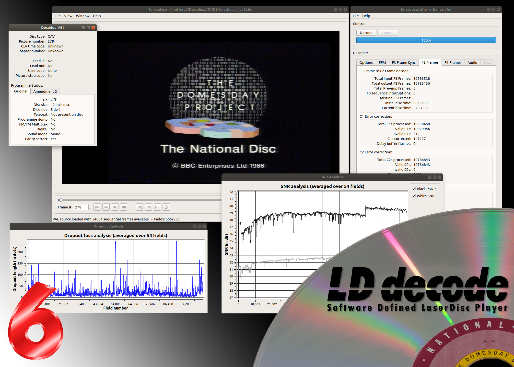
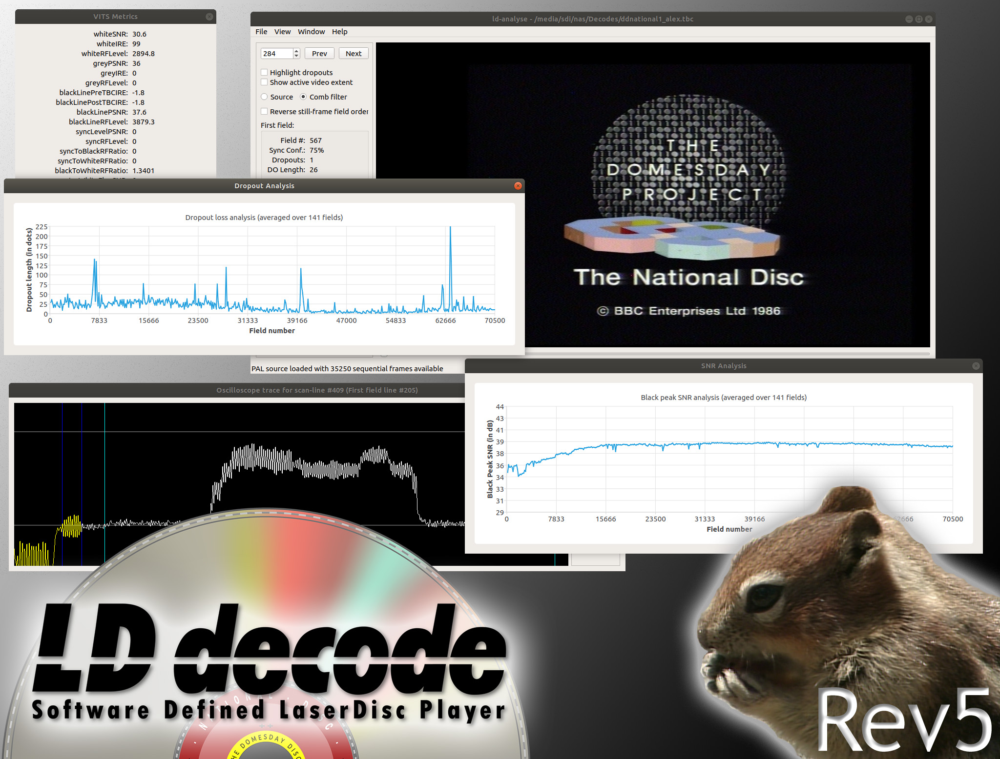

# Release highlights

## ld-decode revision 7

December 2022

* AC3 support!  (special thanks to Staffan Ulfberg for figuring out the decoding and error correction, and Ian and Leighton Smallshire for the code here)
* Improved ld-analyze UI with more functionality, including a vectorscope
* cmake is now used, allowing builds on many more distributions
* Improvements to disk stacking
* Further improved EFM decoding with better filters and higher accuracy
* ld-process-efm is now a command line tool
* DTS decoding support
* Option for line-locked NTSC analog audio output
* Improved analog(ue) audio decoding quality (but CX still needs work)
* Lots (and lots and lots) of bug fixes

## ld-decode revision 6

December 22nd 2019

* ld-decode processing speed greatly improved
* ld-decode and ld-decode tool multithreading support
* Direct support for compressed RF disc images in ld-decode
* Lots (and lots) of bug fixes
* Improved TBC
* NTSC Analog audio improvements
* PAL Analogue audio improvements
* PAL Transform chroma-decoder
* Many improvements to the chroma decoder
* New ld-analyse GUI with better UI and improved graphing
* Differential dropout detection
* Improved single-disc drop-out correction
* Greatly improved EFM decoding with better filters and higher accuracy
* Automatic disc mapping and metadata correction
* Improved wiki with more documentation

## ld-decode revision 5

May 19th 2019

* Improved MTF handling in ld-decode
* EFM demodulation in ld-decode
* EFM digital audio decoding with JSON metadata production
* EFM data decoding (tested with Domesday LD-ROM discs) with JSON metadata production
* VITS (Vertical Interval Test Signal) metadata production in ld-decode
* VITS analysis in ld-analyse including SNR graph
* PAL and NTSC comb filter output dimensions now more ffmpeg friendly
* Support for keyboard shortcuts in ld-analyse
* Fixes (many!) to ld-decode and the tool-chain to improve both quality and robustness
* Drop-out correction support for NTSC discs with pull-down fields
* Improved ld-decode-tools MacOS support

## ld-decode revision 4

January 28th 2019

Some of the many new features include:

* Accurate dropout detection in ld-decode using pre- and post-filtered decodes
* Improved dropout correction supporting inter-field replacement
* Intelligent line and sub-line video combination (combine video data from multiple disc sources)
* Improved NTSC 3D comb filter
* Improved YIQ to RGB colour-space conversion for NTSC
* Support for black and white only output from NTSC and PAL comb filters
* Capture quality metrics via VITS analysis
* CLV time code support in all post-processing tools
* Multiple improvements to both PAL and NTSC video and analogue audio decoding
* Improved VBI decoding now provides full IEC parameter support for both NTSC and PAL
* NTSC white-flag and 40-bit FM code decoding supported
* VBI auto-correction of time-code and frame number sequences as well as soundmode
* Analogue audio decoding improvements (better audio, more accurate timing)
* New JSON library for better handling of large JSON files (especially for more heavily damaged discs)
* Field order sequencing more robust with sync ‘confidence’ analysis
* Support for disc sources with reversed field order
* Support for non-standard discs with 90 degree colour burst offsets
* Support for NTSC and NTSC-J sources
* Termination and crash handling improved in ld-decode
* Multiple improvements to the ld-analyse GUI:
    * Faster comb filter previews,
    * Whole capture dropout analysis graphs,
    * Scalable video preview
    * Improved VBI analysis
    * Improved dropout analysis
    * Save frame preview as PNG
    * Dropout highlighting in line trace oscilloscope
    * …and many more minor fixes

## Other notable dates

* June 20th 2017 - Domesday Duplicator 3_0 released
* May 29th 2017 - Domesday Duplicator 2_2 released
* December 14th 2017 - Domesday Duplicator 2_0 released
* October 30th 2017 - First sample published from the Duplicator
* September 11th 2017 - First collaboration suggestion between ld-decode and Domesday86
* January 3rd 2017 - Domesday86.com website launched
* September 2016 - Much discussion about the need for better capture
* May 13th 2015 - First PAL images produced
* January 4th 2014 - First combined TBC and NTSC comb-filter
* November 2nd 2013 - Analog audio decoding starts working
* July 21st 2013 - First 'it's a dumb idea' response post
* April 30th 2013 - Project announced on lddb.com
* April 28th 2013 - Chad creates the ld-decode repo