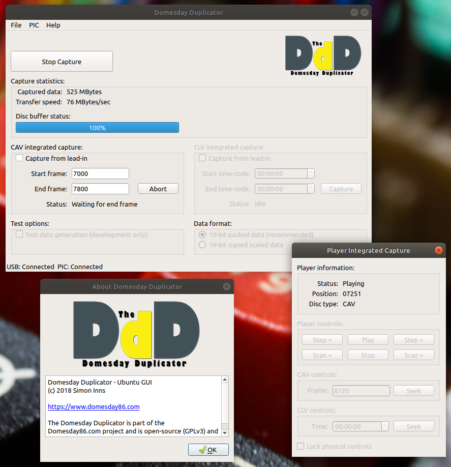
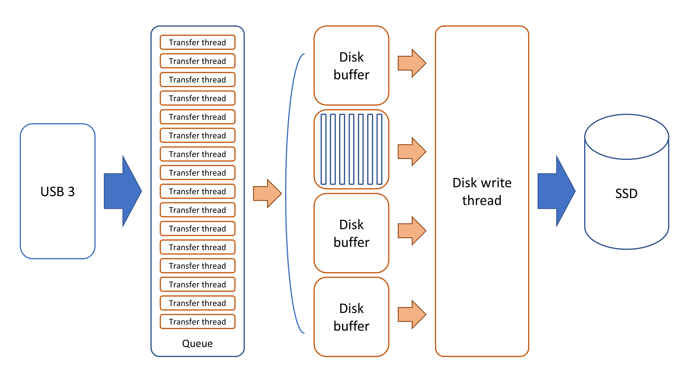

# Domesday Duplicator Software Guide

The Domesday Duplicator is a completely open-source and open-hardware solution.  All required files to construct the hardware and all of the source-code is available on Github. The Github repository contains the following items:

* Kicad schematics and PCB design
* FPGA Verilog HDL code for the DE0-Nano
* GPIF II state-machine design for the FX3
* FX3 firmware for the Cypress FX3 board
* Linux (Ubuntu 18.04 LTS) GUI capture application

The Github repository is accessible via the following link: [Domesday Duplicator Github](https://github.com/simoninns/DomesdayDuplicator) 

The development environment for all parts of the Domesday Duplicator software is Ubuntu 18.04 LTS with the exception of the Cypress FX3 GPIF design utility (which, despite Cypress stating Linux compatibility for their product, does not run on Linux (and is an essential part of their development tool-chain)).

# FPGA code
## Purpose
The DE0-Nano FPGA board is used to bridge the Domesday Duplicator's ADC hardware with the Cypress FX3 USB 3.0 board.  The code provides data manipulation, error checking and a 16K word FIFO ping-pong buffer to allow buffering in case of short constrictions of USB bandwidth to the host computer.  The FPGA code also contains a test data generation function that allows testing of the Domesday Duplicator with known test data (that can be verified as intact once received by the host application).

## Development environment
The development environment for the FPGA code is Intel Quartus Prime Version 18.0.0 Build 614 Lite Edition running on Ubuntu 18.04 LTS.  In order to compile the FPGA code you will need to download Quartus from Intel's website and follow the vendor's installation instructions.  Once installed you can open the .qpf project file and build the FPGA image from source.

## USB device configuration
In order to program the DE0-Nano it is necessary to provide user-space access to the USB programming device. To add the required rules create the following file:

```
/etc/udev/rules.d/40-altera-usbblaster.rules
```

Then place the following configuration in the rules file:

```
SUBSYSTEM=="usb", ATTRS{idVendor}=="09fb", ATTRS{idProduct}=="6001|6002|6003", OWNER="root", GROUP="root", MODE="0666", SYMLINK+="usbblaster"
```

Then issue the following command to re-read the USB configuration rules:

```
sudo udevadm control --reload-rules
```

## Programming the DE0-Nano
In order to program the DE0-Nano so that the Domesday Duplicator software is loaded and executed on power up, it is necessary to program the EPCS64 serial configuration device.  Instructions for programming the serial device can be found in the DE0-Nano user manual available from Terasic. 

Firstly load the project and use Processing->Start Compilation to begin the compilation process and generate the .sof programming file.  To temporarily program the DE0-Nano simply use Tools->Programmer and flash the DE0-Nano board using the .sof file.  A file DomesdayDuplicator\_write\_sof.cdf is provided for .sof programming (note: you may need to modify this slightly for your own environment) - Double-clicking on this file (in the Files section of the project navigator) will open the programming window with the correct programming settings. 

To program the DE0-Nano permanently follow the instructions given on page 146 of the DE0-Nano user guide - section 9.1 - Programming the Serial Configuration Device.  To make the process easier a Conversion Setup file DomesdayDuplicator.cof is provided.  From the Convert Programming File window click on the "Open Conversion Setup Data" button and select the .cof file and the conversion settings will be automatically loaded. 

To write the JIC programming file to the DE0-Nano a DomesdayDuplicator\_write\_jic.cdf file is provided - Double-clicking on this file (in the Files section of the project navigator) will open the programming window with the correct programming settings.  You may need to switch to the "Files" view in the project navigator in order to see the included files. The DE0-Nano User Manual is available from [this link](http://www.ti.com/lit/ug/tidu737/tidu737.pdf).

## Source code modules
### DomesdayDuplicator.v
This module is the top-level verilog module and contains the hardware mapping information for the communication between the FPGA and the ADC as well as the communication between the FPGA and the FX3. The module also includes instantiation code for the Intel IP PLL functions which generate the required 60MHz clock (for FPGA to FX3 communication) and 40 MHz clock (for ADC to FPGA communication - i.e. the sample rate clock). The top-level module includes the sub-modules 'dataGenerator', 'buffer', 'fx3StateMachine' and 'statusLED'.  The purpose of these modules is described below.

### dataGenerator.v
The data generator module is responsible for generating data either from the ADC or (if in test mode) internally. When in test mode the generator outputs a repeating sequence of 10-bit numbers, 0 to 1020 inclusive.

The data generator also inserts a sequence number into the top 6 bits of each sample, so that the DomesdayDuplicator application can detect missing samples. The sequence numbers count repeatedly from 0 to 62 inclusive, incrementing every 65536 samples.

Data from the ADC is read on the positive edge of the ADC clock and passed to the FIFO buffer.

The lengths of the test sequence (1021) and the sequence number sequence (63) were chosen in order to maximise the length of time before a USB transfer has the same contents as a previous transfer in test mode (about 210 seconds). The number of samples per sequence number was chosen to allow a length of blocks of missing samples up to 0.1s to be detected correctly; experimentation on a machine with an early USB3 controller showed maximum dropouts of about 0.01s under artifically heavy CPU load, so this gives some additional margin.

(In versions of the firmware before June 2022, there were no sequence numbers, and the test sequence ran from 0 to 1023. The DomesdayDuplicator application will still work with older firmware.)

### buffer.v
The buffering functionality is provided by two dual-clock FIFOs implemented using the Intel IP DCFIFO. The two FIFO buffers store 8K words of 10-bit ADC data each and are arranged in a 'ping-pong' buffer configuration where data is written to one buffer and read from the other.  Once the data available in a buffer is depleted the buffers are swapped. 

Data is only written to the ping-pong buffers if the collectData flag is set.  Each FIFO buffer is 10-bits wide and 8192 words deep.  The buffer size is chosen to match the USB end-point buffer size provided by the FX3 (16 Kbytes which equates to 8192 16-bit words). 

Data is read from the 60MHz read-side of the dual-clock FIFO on the positive-edge of the FX3 clock (60MHz) and passed padded to 16-bits before being passed to the data-out bus.  Data is only read from the FIFO when the readData flag is set.

### fx3StateMachine.v
The fx3StateMachine module implements the required mirror state-machine for the GPIF II implementation (detailed below).  The state-machine has two states:

1. state\_waitForRequest - The state-machine waits for the GPIF II state-machine to indicate a transfer is about to begin.
2. state\_sendPacket - The state-machine waits for 8192 clock cycles (whilst data is transferred) before returning to the waitForRequest state.

### statusLED.v
The statusLED module provides a simple indication that the FPGA firmware is running.  The 8 LEDs of the DE0 nano are lit in sequence.  The LED pattern is interrupted if the DE0 nano firmware is not programmed correctly or the DE0-nano is being held in reset (by pressing the reset button on the FX3 board).

# Cypress FX3 firmware
## Purpose
The Cypress FX3 firmware provides a DMA driven data transfer between the FPGA and the USB 3 compatible host computer.  A GPIF state-machine design is used to automatically read data from the FPGA and transmit it via USB 3 with minimal interaction of the FX3's ARM processor. 

In addition the FX3 provides a set of generic input and output GPIOs to and from the FPGA.  Currently the firmware monitors the inputs from the FPGA and produces debugging information (via the serial console) if any signal is set, this is to assist with debugging the FPGA code.  Outputs to the FPGA are available via a vendor-specific USB command (0xB6) that accepts a byte containing bit-flags and sets the outputs to the FPGA according to the state of the flags (used to send capture configuration settings from the GUI application to the FPGA).

## Development environment
The FX3 firmware is developed in the Cypress EZ USB Design Suite for Linux and cyusb\_linux\_1.0.5 (provided by the FX3\_SDK\_1.3.4\_Linux tarball available from Cypress).  The GPIF II state-machine design is developed in Cypress GPIF II Designer 1.0 (which is only available for Windows). 

Instructions for building the FX3 firmware image are include in the github repository along with the source code for the FX3.

## Programming the FX3
The Cypress FX3 is programmed using the cyusb\_linux utility included with the Cypress Linux SDK (note: if you have trouble compiling the programming GUI when running the install.sh from Cypress, [please see this forum post](https://community.cypress.com/thread/32219?start=0&tstart=0)).

Note: The following repo contains an Ubuntu-ready version of the FX3 programming utility and may be a useful shortcut:

[CyUSB Suite for Linux](https://github.com/Ho-Ro/cyusb_linux)

To program the device please see the following steps:

1. Close/short jumper J4 (PMODE) on the FX3 Superspeed board
2. Power off the FX3 and then power it on again
3. Load the cyusb\_linux application
4. Highlight the FX3 bootloader device at the top of the window
5. Click on the 'program' tab
6. Select I2C EEPROM
7. Click on 'select file' and select the FX3 programming file from disk (use the .img file from the Release directory)
8. Click on 'Start download' to write the programming file to the device
9. Wait for programming to complete
10. Remove the jumper from J4
11. Power off the FX3 and then power it on again


_cyusb\_linux Screenshot_

## GPIF II
### IO Matrix
The following diagram shows the IO matrix configuration for the FX3 GPIF implementation: 


_Cypress GPIF I/O Matrix view_

The purpose of the signals are as follows:

* CLK - This is the GPIF clock supplied by the FPGA (80 MHz)
* dataAvailable - This signal indicates that there is sufficient data in the FPGA's FIFO buffer for a transfer
* Databus - The 16-bit data bus from the FPGA to the FX3
* nReset - (not) reset condition signal from the FX3 to the FPGA
* collectData - Flag from the FX3 to the FPGA that indicates if the FPGA should collect ADC data
* readData - Flag from the FX3 to the FPGA indicating that a transfer is about to begin
* input0 - Generic input GPIO from the FPGA to the FX3
* input1 - Generic input GPIO from the FPGA to the FX3
* input2 - Generic input GPIO from the FPGA to the FX3
* input3 - Generic input GPIO from the FPGA to the FX3
* outputE0 - Generic output GPIO from the FX3 to the FPGA (with 'early' low-latency)
* outputD0 - Generic output GPIO from the FX3 to the FPGA (with 'delay' normal latency)
* outputD1 - Generic output GPIO from the FX3 to the FPGA (with 'delay' normal latency)
* outputD2 - Generic output GPIO from the FX3 to the FPGA (with 'delay' normal latency)
* outputD3 - Generic output GPIO from the FX3 to the FPGA (with 'delay' normal latency)

### State machine
The following diagram shows the GPIF II state machine design for the FX3 GPIF implementation:


_Cypress GPIF State-machine view__

The state machine is designed to use the automatic transfer feature of the FX3 where the incoming data from the FPGA is automatically moved to the USB interface by the GPIF module with minimal interaction with the FX3's ARM processor.  The design uses two GPIF 'threads' to ensure minimum delay between transfers.  The GPIF design is configured with 16Kbyte buffers and data is automatically committed to the USB interface once a buffer is full. 

As the GPIF interface is synchronous both threads enter a wait state until the FPGA signals that enough data is available for a transfer.  Once this flag is received the GPIF changes to the 'request' state where it signals to the FPGA that a transfer is about to start (the TH0\_REQUEST and TH1\_REQUEST states repeat for 3 clock cycles to allow time for the FX3 to send the signal and the FPGA to receive it). 

Once the state-machine enters the read state, 8192 16-bit words of data are transferred between the FPGA and the FX3 (filling the available 16Kbyte buffer), the state-machine then commits the data to the USB interface and returns to a wait state.  This design allows for a deterministic transfer with minimal signalling complexity whilst allowing for the non-deterministic nature of the DMA ready state on the FX3 (the buffer 'ready' is unpredictable due to the reliance on the host computer to transfer data in a timely manner).  By using a combination of deterministic and non-deterministic states the GPIF design provides an asynchronous data transfer via the synchronous interface with minimal overhead to ensure high-bandwidth of data transfer. 

Since the FPGA to USB interface is 60MHz (20Mhz faster than the rate of capture) this design allows the USB interface to 'catch-up' rapidly whenever there is a drop in the bandwidth across the USB interface.

## Source code modules
### cyfx\_gcc\_startup.S
This file contains the proprietary start-up code necessary for the FX3 to function - Cypress why-oh-why would you not release this open-source?

### cyfxtx.c
This file contains the Cypress USB 3.0 Platform source file - again under a proprietary license (and necessary for the FX3 to function)

### domesdayDuplicator.c
This file contains the main functions for the Domesday Duplicator firmware.  All functions are heavily commented; please see the Github repository for details.

### domesdayDuplicator.h
This file contains the definitions and header file information for domesdayDuplicator.h

### domesdayDuplicatorGpif.h
This file contains the state-machine definition code generated by the GPIF II designer application.  The original GPIF II designer project is also included in the Github repository.

### usbDescriptor.c
This file contains the USB descriptor information for the Domesday Duplicator USB device.

## Vendor specific USB commands
The firmware handles two vendor specific USB commands 0xB5 and 0xB6.

### Vendor specific command 0xB5 - Start/Stop data collection
The vendor specific command 0xB5 accepts a value of either 0 or 1.  If called with a value of 1 it causes the firmware to flag the FPGA to begin sample data collection.  Calling the command with a value of 0 causes the firmware to flag the FPGA to stop sample data collection.

### Vendor specific command 0xB6 - Configuration bit flag
The vendor specific command 0xB6 accepts a byte value from the host that is interpreted as a bit-flag.  Only bits 0-4 are used (bits 5-7 are ignored and can be set to any value).  The setting of the bit-flags are mapped to output GPIO pins as follows:

* Bit 0 - GPIO22
* Bit 1 - GPIO23
* Bit 2 - GPIO24
* Bit 3 - GPIO25
* Bit 4 - GPIO26

The command is used by the host application to set the capture configuration of the FPGA.  The exact interpretation of the flags is dependent on the FPGA programming (and is kept deliberately generic in the FX3 firmware).

## Serial debug
The FX3 Superspeed explorer board provides a USB 2.0 service debug output.  Connecting this output to a suitable machine with a serial terminal allows monitoring of the debug information from the FX3 firmware. The FX3 serial debug output is 115200 bps 8N1. In order to access any serial port the Ubuntu user account must be a member of the dialout group.  Add your current user account to the dialout group using the following command:

```sudo adduser $USER dialout```

If you have problems getting the ttyACM device configured for use with the Cypress FX3 board, create (as root) the following file:

```/etc/udev/rules.d/49-cypressserial.rules```

Then place the following configuration in the rules file:

```
# 04b4:0007 - Cypress FX3 serial debug port
ATTRS{idVendor}=="04b4", ATTRS{idProduct}=="0007", ENV{ID\_MM\_DEVICE\_IGNORE}="1"
ATTRS{idVendor}=="04b4", ATTRS{idProduct}=="0007", ENV{MTP\_NO\_PROBE}="1"
SUBSYSTEMS=="usb", ATTRS{idVendor}=="04b4", ATTRS{idProduct}=="0007", MODE:="0666"
KERNEL=="ttyACM\*", ATTRS{idVendor}=="04b4", ATTRS{idProduct}=="0007", MODE:="0666"
```

Then issue the following command to re-read the USB configuration rules:

```sudo udevadm control --reload-rules```

# Linux GUI capture application
## Purpose
The Linux GUI application provides a capture front-end for the user.  The application also provides a high-speed multi-threaded USB implementation that allows extremely high-speed data transfer from the FX3 in real-time.  In addition, a multi-buffer disk IO implementation deals with writing the large amounts of capture data to disk in a timely manner.  The Linux application is also capable of sending vendor-specific USB commands to the Domesday Duplicator in order to control and configure the capture device. 



_Domesday Duplicator Ubuntu GUI application_

## Development environment
The Linux GUI application is developed using Qt Creator 4.7.1 for Linux (Based on Qt 5.11.1 GCC 64-bit).  The application is tested on Ubuntu 18.04 LTS.  For instructions on how to install and build the application please see the [Domesday Duplicator User Guide](User-Guide).

## Source code modules
The GUI application modules are as follows:

* aboutdialog - the About window dialogue containing application info, GPL licence terms and credits
* advancednamingdialog - the advanced naming dialogue window and associated GUI logic
* configuration - a class dealing with saving and loading the persistent configuration (used to save preferences)
* configurationdialog - the preferences dialogue window and associated GUI logic
* main - the Qt application start-up code
* mainwindow - the main window and associated GUI logic
* playercommunication - simple blocking serial communication to the LaserDisc player
* playercontrol - threaded player communication and automatic capture state-machine logic
* playerremotedialog - the player remote control dialogue window and associated GUI logic
* usbcapture - the USB bulk transfer code for performing capture and save to disc
* usbdevice - high-level USB library including hot-plug device detection.

## Multi-threaded USB transfer architecture
The following diagram shows the approximate structure of the multi-threaded architecture used by the GUI application to achieve the required USB and disk bandwidth: 



_Linux GUI transfer architecture_

The USB interface is processed using multiple transfer threads which are 'in flight' at any one time (configurable from the definitions in the bulk-transfer code).  The collection of transfers are called the 'queue'.  This causes minimal latency when reading data from the USB device.  Each thread causes a 'callback' once the transfer is complete.  The callback function stores the thread in the current queue buffer and then re-launches the transfer for the next queue.  Once the last transfer in the queue is complete the queue buffer is stored in the next available disk buffer slot.  The disk buffers are much larger than the queues as, for optimal disk write performance, it is more efficient to write larger blocks of data (rather than many smaller writes).  Once the 'queue limit' of the disk buffer is reached, the buffer is marked as 'ready for writing'.  A separate disk write thread monitors the disk buffers and, when ready, marks the buffer as 'writing' and commits the data to the SSD drive of the host PC. 

The sample data packing (either 10-bit or 16-bit) is provided by the disk buffer writing threads.  Data is converted on-the-fly once a complete disk buffer is marked as ready for writing. 

Along with the main application thread, the GUI uses around 18 concurrent threads to achieve the required performance.  This has the additional benefit of being very suitable for multi-core processors; allowing the application to gain the required end-to-end performance.