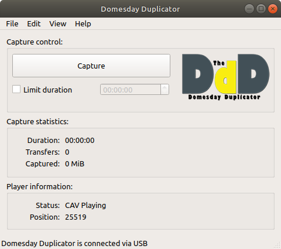
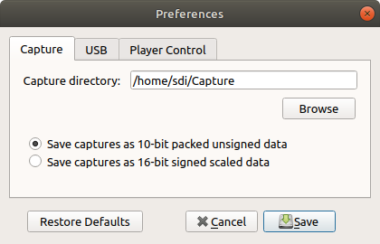
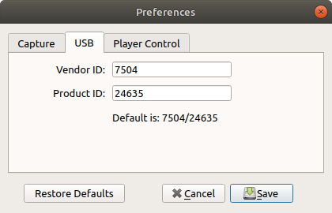
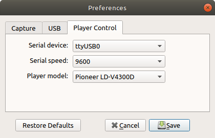
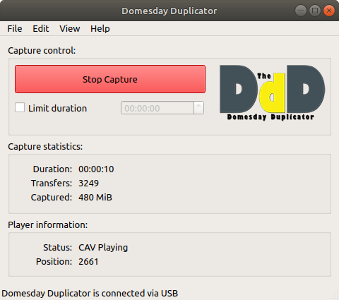
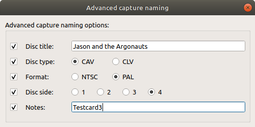
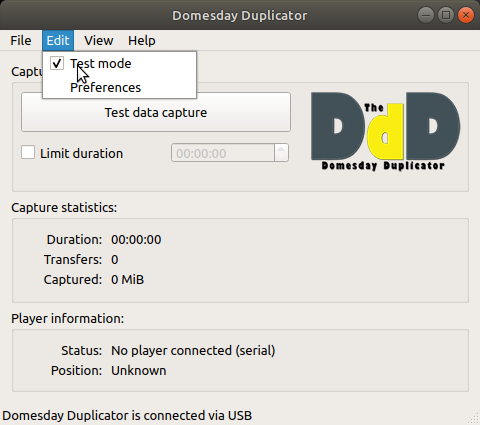
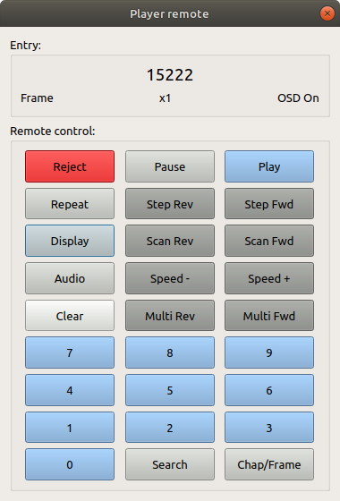
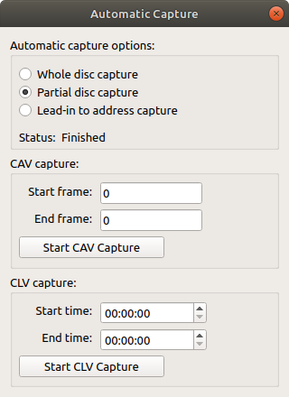

# Domesday Duplicator User-Guide

The Domesday Duplicator (DdD) application is a complete graphical user interface for the Domesday Duplicator USB3 capture device.  The application is designed for the Ubuntu distribution and is GPLv3 open-source.  The application supports one-click LaserDisc RF capture as well as a host of additional features for more advanced capture requirements.



_The Domesday Duplicator Application_

As well as supporting high-speed USB3 communication with the Domesday Duplicator board, the application also provides advanced serial control of the Pioneer LD-V4300D and CLD-V2800 LaserDisc players.  Serial control allows the application to provide fully automatic capture of LaserDiscs either in part or as a whole.

The supported environment for the application is currently Ubuntu 20.04 LTS. The application usually works well on other GNU/Linux distributions, and may work on other operating systems too, but if you are reporting a problem, please try to reproduce it in the supported environment first.

# Linux Installation

## Getting the software

To compile the software on Ubuntu 22.04, you will need to run the following command to install the required dependencies:

```sudo apt install --no-install-recommends git cmake libgl-dev qt6-base-dev libqt6serialport6-dev libusb-1.0-0-dev qt6-multimedia-dev build-essential```

The application source-code is available from the Domesday86 project Github.  It is recommended to install the application under the home directory of your Ubuntu user account.  To get a copy of the application's source code, use the following commands from the Ubuntu terminal window:

```
mkdir ~/github
cd ~/github
git clone https://github.com/simoninns/DomesdayDuplicator
```

Once the software is downloaded, simply issue the following commands to compile the application:

```
cd ~/github/DomesdayDuplicator/Linux-Application
cmake -DCMAKE_BUILD_TYPE=RelWithDebInfo .
make -j8
sudo make install
```

This will allow you to run the application using the following command:

```~/github/DomesdayDuplicator/Linux-Application/DomesdayDuplicator/DomesdayDuplicator &```

By default CMake will install into `/usr/local`. To install into `/some/dir` instead, add `-DCMAKE_INSTALL_PREFIX=/some/dir` to the `cmake` command.


## USB device permissions


In order for the GUI application to connect to the Domesday Duplicator USB device it is necessary to provide permissions for user-level access. For this you need to create a file called 40-domesdayduplicator.rules in the /etc/udev/rules.d directory (requires root permissions). The contents of the file should be as follows:

```
# 1d50:603b - Domesday Duplicator
SUBSYSTEM=="usb", ATTRS{idVendor}=="1d50", ATTRS{idProduct}=="603b", MODE="0666"
```

Once the file has been created, issue the following command to reload the USB configuration rules:

```sudo udevadm control --reload-rules```


## Serial port device permissions


If you wish to use the automatic capture feature a serial connection between the Ubuntu PC and the laser video disc player is required (you will need an appropriate cable and USB to RS232 adapter). In order to access a serial device the Ubuntu user account must given the 'dialout' group permissions. This can be added to the current user account using the following command:

```sudo usermod -a -G dialout $USER```

Note that this permission does not become active until the user account has logged out and logged back in again.


## Real-time scheduling


The DomesdayDuplicator application will automatically make use of real-time scheduling, if it is available on your system. When capturing data over USB, the application sets the capture thread to have real-time priority, so the operating system will run it before other threads that are trying to use the CPU -- this makes it less likely that capture will fail because the application could not service USB transfers quickly enough.

Similarly, the application tries to lock its capture buffers into RAM -- this stops the operating system from paging them out to disk when memory is required for other programs or disk cache.

Real-time scheduling and memory locking are commonly used by audio and video applications, so most distributions either enable them by default or have an easy way to do so. See [JACK: How do I configure real-time scheduling?](https://jackaudio.org/faq/linux_rt_config.html) for a detailed guide.


## Configuring the application


The first time you use the Domesday Duplicator application, it is important to ensure that your configuration is correct.  To configure the application simply select 'Edit' from the menu bar and click on 'Preferences'.  You will see the following window:



_Domesday Duplicator - Preferences - Capture_


### Capture directory


Firstly, configure your desired capture directory.  When you capture LaserDiscs using the application, the files are automatically named and placed in a single target directory.  Create a directory called 'Capture' using the file explorer in Ubuntu and then, in the preferences window, click on 'Browse'.  You should then use the file dialogue to select your capture directory.  Once selected the file path will be shown in the preferences window.


### Capture sample format


The Domesday Duplicator supports two different capture formats.  The '10-bit packed unsigned data' is recommended as it provides the smallest possible file size for captures.  The '16-bit signed scaled data' format uses more disk space, but is directly compatible with sample editors such as Audacity and is therefore useful when setting up, testing a capture system or analysing results from a capture.


### USB configuration

The second tab in the preferences window is the USB configuration as shown in the following picture:



_Domesday Duplicator - Preferences - USB_

This window allows you to change the VID and PID of the capture USB device.  For normal use it's recommended to leave these values as per the default.


### Player control


The third tab in the preferences window is the Player Control configuration as shown in the following picture:



_Domesday Duplicator - Preferences - Player control_

This window allows you to configure the application for player control (if you have a supported player and the necessary serial hardware).

The serial device drop-down box lists the available serial devices seen by the application.  All serial devices available on your computer will be listed; ensure you select the right device for your player's serial connection.

The serial speed sets the speed at which the application will communicate with the player.  This is generally 4800 or 9600 depending on your player, however it is possible to set different speeds on the player, so it is prudent to check the configuration of the player according to the user-manual.

The player model drop-down allows you to select the type of player you have connected.  Currently the supported players are the Pioneer LD-V4300D and the Pioneer CLD-V2800.


### Saving the preferences


Once you have finished setting your preferences you can simply click 'Save' in order to store the settings on your machine (the application will remember them between uses).  If you want to exit the preferences window without saving, click 'Cancel'.  The 'Restore Defaults' button will set the preferences to their default values.


# Capturing RF


To capture a LaserDisc or Tape (or part of one) with the application the player should be set up either ready to play or with the player on still-frame/pause at the required start address of the medium.  There is no need to configure the application for CAV/CLV or PAL/NTSC etc. Since all RF capture is performed at the same speed by the Duplicator board, it simply captures what the device reads from the media.

You should ensure that the Domesday Duplicator board is correctly connected to the host PC and that the application shows "Domesday Duplicator is connected via USB" in the status bar of the main application window.

Once the player and Duplicator board are ready, simply click the 'Start Capture' button in the application.  During capture the button will turn red as shown in the following picture:



_Capturing a LaserDisc_

Note that the 'player information' is only available if the player is connected via serial to the application.

During capture the application shows the capture duration (in hh:mm:ss format), the number of USB transfers that have been performed and the approximate size of the capture file in MiBs.

To stop the capture click again on the red button; the application will stop the capture process and write out the remaining data to the capture file.  The capture file will be located in the capture directory (defined in Preferences->Capture) and will have a file-name automatically assigned as follows:

```RF-Sample_yyyy-MM-dd_hh-mm-ss.lds```

Where yyyy-MM-dd is the date and hh-mm-ss is the time at which the capture started.  The file extension `.lds` is based on the configured capture file format.  The files will be `.lds` for 10-bit packed (Laser Disc Sample) and `.raw` for 16-bit signed captures (for compatibility with sample editing software) but will need ot be renamed to `.s16` for common usage with decoders. 

(You can compress this with 40-60% space-saving via FLAC with the `ld-compress` script or via FLAC directly if in raw mode)


## Time-limited capture


If you wish to limit the maximum duration of a capture, simply tick the 'Limit Duration' check box and enter the required maximum capture length in hh:mm:ss format before starting the capture.  The application will automatically stop the capture and save the file once the specified duration has elapsed.


## Advanced file naming


If you wish to have more control over the file names used when performing captures, the application provides an advanced file naming dialogue that provides more options.  To open the window select 'View' from the menu bar and then click on 'Advanced naming'.  The following window is shown:



_The advanced capture naming window_

Simply tick the check-boxes next to the extra information you would like to include and select from either the available options or type in the text box as appropriate (note that the text box entries are limited to A-Z, a-z, 0-9, space, minus and underscore).  The advance capture naming mechanism provides the ability to add more detail to the capture files name whilst maintaining a standard file-naming convention to make it easier to sort and identify captures.  The format of the capture file name (with all advanced options selected) is as follows:

```Disc title_Disc type_format_Disc side_notes_date_time.lds```

So the example shown above would produce a file name similar to the following:

```Jason and the Argonauts_CAV_PAL_side4_Testcard3_2018-10-10_10-22-34.lds```

Any parts which are not selected are simply omitted from the file name.  Note that the settings in the advanced capture naming window apply even if you close the window.  To return to the default file name convention, simply clear the check boxes.


## Test data generation


For testing purposes the Domesday Duplicator hardware provides a function where the RF capture data is replaced by a pattern of data generated by the Duplicator board itself.  This can be useful (along with the 16-bit capture format) for verifying the Domesday Duplicator board before attempting to connect to a LaserDisc player's RF output.  To enable the test data generation simply click on the option in the 'Edit' menu as shown in the following picture:



_Test data mode selection_

For normal capture operation the 'Test mode' check-box should remain unchecked.  If you check the 'Test mode' option, the capture button will show 'Test data capture' to warn you that no real capture data will be generated.  In test mode the settings of the advanced capture naming window are ignored and the resulting capture files are always named as follows (with .lds or .raw depending on the configured sample format):

```TestData_yyyy-MM-dd_hh-mm-ss.lds```


# Player remote control


The player remote control windows provides a software remote control interface for a serial connected LaserDisc player.  The form and function of the remote is based on a Pioneer CU-V113A remote control and (wherever possible) the buttons function like the original remote.  To open the remote control select 'View' from the menu bar and click on the 'Player remote' option.  The remote control window is shown in the following picture:



_Player remote control_

If the player remote control window is selected when no player is connected using serial, the buttons will be disabled.  The remote can also be used to select a chapter, frame or time-code (note: chapters can be available on either CAV or CLV discs but frames are CAV only and timecodes are CLV only).  To use the feature first click the 'Chap/Frame' button to select the type of addressing you want (the currently selected address type is shown in the top-left of the window), enter the desired address using the number buttons and then click 'Search'.  Clicking the 'Clear' button will clear the currently entered address.

The 'Display' button turns on and the player's on screen display (the status of the OSD is shown in the top-right of the window) and the 'Audio' button selects from the possible audio options provided by the player and the disc.

When using multi-fwd and multi-rev on a CAV disc (this option is not available for CLV discs) you can also select the desired playback speed using the 'Speed-' and 'Speed+' buttons.  The currently selected speed is shown in the middle-top of the window.


# Automatic capture


The automatic capture window provides a fully automated capture system for a serial connected LaserDisc player.  To open the automatic capture window select 'View' from the menu bar and click on the 'Automatic capture' option.  The automatic capture window is shown in the following picture:



_Automatic capture window_

The automatic capture system uses serial control of the player to both command the player during capture as well as monitor the progress of the capture based on the frame/timecode position reported.  Note that the frame/timecode position reporting is not 'instant', so an automatic capture may overrun the required end address slightly due to communication lag.

The method of addressing is based on the disc format, with CAV using frame number and CLV using time codes.  The availability of the fields in the window is based on the selected capture option.  The three capture options are described below.


## Whole disc capture


The 'whole disc capture' option is the simplest of the three options and is designed to capture a whole disc from lead-in to the end.  To use whole disc capture, select the capture option and then click 'Start CAV Capture' or 'Start CLV Capture' according to the disc type present in the LaserDisc player.  The capture process is as follows:

1. The disc is placed into play mode and the the disc type is confirmed
2. The player is instructed to move to the last frame/time code on the disc and the length of the disc is recorded
3. The player is 'spun-down' to a complete stop
4. Capture begins
5. The player is 'spun-up' and begins playing (so the lead-in is captured)
6. Capture continues until the player reaches the frame/time code recorded in step 2
7. Capture is stopped

Note that the player is responsible for pausing or stopping playback at the end of the disc.  If the player has an option to 'auto repeat side' or similar, it is recommended that this is turned off.


## Partial disc capture


The 'partial disc capture' option is the most flexible of the three options as it is possible to specify both the start and end address of the capture.  Since a start address is used, this option cannot be used to capture lead-in information.  The capture process is as follows:

1. The player is 'spun-up' and placed into play mode (if it's not already playing or paused)
2. The player is instructed to move to the last frame/time code on the disc and the length of the disc is recorded
3. The player seeks to the required start address and pauses
4. Capture begins
5. The player switches to play mode
6. Capture continues until the end address is reached (or the end of the disc)
7. Capture is stopped


## Lead-in to address capture


The 'lead-in to address' capture option allows capture of the disc from the lead-in to a specified end-address (no start address is allowed since the lead-in is always at the start of the disc).  The functionality is the same as 'partial disc capture' as described above, with the exception that the player is spun-down before capture begins.


# Viewing the 'about' window


The about window shows information about the application including software license details.  The about window is shown in the following picture:


_The About window_

For more information click on the 'Licensing' or 'Credits' tabs at the top of the window.
