# Introduction

ld-analyse is a graphical application originally designed to assist with the analysis of LaserDisc images decoded by ld-decode but now supports a wider range of uses including analysis of video tapes and decoded raw composite sources.

The primary file-type is TBC (time-base corrected) video files containing the raw NTSC or PAL fields.

TBC files are usually identified by the `.tbc` & `_chroma.tbc` file-extensions.

The application also presents source and tool-chain metadata (supplied by JSON files) that provide additional details about the TBC file's contents such as VBI data and TV System.


# Command line


Note: The input file name is optional (you can either specify it from the command line or use the GUI once the application is running).

Dark Mode Is automatic on Linux/MacOS with QT but is currently not on Windows builds this can be forced into said mode with:

    ld-analyse -style fusion

This also applys to the DdD capture app.

Syntax:

ld-analyse \<options> \<input TBC file name>

```
Options:
  -h, --help     Displays this help.
  -v, --version  Displays version information.
  -d, --debug    Show debug

Arguments:
  input          Specify input TBC file
```

# Opening a Time-Base Corrected (TBC) video file

To open a TBC file for analysis, click on the File menu and select open

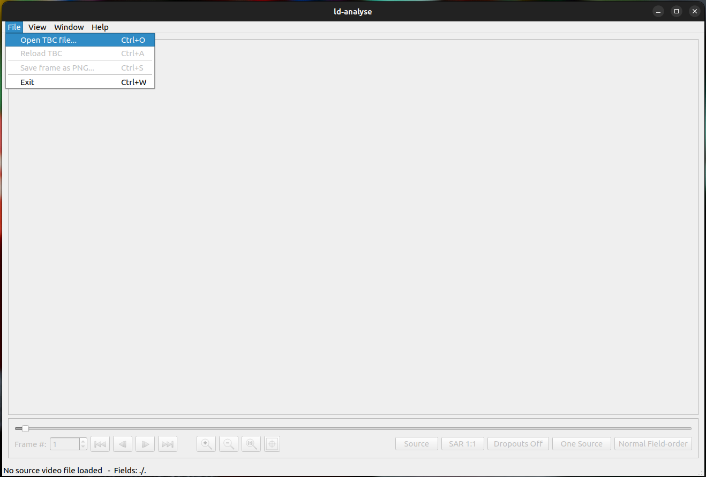

This will display a list of available files filtered by the .tbc extension.  Simply double click on the required TBC file to open it.

If you decoded a videotape using vhs-decode, then you will have two TBC files, one for luma and one for chroma - you can select either of them and ld-analyse will open both automatically.

# The ld-analyse main window

Once a TBC file is opened the main window provides a view of the currently selected video frame as well as information about the current frame.  There are two primary frame views selected by the 'Source' button which changes to 'Chroma' when clicked to indicate the currently selected viewing mode.

When 'Source' is selected the main window displays the raw frame data (which is grey-scale) including both visible and non-visible picture information:

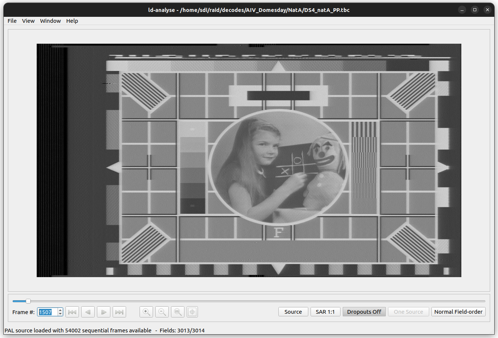

When 'Chroma' is selected the main window displays the frame data after processing with the chroma-decoder (the chroma-decoder is responsible for processing the raw frame into a colour image):

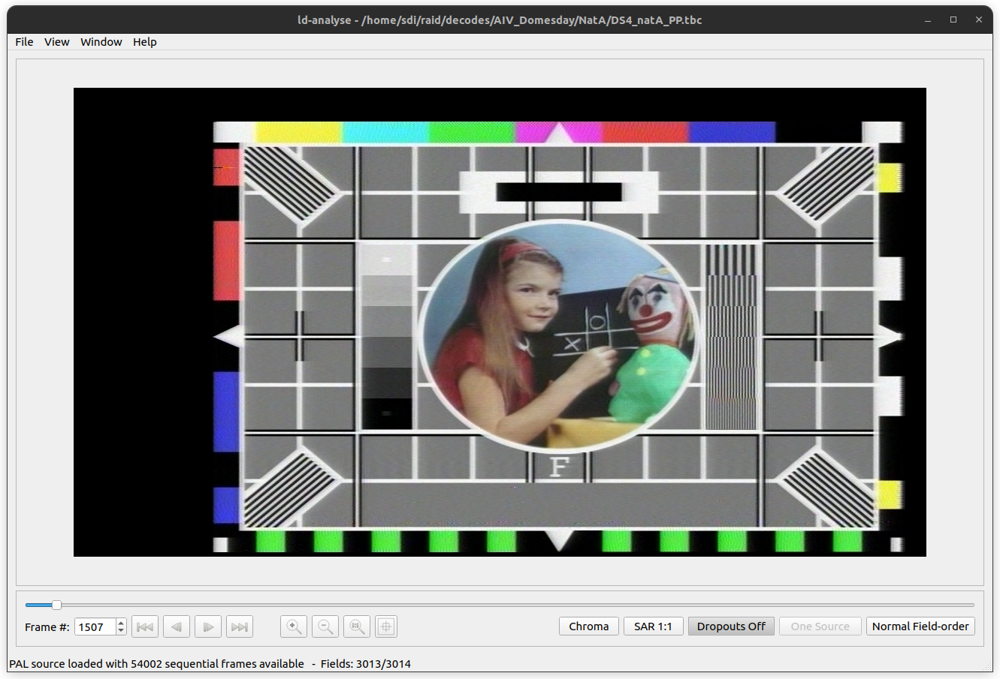

The analyser also allows the source to be viewed in one of three aspect ratios.

'SAR 1:1' is the Source Aspect Ratio (the frame is displayed as represented by the source TBC file) and is shown in the chroma example above.

'DAR 4:3' shows the frame as if the Destination Aspect Ratio was 4:3:

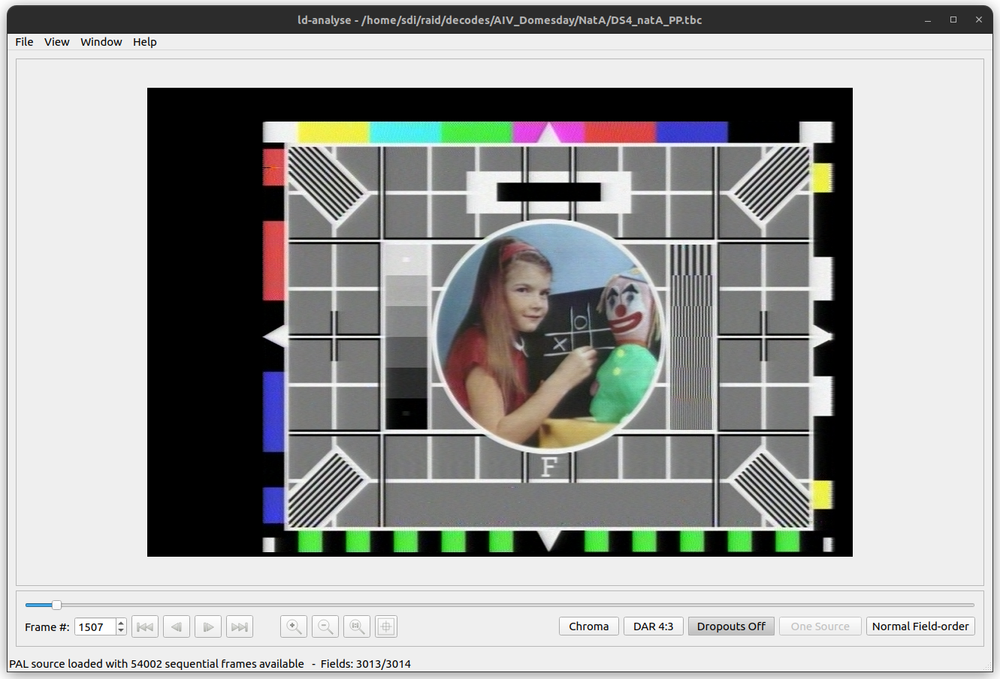

'DAR 16:9' shows the frame as if the Destination Aspect Ration was 16:9:

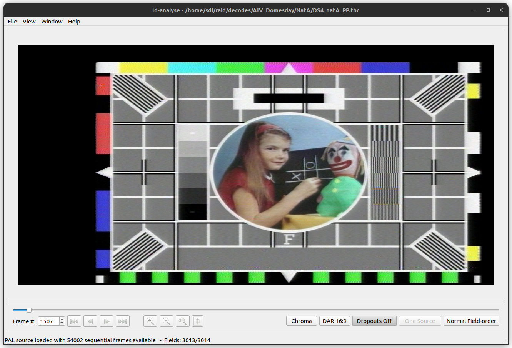

The displayed frame (as source or chroma) is made up of two fields that form alternate 'lines' of the image.  These fields are referred to as 'first' and 'second' fields denoting the order in which they should be interlaced in order to form the desired image.

The main window shows information about the first and second field including the field numbers in the main window's status bar. The status bar will also show the time code from LaserDisc VBI and VITC if available.

The order of the field lines can be reversed if required.  Please see the section 'Normal/Reverse field order' below.

## Understanding the make-up of a frame

The decoded frame is made up of several distinct areas.  The following diagram shows the location of the main areas (please see the PAL and NTSC specification documents for more detailed descriptions of the frame contents):


* VBI - The Vertical Blanking Interval or VBI is the an area that is used to store general information about the frame/field including time-codes and picture numbers.
* VITS - Vertical Interval Test Signals are a set of signals designed to assist with testing
* VSYNC - The Vertical picture synchronization pulse
* HSYNC - THe Horizontal picture synchronization pulse
* Colour burst - a timing signal used to corrected decode colour from the field line
* Visible area - The area of the frame which is usually visible on the end-system device such as a TV set

## VITC - Timecode Readout

`ld-process-vbi` can scan for common [SMPTE VITC Timecode](https://github.com/oyvindln/vhs-decode/wiki/VITC-SMPTE-Timecode) and add that to the .JSON files if the data is detected you will see the `HH:MM:SS:FF` readout automatically, this is the exact hour/min/sec/frame information the for current frame displayed at the bottem, typically this is runtime on commercial media or time of day information on prosumer/broadcast tapes.

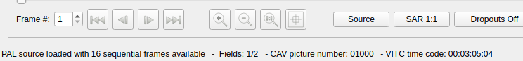

## Frame navigaion and analysis controls

The most common controls are present on the main window under the frame slider-bar:

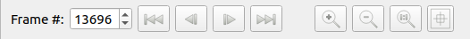

The button in left to right order are:

* Current frame number
* Previous chapter / start of source
* Back one frame
* Forwards one frame
* Next chapter / End of source
* Zoom in
* Zoom out
* Reset zoom
* Interactive oscilloscope

If the source TBC contains chapter numbers the start and end frame buttons will move back/forth one chapter at a time, otherwise the chapter buttons will advance to the beginning or the end of the source.

Note that clicking on the 'interactive oscilloscope' button opens the line oscilloscope.  When the interactive oscilloscope button is activated it is possible to click in the frame viewer to highlight the required line in the line scope.  It is also possible to click-drag the mouse to interactively display video lines (both in the oscilloscope window and the main window).

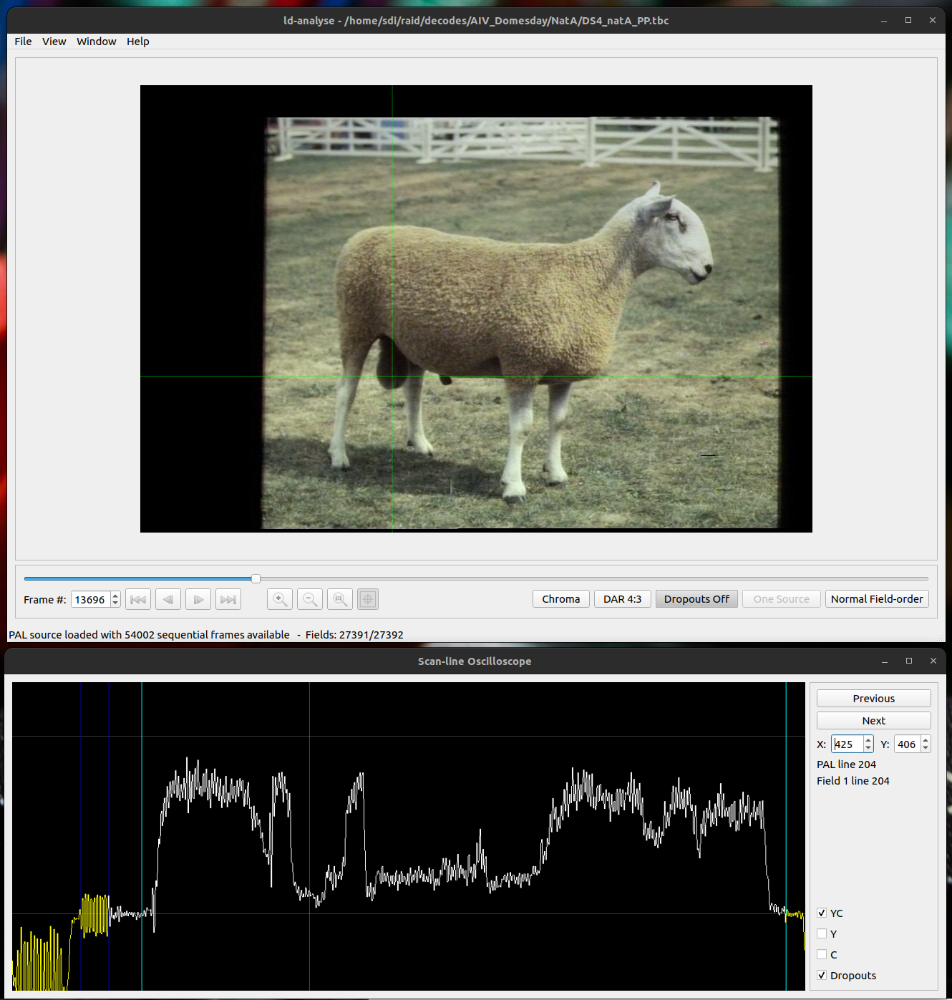

## Highlight dropouts

Dropouts are temporary losses of signal caused by dirt, damage, scratches or other defects on the originally sampled LaserDisc or other source media.  ld-decode detects areas of dropouts during the decoding process.  These detected areas are shown in the currently selected frame.  Red lines represent drop-outs in the first field of the frame and blue lines represent drop-outs in the second field.

Dropouts are highlighted by clicking on the 'Dropouts Off' button which will then change to 'Dropouts On' (clicking again reverses this action):

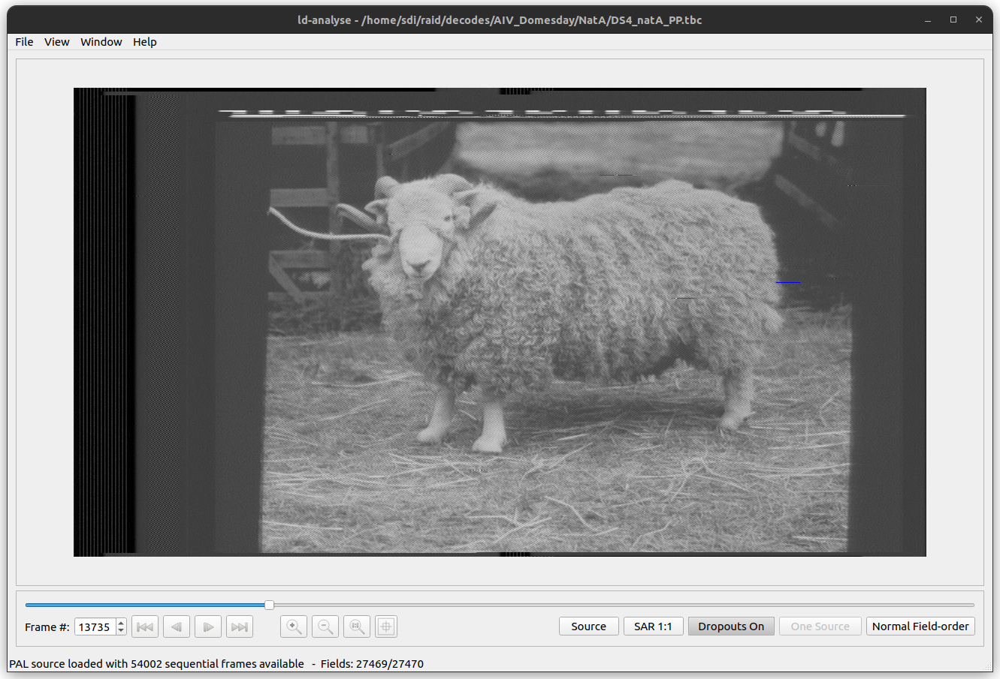

## Source selection

For TBC files produced by ld-decode, this button will say 'One Source' and be greyed out.

If you opened a TBC file produced by vhs-decode, where luma and chroma are stored in separate files, this button allows you to cycle between three different modes:

* 'Y+C Sources' - View the sum of the luma and chroma signals (i.e. the full composite signal; the usual mode)
* 'Y Source' - View only the luma signal
* 'C Source' - View only the chroma signal

## Normal/Reverse field order

Some sources are mastered with the expected field order reversed.  This causes ld-analyse to combine the wrong fields and the resulting frame is a mix of two adjacent frames.  Clicking on the 'Normal Field-order' button reverses the displayed field order:

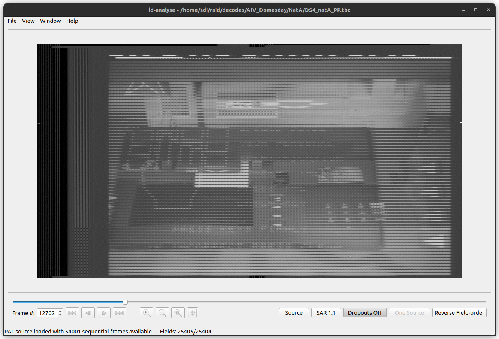

Clicking again on the same button will revert back to normal field order.  Note that switching the field order will cause ld-analyse to return to the first frame of the TBC file.

# The File menu

The file menu contains options for handling the loading and saving of various files.

## Open TBC file

This option opens a new TBC file as described above.

## Reload TBC

This option reloads the current TBC file (this is useful when checking a TBC file that is still being decoded in order to view any new frames that have decoded since the file was originally loaded).

## Save JSON

This action saves any changes you've made to the JSON metadata for the current TBC file. The menu item is greyed out if no changes have been made.

## Save frame as PNG

This option saves the currently selected frame as a PNG image.  The image saved contains both the visible and non-visible frame image.  The option saves the currently displayed image (however, drop-out highlighting is not included).

## Exit

This option quits ld-analyse and closes all windows.

# The View Menu

The view menu contains a number of options used to control the main window's frame view.

## Zoom in

This option zooms into the frame image.  Note: if dropout highlighting is selected, highlighting will also zoom to make it easier to see DO areas.

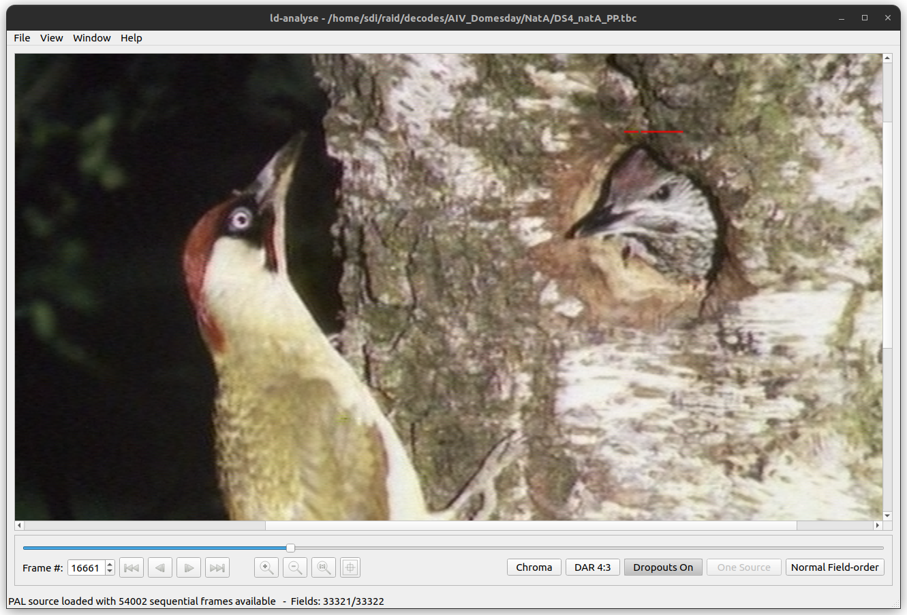

## Zoom out

This option zooms out of the frame image.

## Zoom to original size

The zoom to original size option causes the main window to resize the frame viewer to the actual size of the captured frame (i.e. a 1:1 pixel representation).

## Zoom to 2x size

This option zooms the frame viewer to 2 times the original size.

## Zoom to 3x size

This option zooms the frame viewer to 3 times the original size.

# The Window Menu

The Window menu contains a number of options that open additional windows to assist with analysis.

## Dropout analysis

The dropout analysis window shows a graph of dropouts detected in the whole TBC file.  The dropouts are averaged over multiple fields to simplify the view (the number of fields used per average increases as the total number of fields increases).  The graph shows the dropouts on the X axis (represented by the total length in picture 'dots' of all detected dropouts in the field) and the field number on the Y axis:

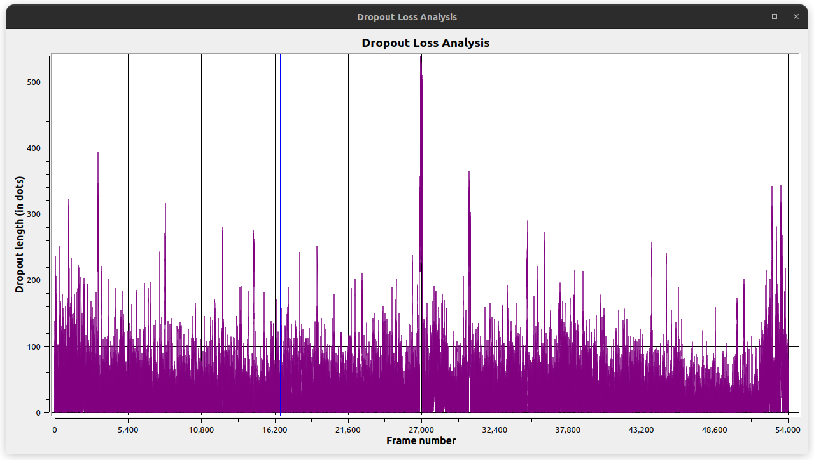

## Visible dropout analysis

The visible dropout analysis shows a similar view to the overall dropout analysis however, on the dropouts in the visible area of a frame are counted:

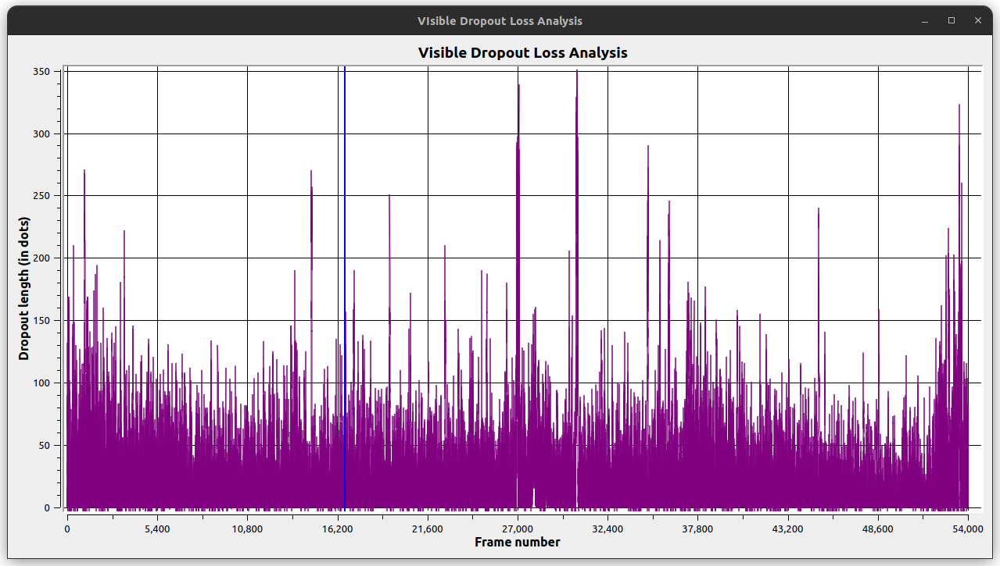

This view is useful as only dropouts in the visible area will be noticeable to the end-viewer; therefore sources that have less visible dropouts are more desirable that sources with more visible dropouts.

## Black SNR analysis

The Black SNR analysis window shows the reported black peak SNR across the whole TBC video file (the black lines) and the average (the red line).  Black SNR (Signal to Noise Ratio) gives a view of the quality of the original source (and the capture set-up).

Higher values represent a better source signal and can be gained by the use of clean, undamaged source material as well as carefully calibrated and tested capture environments.

A rule of thumb scale is as follows:

* 44-50 - Excellent Signal
* 35-40 - Good signal
* 30-35 - Ok signal
* 25-30 - Poor signal
* 10-20 - Severe Signal loss (rotten or badly damaged media)

### Video Tape

Generally the signal will be quite "flat" profile of SNR per recording segment, excluding areas of high mould or damage or multible years diffrance between recordings on a particular tape, however of course any thermal shift, magnetic or moisture exposure can be a verying factor in terms of cause of dropout and loss of signal, alongside the inital level of clean amplifcation the VCR provides for capture.

### LaserDisc


Generally the signal will be worst at the beginning of a LaserDisc disc (due to the MTF effect on the optics) and then reach a peak quality around frame 15,000.  Some discs exhibit quality loss towards the end of the disc (as this area is most likely damaged by both handling and edge-rot issues).

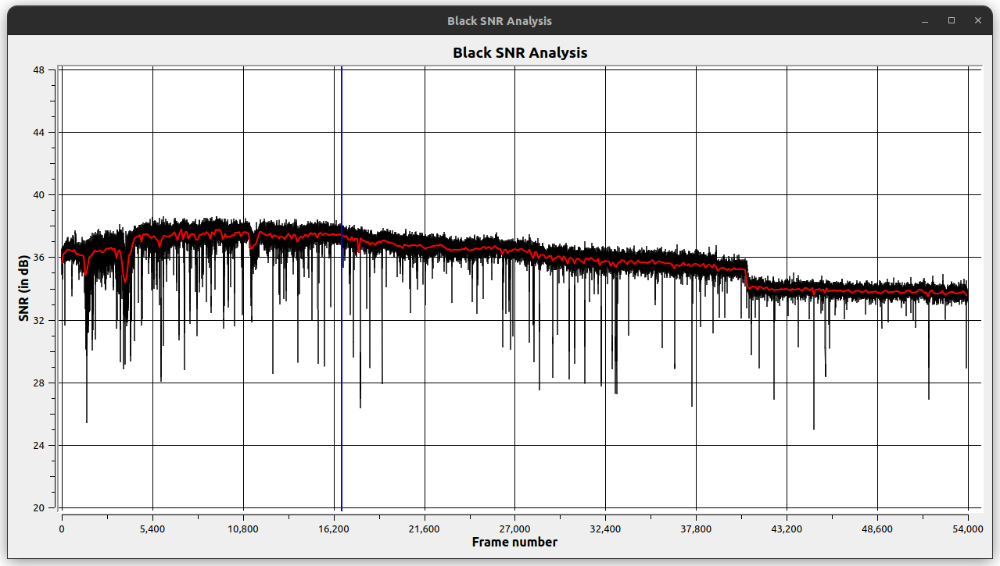

## White SNR analysis

White SNR signal analysis is similar to black SNR however, the measurement is taken at the white IRE video point rather than the black.  White SNR is a measure of signal quality but is less important (in general) than the black SNR result (since noise at the white level has generally less visible effect on the overall image):

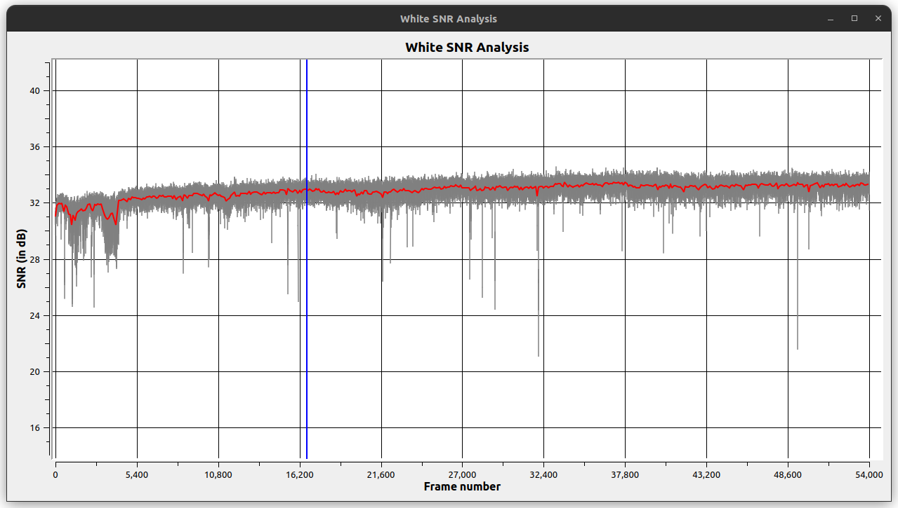

## VBI

The VBI (Vertical Banking Interval) contains a number of metadata fields providing information about the current frame and LaserDisc such as frame number, audio type and disc type.

* SMPTE VITC TimeCode - Runtime & segment runtime timecode
* Disc type - CAV or CLV
* Picture number - The current frame number (only for CAV discs)
* CLV time code - The current time code (only for CLV discs)
* Chapter number - The current chapter number
* Lead in - a special flag found at the start of LaserDiscs
* Lead out - a special flag found at the end of LaserDiscs
* User code - a code included by the mastering process
* Picture stop code - a flag indicating the player should pause on the current frame

### Original specification VBI

The original specification VBI tab shows the interpretation of the raw VBI data according to the original LaserDisc specification.  This generally applies to very early LaserDiscs (pre-1986).

* CX - CX audio mode is on/off
* Disc size - 12 or 8 inches
* Disc side - 1 or 2
* Teletext - True if teletext is present anywhere on the disc
* Programme dump - Not defined
* FM/FM Multiplex - Not defined
* Digital - Not defined
* Sound mode - Mainly mono, stereo or bilingual (dual-mono)
* Parity correct - a parity flag for the VBI (programme status part only)

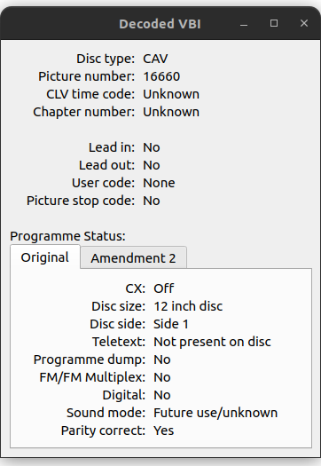

## Amendment 2 specification VBI

The amendment 2 tab shows the VBI according to the amendment 2 version of the LaserDisc specifications (and generally covers most LaserDiscs).

* CX - CX audio mode is on/off
* Disc size - 12 or 8 inches
* Disc side - 1 or 2
* Teletext - True if teletext is present anywhere on the disc
* Copy allowed - True if copying is allowed
* Standard video - True if main content is standard video
* Sound mode - Mainly mono, stereo or bilingual (dual-mono)

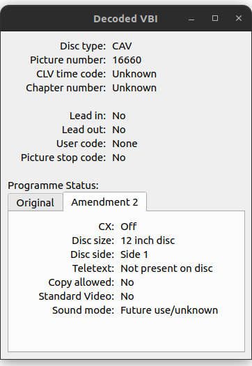

## Line scope

The line scope provides an oscilloscope style view of a video line.  The current video line can be selected by clicking on the current frame (this will also open the line scope window if required).

The view is divided into sections by several vertical lines.  The sections are as follows:

* Pilot/Vertical Sync
* Colour burst
* Front-porch
* Visible line
* Back porch

The top horizontal line represents the expected white-level IRE and the bottom horizontal line represents the expected black level IRE.

The two spinboxes on the right show the selected position within the frame using 0-based coordinates within the uncropped output image. The 'Previous' and 'Next' buttons move up or down a line; you can also use the mouse scrollwheel over the spinboxes. When in interactive mode, a green crosshair shows the selected position in the main frame view window.

Left-clicking on the scope view will select the corresponding X position in the main window. Shift-left-clicking will set the black or white level (see 'Video Properties' below).

The number of the selected line is shown using the standard line numbering convention for the current video standard, and as a 1-based line number within the field as used in the ld-decode metadata.

The YC tick-box shows the combined Y (Luminance) and C (Chrominance) values (the combined YC signal is the actual signal present in the original TBC video):


The 'dropouts' tick-box will highlight any drop-outs detected on the line in red (in the YC view).  Unticking this box removes the highlighting:


The Y tick-box filters the original signal to present just the Luminance signal:


The C tick-box filters the original signal to present just the Chrominance signal:


If you select YC and Y or C, the YC line will dim to allow easier viewing of the sub-signals:


## Vectorscope

The vectorscope shows the colour information within the current frame.

Colour information within composite video is represented using two coordinates, U and V, for each point in the image. The vectorscope is a scatterplot of the U and V colour coordinates for all the samples in the frame. An image consisting of a single solid colour will show a single blob on the vectorscope, and an image consisting of patches of several different colours will show a blob for each colour (with faint lines between them for the transitions between colours).

The angle around the chart represents the hue -- red is top left, blue is to the right, green is bottom left -- and the distance from the centre of the chart represents the saturation.

The vectorscope is normally used along with [colour bars](http://web.archive.org/web/20190506044324/http://www.radios-tv.co.uk/Pembers/Test-Cards/Test-Card-Technical.html#Bars) to check that colours are being decoded with the correct hue and saturation, and two graticules are provided that show the correct positions of the colour bar colours for 75% and 100% bars. For NTSC, the graticule also shows lines for the I/Q axes which should line up with elements of SMPTE colour bars.

If your video includes colour bars (or a different test signal with patches of the same colours), you can use the vectorscope to adjust the 'Chroma Gain' and 'Chroma Phase' chroma decoder settings. The gain control zooms the vectorscope in and out, and the phase control rotates it. Some LaserDiscs and videotapes include colour bars as part of the programme; many discs also have colour bars in the lead-in or lead-out, if your player can reach them in service mode.

The screenshot below shows 75% PAL colour bars on the vectorscope. These are correctly adjusted -- the blobs for the colours land in the centre of the graticule targets:

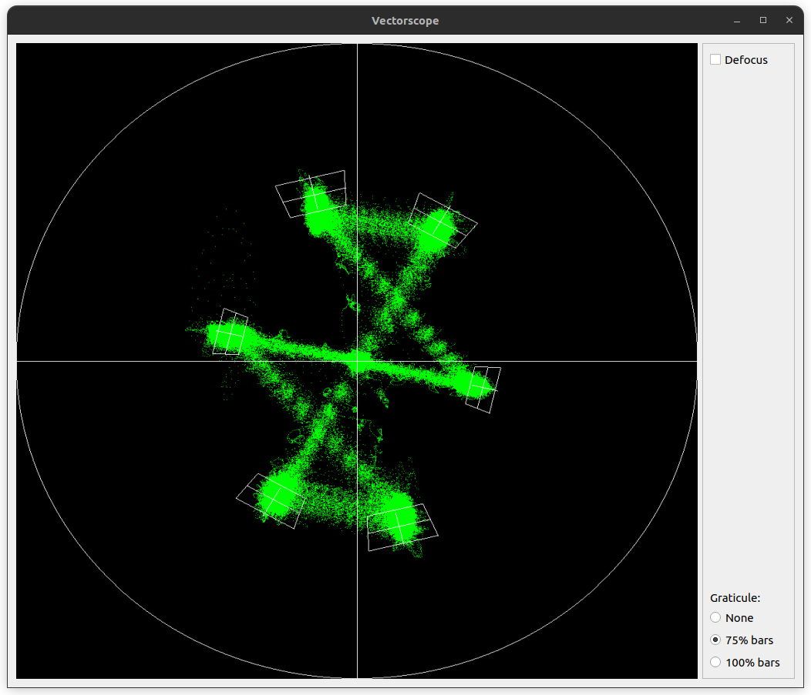

The 'Defocus' checkbox blurs the dots on the display a little; this can be useful if you have a very good-quality source video and the colour blobs are hard to see.

## Closed Captions

On some NTSC sources closed caption subtitle information is included.  When the closed caption window is open it is possible to scroll through a contiguous sequence of frames (using the next frame button) - if CC information is present it will be typed out into the closed caption window.  Text in the CC window can be cut and pasted into another application if required.  For export of closed-captions from the entire source please see the ld-export-metadata tool.  Note that skipping over more than a single frame will automatically clear the CC output window.

The closed captions viewer is as follows:


## Video parameters

The Video Parameters window allows you to adjust some of the metadata for the current TBC file. You can save these parameters back to the TBC's JSON file using 'File > Save JSON'.

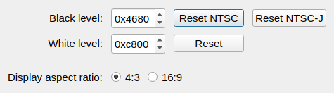

### Black/white level

The 'Black level' and 'White level' adjust the signal levels in the input file that correspond to black and white. The 'Black level' control is like the Brightness control on a monitor, and the difference between the two is equivalent to the Contrast control.

By default, these are set by ld-decode or vhs-decode to the standard values for the current video system. They are shown here as 16-bit hexadecimal numbers, corresponding to the sample values in the TBC file -- digital video standards usually refer to 8-bit values, which correspond to the first two digits here.

You can also set the black and white level in the Line Scope window, by holding down Shift and left-clicking on the scope view. Clicking in the top half of the scope will set the white level, and in the bottom half will set the black level.

The 'Reset' buttons return the black or white level to their standard values. For NTSC video, there are two black level reset buttons, one for standard NTSC and one for the Japanese NTSC-J standard; if you selected the wrong NTSC variant when decoding the video, you can use this to switch between NTSC and NTSC-J.

Note that the difference between the white and black levels is used to adjust the scaling of colour information, so you should set the black/white levels correctly before adjusting the chroma gain.

### Display aspect ratio

'Display aspect ratio' allows you to choose the aspect ratio at which the video is intended to be displayed.

For most video, this should be set to 4:3. You should only change it to 16:9 if your video consists of anamorphic widescreen material, filling the whole screen and compressed horizontally (e.g. "Squeeze LD" LaserDiscs).

## Chroma decoder configuration

This window lets you adjust the chroma decoder's settings. Most of the options here correspond to command-line arguments to the `ld-chroma-decoder` tool, so you can use it prior to decoding to find the best settings.

### Chroma gain

The 'Chroma gain' slider adjusts the saturation of the colour information in the image; it's like the Colour control on a monitor.

In an ideal world, this should be set to 1.0. Because colour information is stored in high frequencies in composite video, and high frequencies are usually the first to be lost in low-quality video, in practice you will often need to set this to a higher value in order to get correct colour reproduction. Make sure that you've set the black and white levels correctly first, though (see Video Parameters above).

### Chroma phase

The 'Chroma phase' slider adjusts the phase of the chroma signal before it is decoded into colour information. For NTSC, this behaves like the Hue control on a monitor. PAL monitors don't have a Hue control because they cancel phase errors automatically at the cost of reduced saturation; you can adjust this to maximise saturation with a standard PAL decoder, or to minimise Hanover bars with a Simple PAL decoder.

The best way to adjust chroma gain and phase is to use the vectorscope display with colour bars; see above.

### Luma noise reduction

Luma noise reduction applies a simple noise reduction algorithm to the luma signal.  High-frequency signals will be discarded unless they're larger than the value set here.

Many LaserDisc players use this kind of noise reduction. For command-line decoding, you usually want to disable this and use a better-quality external noise reduction algorithm (ffmpeg provides several).

### PAL and NTSC tabs

There are separate tabs for PAL- and NTSC-specific options. In both cases, there are some options that control how chroma (colour) and luma (brightness) information are separated - the chroma filter - and then some that control how chroma information is turned into actual colours.

### PAL

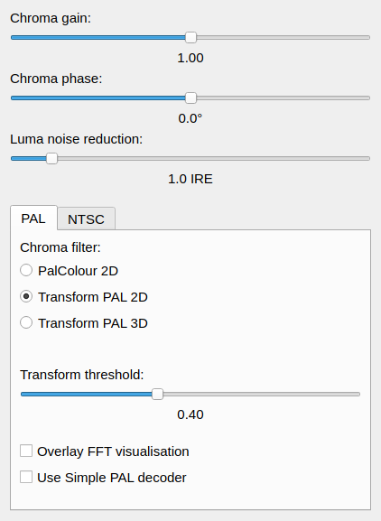

The 'Chroma filter' radio buttons let you select between three different chroma filters, corresponding to `pal2d`, `transform2d` and `transform3d` at the command line. PalColour is a simple PAL-D decoder, like most monitors, that will give reasonably good results on very poor quality or nonstandard video. The others use the BBC's high-quality Transform PAL algorithm: Transform PAL 2D uses a single field, and Transform PAL 3D uses multiple fields for better quality (but is slower).

The 'Transform threshold' slider controls how Transform PAL identifies chroma information. The default value of 0.4 is usually appropriate, but you can adjust the threshold to make it treat more or less information as chroma, which may be useful on extremely noisy video. (The command-line tool has an additional mode that lets you specify per-frequency thresholds; this isn't supported in ld-analyse yet.)

'Overlay FFT visualisation' draws a visualisation of the Transform PAL frequency bins on top of the video. If you know a bit about how the Transform PAL algorithm works, you can use this to see how much chroma information it's detecting (brighter colours mean more chroma) and where the symmetries are.

Normally the output of Transform PAL is fed through PalColour's PAL-D decoder to produce colour output. 'Use Simple PAL decoder' uses a PAL-S decoder instead - it produces better vertical colour resolution, but it's sensitive to phase errors in the input (producing "Hanover bars", where adjacent pairs of lines have different hue).

### NTSC

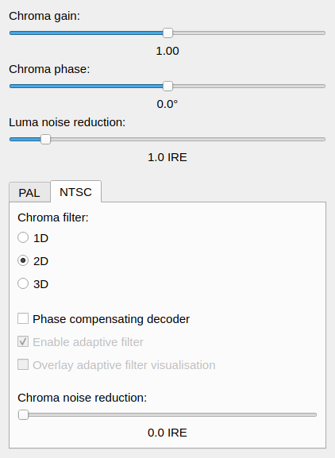

The 'Chroma filter' radio betters let you choose between three different chroma filters, corresponding to `ntsc1d`, `ntsc2d` and `ntsc3d` at the command line. The 1D decoder is a simple notch filter, producing very poor quality output. The 2D decoder is an adaptive 3-line decoder that uses a heuristic to combine information from adjacent lines within a single field. The 3D decoder uses a heuristic that combines information from lines across five fields. 3D will give the best results, particularly for material like animation that often has repeated content between fields, but it's much slower than 2D.

The 3D filter uses the output from the 2D filter, which in turn uses the output of the 1D filter. So if you're seeing an artefact in the 3D output, you can often check the 2D output and the 1D output to see where it came from.

'Phase compensating decoder' adjusts automatically for small chroma phase errors by measuring the colourburst on each line. ld-decode and vhs-decode already do a first pass at this during decoding, but enabling this option will usually improve things further, especially for noisy sources. It is turned on by default for tape-sourced video.

Unticking 'Enable adaptive filter' disables the 3D filter's heuristic, making it always compute chroma based on the difference from the previous frame. This will produce horrible results for moving images, but essentially perfect output for a still image, so you can use it to get the best quality output if there is absolutely no motion between this frame and the previous one.

'Overlay adaptive filter visualisation' shows you what source the 3D heuristic is using for each sample in the image. Red means the same line, yellow the same field, green field -1 or +1, blue field -2 and purple field +2.

'Chroma noise reduction' applies a simple noise reduction algorithm to the chroma signals.  High-frequency signals will be discarded unless they're larger than the value set here. Many LaserDisc players use this kind of noise reduction. For command-line decoding, you usually want to disable both of these and use a better-quality external noise reduction algorithm (ffmpeg provides several).

# The Help menu

The help menu contains an about option that displays information about the application.
